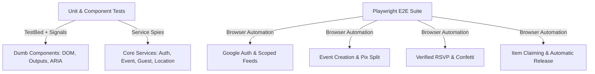

# Automated Testing Strategy Design

**Spec**: `.specs/features/04-testing-strategy/spec.md`  
**Status**: Approved  

---

## Architecture Overview

The Testing Strategy establishes a test harness targeting critical user flows, Signal reactivity, Component APIs, and WCAG accessibility:
1. **Component API & Unit Testing (Jasmine / Angular Test Bed)**:
   - Target: All Dumb/Presentational components and Core Services.
   - Verification: `@Input()` bindings propagate to DOM, user events trigger `@Output()` emissions, ARIA attributes render correctly, and Signals compute accurate values.
2. **End-to-End Journey Testing (Playwright)**:
   - Target: 5 critical production journeys (Auth, Event Creation + Budget Split, 1-Touch Google RSVP, Item Claiming/Release, Collaborator Auto-Claim).
3. **Deterministic Verification Harness**:
   - Automated test scripts wired to TLC Spec-Driven gates.

---

## Code Reuse Analysis

### Existing Components to Leverage

| Component | Location | How to Use |
| :--- | :--- | :--- |
| `SeasonalThemeServiceSpec` | `src/app/core/services/seasonal-theme.service.spec.ts` | Base template for testing service Signals |
| `SeasonalOverlayComponentSpec` | `src/app/shared/components/seasonal-overlay/seasonal-overlay.component.spec.ts` | Base template for component DOM / input testing |

---

## Components & Test Fixtures

### `MockAuthService`
- **Location**: `src/app/testing/mocks/mock-auth.service.ts`
- **Signals**:
  - `currentUser = signal<User | null>(null)`
  - `isAdmin = signal<boolean>(false)`
  - `isSuperAdmin = signal<boolean>(false)`
  - `loading = signal<boolean>(false)`

### `MockEventService`
- **Location**: `src/app/testing/mocks/mock-event.service.ts`
- **Signals & Spies**:
  - `getUserEvents = jasmine.createSpy('getUserEvents')`
  - `createEvent = jasmine.createSpy('createEvent')`

---

## Error Handling Strategy

| Error Scenario | Handling | User Impact |
| :--- | :--- | :--- |
| Flaky async timers in Signal tests | Use `TestBed.flushEffects()` or `fakeAsync` + `tick()` | Guarantees deterministic, fast test execution |
| Missing mock Firebase credentials in CI | Use mock service providers in TestBed | CI runs 100% offline without live Firebase credentials |

---

## Risks & Concerns

| Concern | Location (file:line) | Impact | Mitigation |
| :--- | :--- | :--- | :--- |
| Zero existing test coverage | Entire codebase | Regressions during refactoring | Prioritize unit tests alongside each feature implementation task |

---

## Tech Decisions

| Decision | Choice | Rationale |
| :--- | :--- | :--- |
| Angular Signals TestBed Testing | `provideZonelessChangeDetection` / `flushEffects` | Follows modern Angular v21 standards and eliminates flaky async issues |
| Playwright for E2E | Playwright CLI | Fastest, most reliable cross-browser automation suite for Angular PWAs |
