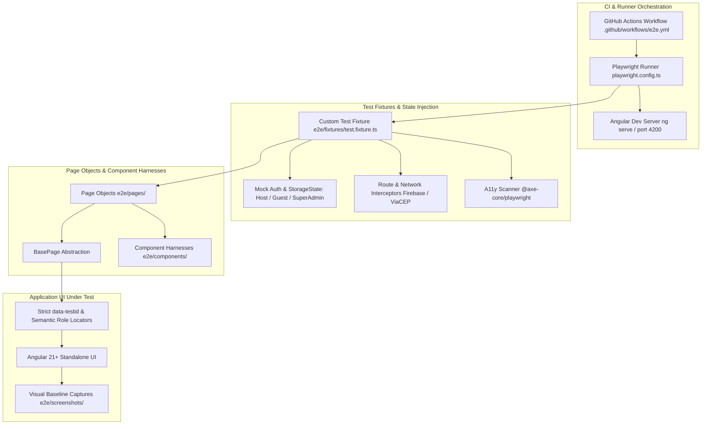

# Feature 09: Playwright E2E Full Coverage & CI Pipeline — Technical Design

**Spec**: `.specs/features/09-playwright-e2e-coverage/spec.md`  
**Status**: Draft

---

## Architecture Overview

This design outlines the technical architecture for comprehensive, production-ready End-to-End (E2E) testing of **Organiza AI** using **Microsoft Playwright**. The architecture enforces strict industry best practices: **Page Object Models (POM)**, reusable **Component Harnesses**, custom **Fixtures with Isolated State Injection**, standardized **`data-testid` locator hierarchy**, automated **WCAG 2.1 AA Accessibility Scanning** via `@axe-core/playwright`, **Visual Layout Baseline Inspection** against `DESIGN.md`, **Dual-Context Real-Time Concurrency**, and **GitHub Actions CI Pipeline Automation**.

### High-Level Architecture Flow



---

## Locator Philosophy & Strictness Standard

Following official Microsoft Playwright documentation, all element queries follow a strict two-tiered selection hierarchy, completely eliminating fragile CSS class selectors and internal framework attributes:

```
┌─────────────────────────────────────────────────────────────┐
│  Tier 1: Semantic & User-Visible Locators (Preferred)      │
│  page.getByRole(), page.getByLabel(), page.getByText()      │
├─────────────────────────────────────────────────────────────┤
│  Tier 2: Explicit Test IDs (For Cards, Containers, Lists)   │
│  page.getByTestId('login-submit-btn')                       │
├─────────────────────────────────────────────────────────────┤
│  ❌ STRICTLY FORBIDDEN ANTI-PATTERNS:                       │
│  - CSS classes: .login__google-btn, .home__title, .mat-card │
│  - Angular internals: input[formcontrolname="email"]       │
│  - Deep DOM / XPath paths: div > div:nth-child(2) > p       │
│  - Arbitrary sleeps: page.waitForTimeout(3000)              │
└─────────────────────────────────────────────────────────────┘
```

### Standard `data-testid` Naming Taxonomy (Kebab-Case)

All `data-testid` attributes added to Angular templates adhere strictly to the following taxonomy:

| Element Type | Pattern | Examples |
| ------------ | ------- | -------- |
| Page Container | `<page>-page` | `home-page`, `login-page`, `dashboard-page`, `event-editor-page`, `event-detail-page`, `profile-page` |
| Form Input | `<context>-<field>-input` | `login-email-input`, `event-title-input`, `event-cep-input`, `guest-name-input` |
| Action Button / CTA | `<context>-<action>-btn` | `login-submit-btn`, `google-login-btn`, `event-create-btn`, `rsvp-confirm-btn`, `copy-pix-btn` |
| Entity Card / ListItem | `<context>-<entity>-card` | `event-card`, `rsvp-card`, `pix-card`, `item-list-card`, `family-member-card` |
| Status / Alert / Feedback | `<context>-<type>-alert` / `<type>-state` | `login-error-alert`, `home-empty-state`, `loading-spinner`, `offline-banner` |
| Dialog / Modal / Drawer | `<name>-dialog` / `<name>-drawer` | `rsvp-dialog`, `guest-form-dialog`, `collaborator-invite-dialog`, `confirm-dialog` |
| Interactive Chip / Filter | `<context>-<filter>-chip` | `status-filter-all-chip`, `status-filter-active-chip`, `status-filter-cancelled-chip` |

---

## Code Reuse Analysis

### Existing Components to Leverage

| Component | Location | How to Use |
| --------- | -------- | ---------- |
| Playwright Test Runner | `package.json` (`@playwright/test: ^1.62.1`) | Native runner with parallel execution, web server integration, and reporters. |
| Angular Dev Server | `angular.json` / `package.json` | Web server launched on `http://localhost:4200` via `webServer` block in `playwright.config.ts`. |
| Existing Smoke Spec | `e2e/smoke.spec.ts` | Refactor to use Page Objects and `data-testid` selectors. |
| Angular Templates | `src/app/**/*.html` | Enrich with semantic `data-testid` attributes matching the taxonomy. |

### Integration Points

| System | Integration Method |
| ------ | ------------------ |
| Playwright Configuration | `playwright.config.ts` configured with `testIdAttribute: 'data-testid'`, base URL, HTML/List reporters, failure artifacts (trace, screenshot, video), and web server boot. |
| Axe Core A11y | Injected via `@axe-core/playwright` (`AxeBuilder`) into `BasePage` and custom test fixtures to run `analyze()` with WCAG 2.1 AA tags (`wcag2a`, `wcag2aa`, `wcag21a`, `wcag21aa`). |
| Angular Auth & Guards | Page Object navigation methods verify route redirects (`/login`, `/meus-eventos`, `/admin`, `/perfil`) deterministically. |
| GitHub Actions | `.github/workflows/e2e.yml` running on Ubuntu runners with Playwright browser caching and artifact upload. |

---

## Components & Page Object Models (POM)

### 1. BasePage Abstraction (`e2e/pages/base.page.ts`)

- **Purpose**: Abstract base class providing common navigation, URL verification, accessibility audit assertions, and screenshot capture.
- **Location**: `e2e/pages/base.page.ts`
- **Interfaces**:
  - `goto(path?: string): Promise<void>` - Navigates to the relative route and awaits network stability.
  - `assertLoaded(): Promise<void>` - Abstract method ensuring root container is visible.
  - `assertUrl(pattern: string | RegExp): Promise<void>` - Asserts current page URL.
  - `assertNoA11yViolations(options?: { includeRules?: string[]; excludeRules?: string[] }): Promise<void>` - Runs `@axe-core/playwright` WCAG 2.1 AA audit.
  - `captureScreenshot(name: string): Promise<void>` - Saves full-page screenshot to `e2e/screenshots/{name}.png`.
- **Dependencies**: `@playwright/test`, `@axe-core/playwright`.

### 2. HomePage (`e2e/pages/home.page.ts`)

- **Purpose**: Encapsulates public discovery, event feed browsing, theme switching, and seasonal overlays.
- **Location**: `e2e/pages/home.page.ts`
- **Interfaces**:
  - `readonly pageRoot: Locator` - Located via `getByTestId('home-page')`.
  - `readonly eventCards: Locator` - Located via `getByTestId('event-card')`.
  - `readonly emptyState: Locator` - Located via `getByTestId('home-empty-state')`.
  - `readonly themeToggleBtn: Locator` - Located via `getByTestId('theme-toggle-btn')`.
  - `readonly seasonalOverlay: Locator` - Located via `getByTestId('seasonal-overlay')`.
  - `toggleTheme(): Promise<void>` - Clicks theme toggle and verifies light/dark mode transition.
  - `clickEventCard(index: number): Promise<void>` - Clicks event card by index to navigate to `/evento/:id`.
- **Dependencies**: `BasePage`.

### 3. LoginPage (`e2e/pages/login.page.ts`)

- **Purpose**: Encapsulates authentication, email/password login/registration, Google login trigger, and verification banner.
- **Location**: `e2e/pages/login.page.ts`
- **Interfaces**:
  - `readonly emailInput: Locator` - Located via `getByTestId('login-email-input')` / `getByLabel('E-mail')`.
  - `readonly passwordInput: Locator` - Located via `getByTestId('login-password-input')` / `getByLabel('Senha')`.
  - `readonly submitBtn: Locator` - Located via `getByTestId('login-submit-btn')`.
  - `readonly googleBtn: Locator` - Located via `getByTestId('google-login-btn')`.
  - `readonly errorAlert: Locator` - Located via `getByTestId('login-error-alert')`.
  - `readonly verificationBanner: Locator` - Located via `getByTestId('email-verification-banner')`.
  - `login(email: string, password: string): Promise<void>` - Fills form and submits.
  - `loginWithGoogle(): Promise<void>` - Triggers Google sign-in.
- **Dependencies**: `BasePage`.

### 4. OrganizerDashboardPage (`e2e/pages/organizer-dashboard.page.ts`)

- **Purpose**: Encapsulates `/meus-eventos` dashboard, status filter chips, owned/collaborated event lists, and "Criar Evento" CTA.
- **Location**: `e2e/pages/organizer-dashboard.page.ts`
- **Interfaces**:
  - `readonly filterChips: Locator` - Located via `getByTestId(/status-filter-.*-chip/)`.
  - `readonly createEventBtn: Locator` - Located via `getByTestId('create-event-btn')`.
  - `readonly eventCards: Locator` - Located via `getByTestId('organizer-event-card')`.
  - `filterByStatus(status: 'Todos' | 'Ativos' | 'Encerrados' | 'Cancelados'): Promise<void>`.
  - `openEventEditor(eventId: string): Promise<void>`.
- **Dependencies**: `BasePage`.

### 5. EventEditorPage (`e2e/pages/event-editor.page.ts`)

- **Purpose**: Encapsulates `/meus-eventos/evento/novo` and `/meus-eventos/evento/:id` event creation, editing, ViaCEP auto-fill, item management, and share panel.
- **Location**: `e2e/pages/event-editor.page.ts`
- **Interfaces**:
  - `fillBasicInfo(title: string, date: string, description: string): Promise<void>`.
  - `fillCep(cep: string): Promise<void>` - Fills 8-digit CEP and awaits auto-population of address fields.
  - `saveEvent(): Promise<void>`.
  - `addWishlistItem(name: string, category: string, quantity: number): Promise<void>`.
  - `openSharePanel(): Promise<SharePanelHarness>`.
- **Dependencies**: `BasePage`, `SharePanelHarness`.

### 6. EventDetailPage (`e2e/pages/event-detail.page.ts`)

- **Purpose**: Encapsulates attendee view at `/evento/:id`, countdown timer, RSVP confirmation dialog, Pix split estimation, and wishlist item claiming.
- **Location**: `e2e/pages/event-detail.page.ts`
- **Interfaces**:
  - `readonly rsvpCard: RsvpCardHarness`.
  - `readonly itemList: ItemListHarness`.
  - `readonly pixCard: Locator` - Located via `getByTestId('pix-card')`.
  - `readonly copyPixBtn: Locator` - Located via `getByTestId('copy-pix-btn')`.
  - `readonly confettiCanvas: Locator` - Located via `getByTestId('confetti-canvas')`.
  - `openRsvpDialog(): Promise<RsvpDialogHarness>`.
  - `copyPixKey(): Promise<string>`.
- **Dependencies**: `BasePage`, `RsvpCardHarness`, `ItemListHarness`.

### 7. ProfilePage (`e2e/pages/profile.page.ts`)

- **Purpose**: Encapsulates `/perfil` user information and personal family roster manager CRUD.
- **Location**: `e2e/pages/profile.page.ts`
- **Interfaces**:
  - `readonly familyRoster: FamilyRosterHarness`.
  - `updateProfile(name: string, phone: string): Promise<void>`.
- **Dependencies**: `BasePage`, `FamilyRosterHarness`.

---

## Component Harnesses (`e2e/components/`)

1. **`RsvpDialogHarness` (`e2e/components/rsvp-dialog.harness.ts`)**:
   - Manages modal RSVP confirmation, 1-touch Google RSVP, contact phone input, and family batch selector.
   - Encapsulates focus trapping and Escape key closing assertions.
2. **`ItemListHarness` (`e2e/components/item-list.harness.ts`)**:
   - Manages wishlist item claim toggle, unclaim action, and remaining item count assertion.
3. **`SharePanelHarness` (`e2e/components/share-panel.harness.ts`)**:
   - Manages QR code canvas verification, WhatsApp link generation inspection (`https://api.whatsapp.com/send?text=...`), copy link CTA, and collaborator email invite.
4. **`FamilyRosterHarness` (`e2e/components/family-roster.harness.ts`)**:
   - Manages adding, editing, and deleting family members in profile view.
5. **`ConfirmDialogHarness` (`e2e/components/confirm-dialog.harness.ts`)**:
   - Manages confirmation/cancellation triggers for destructive operations (event cancellation, item deletion).

---

## Custom Test Fixture Architecture (`e2e/fixtures/test.fixture.ts`)

```typescript
import { test as base, expect } from '@playwright/test';
import { HomePage } from '../pages/home.page';
import { LoginPage } from '../pages/login.page';
import { OrganizerDashboardPage } from '../pages/organizer-dashboard.page';
import { EventEditorPage } from '../pages/event-editor.page';
import { EventDetailPage } from '../pages/event-detail.page';
import { ProfilePage } from '../pages/profile.page';
import AxeBuilder from '@axe-core/playwright';

type AppFixtures = {
  homePage: HomePage;
  loginPage: LoginPage;
  dashboardPage: OrganizerDashboardPage;
  eventEditorPage: EventEditorPage;
  eventDetailPage: EventDetailPage;
  profilePage: ProfilePage;
  makeAxeBuilder: () => AxeBuilder;
};

export const test = base.extend<AppFixtures>({
  homePage: async ({ page }, use) => { await use(new HomePage(page)); },
  loginPage: async ({ page }, use) => { await use(new LoginPage(page)); },
  dashboardPage: async ({ page }, use) => { await use(new OrganizerDashboardPage(page)); },
  eventEditorPage: async ({ page }, use) => { await use(new EventEditorPage(page)); },
  eventDetailPage: async ({ page }, use) => { await use(new EventDetailPage(page)); },
  profilePage: async ({ page }, use) => { await use(new ProfilePage(page)); },
  makeAxeBuilder: async ({ page }, use) => {
    const makeBuilder = () => new AxeBuilder({ page }).withTags(['wcag2a', 'wcag2aa', 'wcag21a', 'wcag21aa']);
    await use(makeBuilder);
  },
});

export { expect };
```

---

---

## Critical UI/UX Specialist Visual & Heuristic Inspection Protocol

Per Story 6 (PW-21, PW-22), the AI agent acts as a **Senior UI/UX Specialist**, systematically auditing every full-page screenshot captured in `e2e/screenshots/` against **Jakob Nielsen's 10 Usability Heuristics** and the **Vibrant Modernism Design System (`DESIGN.md`)**.

### 1. Nielsen's 10 Usability Heuristics Mapping to Organiza AI

| # | Nielsen Heuristic | Organiza AI UI/UX Inspection Standard | Verified In Views |
| - | ----------------- | ------------------------------------- | ----------------- |
| **1** | **Visibility of System Status** | Spinners (`mat-spinner`), disabled buttons with loading indicators, instant toast feedback for Pix copy and WhatsApp sharing, skeleton shimmer on Slow 3G. | Home, Login, Event Editor, RSVP Dialog |
| **2** | **Match Between System & Real World** | Natural festive vocabulary ("Eventos", "Rachadinha com Meta", "Adicionar Família", "Confirmar Presença"), calendar and map marker iconography. | Event Detail, Dashboard, RSVP Modal |
| **3** | **User Control & Freedom** | Modal dismissal via `Escape` key and backdrop click, clear "Cancelar" actions, ability to unclaim items, non-destructive back navigation. | RSVP Modal, Collaborator Dialog, Confirm Dialog |
| **4** | **Consistency & Standards** | Strict adherence to `DESIGN.md`: `--org-primary`, `--org-surface`, typography (`Plus Jakarta Sans`), 8px/16px/24px spatial grid, uniform button hierarchy. | All views (Desktop & Mobile) |
| **5** | **Error Prevention** | Submit button disabled when forms are invalid, 8-digit CEP masking, confirmation dialogs before event cancellation or item deletion. | Event Editor, Login, Delete Dialog |
| **6** | **Recognition Rather Than Recall** | Pre-populated user name/phone in RSVP dialog, visible countdown timers (7d/1d), clear persistent field labels (not placeholder-only). | RSVP Dialog, Profile, Event Detail |
| **7** | **Flexibility & Efficiency of Use** | 1-touch verified Google RSVP, 1-click Pix copy with visual feedback, batch family roster selection, keyboard navigation (`Space`/`Enter`/`Tab`). | Event Detail, Profile, RSVP Modal |
| **8** | **Aesthetic & Minimalist Design** | Uncluttered Glassmorphism cards, zero visual noise, balanced whitespace, floating background orbs positioned without obscuring text. | Home, Login, Event Cards |
| **9** | **Recognize, Diagnose & Recover from Errors** | Clear inline `mat-error` messages ("E-mail é obrigatório", "Mínimo 6 caracteres", "CEP não encontrado"), non-blocking verification banner with resend timer. | Login, Event Editor, Auth Banner |
| **10** | **Help & Documentation** | Empty state illustrations with actionable prompts ("Nenhum evento disponível no momento"), helper hints under complex fields. | Home Empty State, Dashboard Empty State |

### 2. UI/UX Specialist Visual Quality Checklist

When evaluating captured screenshots in `e2e/screenshots/`, the agent inspects the following visual criteria:

1. **Alignment & Grid Rhythm**: Form fields vertically aligned with consistent 16px/24px gaps; card grids balanced without orphan elements.
2. **Typography Scale**: Display headings (`display-lg`: 48px/36px), Section titles (`headline-sm`: 24px), Body (`body-md`: 16px), Labels (`label-bold`: 14px) strictly matching `DESIGN.md`.
3. **Color Contrast & Luminance**: Text passes WCAG 2.1 AA contrast ratio (>= 4.5:1 for body text on Glassmorphism surfaces, >= 3:1 for large headlines and UI icons).
4. **Glassmorphism & Depth Quality**: Backdrop blur (`backdrop-filter: blur(12px)`), translucent border highlights (`rgba(255, 255, 255, 0.2)`), subtle surface shadows without clipping.
5. **Mobile Touch Target Ergonomics**: All interactive elements (buttons, chips, inputs, toggles) have a minimum clickable area of 48px x 48px on mobile viewports (375px / 412px).
6. **Sticky Action Bar Positioning**: On mobile viewports, the floating RSVP / CTA footer remains anchored above bottom navigation without obscuring card content.

### 3. Baseline Screenshot Milestone Matrix

| Journey / Milestone | Screenshot Output Path | Primary Heuristics & Design Checks |
| ------------------- | ---------------------- | ---------------------------------- |
| Home (Light Mode) | `e2e/screenshots/01-home-light.png` | Heuristics 4, 8, 10: Glassmorphism borders, empty state / card grid, light theme tokens. |
| Home (Dark Mode) | `e2e/screenshots/01-home-dark.png` | Heuristics 4, 8: Dark mode contrast, purple surface tint, theme toggle icon. |
| Login / Register (Desktop) | `e2e/screenshots/02-login-desktop.png` | Heuristics 1, 5, 9: Input alignment, floating orbs depth, inline mat-error states. |
| Login (Mobile 375px) | `e2e/screenshots/02-login-mobile.png` | Heuristics 7, 8: Responsive scaling, Google OAuth button 48px touch target. |
| Organizer Dashboard | `e2e/screenshots/03-dashboard-filters.png` | Heuristics 1, 4, 7: Status filter chips spacing, event card status badges. |
| Event Creation & ViaCEP | `e2e/screenshots/04-event-editor-cep.png` | Heuristics 1, 5, 6: ViaCEP auto-populated address layout, datepicker trigger. |
| Event Detail & RSVP Modal | `e2e/screenshots/05-event-detail-rsvp.png` | Heuristics 3, 6, 7: Modal backdrop blur, focus trap ring, 1-click Pix copy styling. |
| Profile & Family Roster | `e2e/screenshots/06-profile-family.png` | Heuristics 2, 7: Family member card list, add member chip, delete action alignment. |
| Mobile Viewport (375px) | `e2e/screenshots/07-mobile-viewport.png` | Heuristics 4, 7, 8: Sticky RSVP footer bar, drawer touch boundaries, 48px tap targets. |


---

## Directory Structure

```
organizaai/
├── .github/
│   └── workflows/
│       └── e2e.yml                      # GitHub Actions Playwright CI Workflow
├── e2e/
│   ├── components/                      # Reusable Component Harnesses
│   │   ├── collaborator-invite.harness.ts
│   │   ├── confirm-dialog.harness.ts
│   │   ├── family-roster.harness.ts
│   │   ├── item-list.harness.ts
│   │   ├── rsvp-dialog.harness.ts
│   │   └── share-panel.harness.ts
│   ├── fixtures/
│   │   └── test.fixture.ts              # Extended Playwright fixture
│   ├── pages/                           # Page Object Models (POM)
│   │   ├── base.page.ts
│   │   ├── event-detail.page.ts
│   │   ├── event-editor.page.ts
│   │   ├── home.page.ts
│   │   ├── login.page.ts
│   │   ├── organizer-dashboard.page.ts
│   │   └── profile.page.ts
│   ├── screenshots/                     # Visual baseline captures against DESIGN.md
│   │   └── .gitkeep
│   ├── specs/                           # E2E Test Suites covering all 15 stories
│   │   ├── 01-home-theming.spec.ts      # PW-04, PW-05, PW-20
│   │   ├── 02-auth-guards.spec.ts       # PW-06, PW-07
│   │   ├── 03-event-lifecycle.spec.ts   # PW-08, PW-09
│   │   ├── 04-guest-rsvp.spec.ts        # PW-10, PW-11, PW-12, PW-13
│   │   ├── 05-profile-family.spec.ts    # PW-14
│   │   ├── 06-collaborator-rbac.spec.ts # PW-15, PW-16
│   │   ├── 07-visual-layout.spec.ts     # PW-21, PW-22
│   │   ├── 08-keyboard-a11y.spec.ts     # PW-29, PW-30
│   │   ├── 09-multi-user-sync.spec.ts   # PW-23, PW-24 (Dual-context)
│   │   ├── 10-share-qr.spec.ts          # PW-27, PW-28
│   │   ├── 11-pwa-offline.spec.ts       # PW-25, PW-26
│   │   └── 12-network-loading.spec.ts   # PW-31
│   └── smoke.spec.ts                    # Refactored Smoke suite
└── playwright.config.ts                 # Full Playwright configuration
```

---

## Playwright MCP Diagnosis & Remedy

### Problem
In `~/.gemini/antigravity/mcp_config.json`, the server was defined without `-y` and required plugin metadata:
```json
"playwright": {
  "command": "npx",
  "args": [
    "@playwright/mcp@latest"
  ]
}
```
In non-interactive stdio daemon mode, running `npx` without `-y` will hang on package installation prompt, and missing `$typeName` prevents Antigravity from registering the server.

### Solution
Update `~/.gemini/antigravity/mcp_config.json` with:
```json
"playwright": {
  "$typeName": "exa.cascade_plugins_pb.CascadePluginCommandTemplate",
  "command": "npx",
  "args": [
    "-y",
    "@playwright/mcp@latest",
    "--headless"
  ],
  "env": {}
}
```

---

## Error Handling Strategy

| Error Scenario | Handling | User / Test Impact |
| -------------- | -------- | ------------------ |
| Element not found or locator ambiguous | Playwright strict mode throws immediately with full matching DOM snapshot. | Test fails fast with clear selector collision report rather than timing out silently. |
| Slow rendering or async Signal update | Web-First assertions (`expect(locator).toBeVisible()`) auto-retry up to configured timeout (10s). | Eliminates test flakiness due to hydration or network latency. |
| Accessibility violation found | `@axe-core/playwright` formats violation list including node snippets, impact level, and WCAG criterion failure. | Test fails with exact line and remediation suggestion. |
| Dev server not ready during CI run | `playwright.config.ts` `webServer` waits up to 120s with healthcheck on `http://localhost:4200`. | CI builds reliably without race conditions between `ng serve` and test execution. |

---

## Risks & Concerns

| Concern | Location (file:line) | Impact | Mitigation |
| ------- | -------------------- | ------ | ---------- |
| Fragile class selectors in current smoke test | `e2e/smoke.spec.ts:8,21,30` | Smoke tests break if CSS classes change during UI redesigns. | Refactor `e2e/smoke.spec.ts` to use Page Object Models and `data-testid` locators. |
| Missing `data-testid` on Angular templates | `src/app/features/**/*.html` | Tests cannot use `getByTestId()` without adding attributes to HTML. | Add standardized `data-testid` attributes across all feature templates. |
| Playwright MCP server inactive in agent session | `~/.gemini/antigravity/mcp_config.json:44` | AI agent cannot invoke live Playwright browser actions via MCP tools directly. | Provide exact configuration correction (`$typeName`, `-y`, `--headless`). |

---

## Tech Decisions (only non-obvious ones)

| Decision | Choice | Rationale |
| -------- | ------ | --------- |
| Test ID Attribute Standard | `data-testid` | Playwright default and industry standard HTML5 data-attribute; avoids custom selector engine overhead. |
| Assertion Strategy | Playwright Web-First Assertions (`expect(locator)...`) | Built-in auto-retry, element polling, and detailed actionable diffs without arbitrary sleeps. |
| Page Object Exposure in Tests | Custom Playwright Fixtures via `test.extend` | Eliminates manual `new PageObject(page)` boilerplate across every spec. |
| Accessibility Engine | `@axe-core/playwright` (`AxeBuilder`) | Directly enforces project WCAG 2.1 AA mandatory rule in live browser context. |
| Real-Time Concurrency Verification | Dual `BrowserContext` instances in a single spec | Accurately tests live Firestore streaming between Host and Attendee sessions. |
| Visual Inspection Workflow | Full-page milestone screenshots saved to `e2e/screenshots/` + inspection against `DESIGN.md` | Catches visual regressions and padding bugs without expensive visual SaaS dependencies. |
