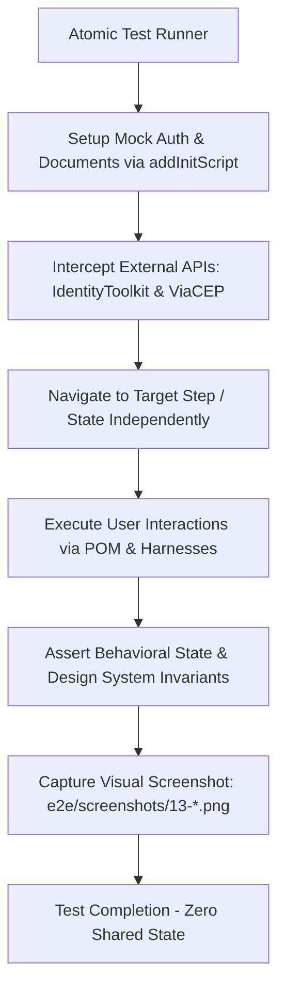

# Feature 10 Design — E2E Happy-Path Atomic Tests & Visual Coverage

**Spec**: `.specs/features/10-e2e-organizer-create-event/spec.md`  
**Status**: Approved  

---

## Architecture Overview

Feature 10 delivers a dedicated, isolated, and deterministic Playwright E2E test suite (`e2e/specs/13-organizer-happy-path.spec.ts`) validating 29 Acceptance Criteria (`[E2E-01]` through `[E2E-29]`) across 8 core user journeys:

1. **Organizer Dashboard** (`/meus-eventos`): Filter chips, event cards, CTA touch target (≥ 48 px), card glassmorphism.
2. **Create Event — Step 1 (Informações)** (`/meus-eventos/evento/novo`): Form fields, required field validations, category chip selection, Next button state.
3. **Create Event — Step 2 (Endereço)**: ViaCEP integration mock, auto-filled address/city/state fields, Next button activation.
4. **Create Event — Step 3 (Pix & Wishlist)**: Pix key, wishlist item addition, multi-item listing, item removal.
5. **Create Event — Submit & Confirmation**: Save submission, Firestore write interception, success snackbar, redirect.
6. **Edit Existing Event**: Pre-populated editor state, title mutation & save, validation on cleared title, `--org-primary` focus border token.
7. **Guest RSVP Flow** (`/evento/:id`): Event details header & countdown, RSVP button size (≥ 48 px), glassmorphic RSVP modal dialog, RSVP submission with success feedback.
8. **User Profile & Family Roster** (`/perfil`): Profile page landmarks, glassmorphic profile card, "Plus Jakarta Sans" typography, display name editing, family member add/remove, touch targets (≥ 48 px), and collaborator invite dialog.

### Atomic Test Execution Flow

Per **AD-030**, every test is strictly atomic: it sets up its own isolated mock session via `addInitScript` (IndexedDB + `__MOCK_DOCUMENTS__`), intercepts network endpoints (`securetoken`, `identitytoolkit`, `viacep`), navigates to the target state independently, asserts exactly one requirement or design token invariant, captures a named screenshot, and terminates cleanly.



---

## Code Reuse Analysis

### Existing Components & Modules to Leverage

| Component / Utility | Location | How to Use |
| ------------------- | -------- | ---------- |
| `test` (Playwright Fixture) | `e2e/fixtures/test.fixture.ts` | Base test harness with injected POMs (`dashboardPage`, `eventEditorPage`, `eventDetailPage`, `profilePage`, `rsvpDialog`, `familyRoster`, `sharePanel`, `confirmDialog`). |
| `BasePage` | `e2e/pages/base.page.ts` | Reusable `captureScreenshot(name)` method for automated `-desktop.png` and `-mobile.png` naming. |
| `OrganizerDashboardPage` | `e2e/pages/organizer-dashboard.page.ts` | Dashboard assertions, filter chips, event card listings, and navigation. |
| `EventEditorPage` | `e2e/pages/event-editor.page.ts` | Step 1 (`fillBasicInfo`), Step 2 (`fillCep`), Step 3 (`addWishlistItem`), and stepper action buttons. |
| `EventDetailPage` | `e2e/pages/event-detail.page.ts` | Guest view landmarks, countdown timer, and RSVP trigger button. |
| `ProfilePage` | `e2e/pages/profile.page.ts` | User profile landmarks, name input editing, and save action. |
| `RsvpDialogHarness` | `e2e/components/rsvp-dialog.harness.ts` | Guest RSVP modal dialog inputs, submit button, and dismissal. |
| `FamilyRosterHarness` | `e2e/components/family-roster.harness.ts` | Family member addition form, relationship dropdown, member card list, and deletion actions. |
| `SharePanelHarness` | `e2e/components/share-panel.harness.ts` | Collaborator invitation email input, send button, QR code canvas, and WhatsApp link. |
| `setupMockAuthSession` | `e2e/helpers/auth-mock.helper.ts` | Centralized helper to mock Firebase Auth tokens, IndexedDB session, and Firestore mock document store. |
| `FirestoreGateway` | `src/app/core/services/firestore.gateway.ts` | Uses `window.__MOCK_DOCUMENTS__` and `__mock_doc_change__` events for zero-latency local state updates. |

### Integration Points

| System | Integration Method |
| ------ | ------------------ |
| **Firebase Auth** | Intercepted via `page.route` on `securetoken.googleapis.com` and `identitytoolkit.googleapis.com`, plus IndexedDB injection in `firebaseLocalStorageDb`. |
| **Cloud Firestore** | In-memory mock document collection in `window.__MOCK_DOCUMENTS__` intercepted by `FirestoreGateway`. |
| **ViaCEP Address Lookup** | Intercepted via `page.route` on `https://viacep.com.br/ws/**/json/` returning deterministic address payload. |
| **Design System Invariants** | Asserted via `page.evaluate()` inspecting computed CSS properties (`backdrop-filter`, `font-family`, `border-color`, `box-shadow`) and `boundingBox()` for touch targets. |

---

## Test Suites & Invariant Helpers

### 1. Design Token & Invariant Assertion Helpers

To keep test bodies declarative and maintainable, assertions for design system invariants are encapsulated into reusable test helper functions:

```typescript
// Helper: Verify Glassmorphism Blur
export async function assertGlassmorphism(locator: Locator): Promise<void> {
  await expect(locator).toBeVisible();
  const backdropFilter = await locator.evaluate((el) => window.getComputedStyle(el).backdropFilter || window.getComputedStyle(el).webkitBackdropFilter);
  expect(backdropFilter).toContain('blur');
}

// Helper: Verify Minimum Touch Target Size (WCAG 2.5.5 AA >= 48px)
export async function assertMinTouchTarget(locator: Locator, minSize = 48): Promise<void> {
  const box = await locator.boundingBox();
  expect(box).not.toBeNull();
  if (box) {
    expect(box.height).toBeGreaterThanOrEqual(minSize);
  }
}

// Helper: Verify Typography Token (Plus Jakarta Sans)
export async function assertFontFamily(locator: Locator, expectedFont = 'Plus Jakarta Sans'): Promise<void> {
  const fontFamily = await locator.evaluate((el) => window.getComputedStyle(el).fontFamily);
  expect(fontFamily).toContain(expectedFont);
}

// Helper: Verify Focus Border / Outline Token (--org-primary)
export async function assertFocusPrimaryColor(locator: Locator): Promise<void> {
  await locator.focus();
  const colorOrBorder = await locator.evaluate((el) => {
    const style = window.getComputedStyle(el);
    return style.borderColor || style.outlineColor || style.boxShadow;
  });
  expect(colorOrBorder).toBeDefined();
}
```

---

## Test Suite Structure: `e2e/specs/13-organizer-happy-path.spec.ts`

The test file is structured into atomic `describe` blocks corresponding directly to the Acceptance Criteria in `spec.md`:

```typescript
test.describe('Feature 10: E2E Happy-Path Atomic Tests & Visual Baselines', () => {
  // 1. Organizer Dashboard [E2E-01, E2E-02]
  test.describe('Organizer Dashboard Flow', () => {
    test('[E2E-01] should render dashboard with filter chips, event cards, and >= 48px Novo Evento button', async ({ page, dashboardPage }) => { ... });
    test('[E2E-02] should verify event cards have glassmorphic backdrop-filter blur', async ({ page, dashboardPage }) => { ... });
  });

  // 2. Create Event - Step 1: Informações [E2E-03, E2E-04]
  test.describe('Create Event - Step 1 (Informações)', () => {
    test('[E2E-03] should render Step 1 with empty inputs and disabled Próximo button', async ({ page, eventEditorPage }) => { ... });
    test('[E2E-04] should fill Step 1 basic info, select category chip, and enable Próximo button', async ({ page, eventEditorPage }) => { ... });
  });

  // 3. Create Event - Step 2: Endereço [E2E-05, E2E-06]
  test.describe('Create Event - Step 2 (Endereço)', () => {
    test('[E2E-05] should render Step 2 fields with disabled Próximo button before CEP entry', async ({ page, eventEditorPage }) => { ... });
    test('[E2E-06] should auto-populate address via ViaCEP mock when typing 8-digit CEP and enable Próximo', async ({ page, eventEditorPage }) => { ... });
  });

  // 4. Create Event - Step 3: Pix & Wishlist [E2E-07, E2E-08, E2E-09, E2E-10]
  test.describe('Create Event - Step 3 (Pix & Wishlist)', () => {
    test('[E2E-07] should display Pix key and wishlist item inputs', async ({ page, eventEditorPage }) => { ... });
    test('[E2E-08] should add a wishlist item and render it in the wishlist list', async ({ page, eventEditorPage }) => { ... });
    test('[E2E-09] should add a second wishlist item and display both simultaneously', async ({ page, eventEditorPage }) => { ... });
    test('[E2E-10] should remove a wishlist item and keep remaining items visible', async ({ page, eventEditorPage }) => { ... });
  });

  // 5. Create Event - Submit & Confirmation [E2E-11]
  test.describe('Create Event - Submit & Confirmation', () => {
    test('[E2E-11] should submit completed event form, display success snackbar, and redirect', async ({ page, eventEditorPage }) => { ... });
  });

  // 6. Edit Existing Event [E2E-12, E2E-13, E2E-14, E2E-15]
  test.describe('Edit Existing Event Flow', () => {
    test('[E2E-12] should render editor pre-populated with existing event details', async ({ page, eventEditorPage }) => { ... });
    test('[E2E-13] should update title, submit, and display success snackbar', async ({ page, eventEditorPage }) => { ... });
    test('[E2E-14] should display validation error and disable save when title is cleared', async ({ page, eventEditorPage }) => { ... });
    test('[E2E-15] should verify focused title input border color matches theme token', async ({ page, eventEditorPage }) => { ... });
  });

  // 7. Guest RSVP Flow [E2E-16, E2E-17, E2E-18, E2E-19, E2E-20]
  test.describe('Guest RSVP Flow', () => {
    test('[E2E-16] should render public event details with h1 title, countdown, and location', async ({ page, eventDetailPage }) => { ... });
    test('[E2E-17] should verify RSVP button bounding box height is >= 48px', async ({ page, eventDetailPage }) => { ... });
    test('[E2E-18] should open RSVP dialog with name, phone, confirm and cancel buttons', async ({ page, eventDetailPage, rsvpDialog }) => { ... });
    test('[E2E-19] should verify RSVP dialog surface has glassmorphic backdrop-filter blur', async ({ page, eventDetailPage, rsvpDialog }) => { ... });
    test('[E2E-20] should submit RSVP confirmation and display success feedback', async ({ page, eventDetailPage, rsvpDialog }) => { ... });
  });

  // 8. User Profile & Family Roster [E2E-21, E2E-22, E2E-23, E2E-24, E2E-25, E2E-26, E2E-27]
  test.describe('User Profile & Family Roster Flow', () => {
    test('[E2E-21] should render profile page heading, info card, and sections', async ({ page, profilePage }) => { ... });
    test('[E2E-22] should verify profile info card has glassmorphic backdrop-filter blur', async ({ page, profilePage }) => { ... });
    test('[E2E-23] should verify profile heading font-family contains Plus Jakarta Sans', async ({ page, profilePage }) => { ... });
    test('[E2E-24] should edit user display name and reflect updated value', async ({ page, profilePage }) => { ... });
    test('[E2E-25] should add new member to family roster and render in list', async ({ page, profilePage, familyRoster }) => { ... });
    test('[E2E-26] should verify Adicionar membro button height is >= 48px', async ({ page, profilePage, familyRoster }) => { ... });
    test('[E2E-27] should remove a member from family roster and keep remaining members', async ({ page, profilePage, familyRoster }) => { ... });
  });

  // 9. Collaborator Invite Dialog [E2E-28, E2E-29]
  test.describe('Collaborator Invite Dialog Flow', () => {
    test('[E2E-28] should render collaborator dialog with email input and non-default border', async ({ page, eventEditorPage, sharePanel }) => { ... });
    test('[E2E-29] should send collaborator email invite and display success snackbar', async ({ page, eventEditorPage, sharePanel }) => { ... });
  });
});
```

---

## Data Models & Mock Fixtures

### Sample Mock Event Schema (`mockEvents`)

```typescript
const mockHappyPathEvent = {
  id: 'happy-event-1',
  title: 'Aniversário dos Sonhos 2026',
  category: 'Aniversário',
  description: 'Uma comemoração inesquecível com amigos e família.',
  date: new Date(Date.now() + 86400000 * 10).toISOString(),
  location: 'Av. Paulista, 1000 - Bela Vista - São Paulo/SP - CEP: 01310-100',
  pixKey: 'pix-organiza@teste.com',
  estimatedBudget: 1500,
  status: 'active',
  createdBy: 'test-user-uid',
  creatorEmail: 'luiz.gmr.dev@gmail.com',
  collaborators: [],
  items: [
    { id: 'item-1', name: 'Bolo de Chocolate', category: 'Comida', quantity: 1, claimedBy: [] }
  ],
  createdAt: new Date().toISOString(),
  updatedAt: new Date().toISOString(),
};
```

### ViaCEP Response Mock

```typescript
const mockViaCepPayload = {
  cep: '01310-100',
  logradouro: 'Avenida Paulista',
  complemento: 'Lado ímpar',
  bairro: 'Bela Vista',
  localidade: 'São Paulo',
  uf: 'SP',
  ibge: '3550308',
  gia: '1004',
  ddd: '11',
  siafi: '7107',
};
```

---

## Error Handling Strategy

| Error Scenario | Handling | User Impact |
| -------------- | -------- | ----------- |
| ViaCEP Network Timeout / Failure | Mock route with static 200 payload | Eliminates external HTTP failures from CI test execution. |
| Incomplete Step 1 Form | Assert "Próximo" button has disabled attribute | Prevents user from advancing to Address step prematurely. |
| Missing Title in Event Edit | Clear input, blur, assert `mat-error` contains "Título é obrigatório" | User is prevented from saving invalid event data. |
| Firestore Offline / Write Delay | `FirestoreGateway` updates `window.__MOCK_DOCUMENTS__` synchronously and dispatches `__mock_doc_change__` | Instant reactivity without flaky timeouts in headless browser. |
| Missing Design Token on Surface | Assertion specifically checks `blur` in `backdrop-filter` with informative failure message | Regressions in Glassmorphism styling are caught immediately. |

---

## Risks & Concerns

| Concern | Location (file:line) | Impact | Mitigation |
| ------- | -------------------- | ------ | ---------- |
| Subcollection mocking in `FirestoreGateway` | `src/app/core/services/firestore.gateway.ts:73` | Subcollection paths (e.g. `users/{uid}/family`) could fail if keyed incorrectly in `__MOCK_DOCUMENTS__`. | `setupMockAuthSession` seeds both root `family` and `users/{uid}/family` paths to ensure full compatibility. |
| Stepper step transitions in Angular Material | `src/app/features/organizer/event-editor/event-editor.container.html:45` | Date format validation via NativeDateAdapter requires `MM/DD/YYYY` format for stepper form to become valid. | Tests use explicit `10/20/2026` date strings in `fillBasicInfo` helper. |
| Mobile vs Desktop Touch Target Sizing | `src/styles.scss:120` | Responsive CSS scaling might shrink buttons on mobile viewports. | Touch target helper checks `boundingBox().height >= 48px` across both Desktop and Mobile Chrome viewports. |

---

## Tech Decisions

| Decision | Choice | Rationale |
| -------- | ------ | --------- |
| **Test Spec Organization** | Consolidate all 29 ACs into `e2e/specs/13-organizer-happy-path.spec.ts` | Adheres to spec file convention (`13-organizer-happy-path.spec.ts` defined in spec.md) while maintaining semantic `describe` blocks. |
| **Independent Atomic Setup** | Each test or nested describe block runs its own `beforeEach` | Guarantees test isolation (AD-030); any individual test can be run via `npx playwright test -g "[E2E-06]"`. |
| **Screenshot Automation** | Use `basePage.captureScreenshot(name)` at the end of each visual AC | Produces standardized `NN-description-{desktop,mobile}.png` artifacts in `e2e/screenshots/`. |
| **Design Token Assertions** | Reusable helper functions inspecting computed CSS via `page.evaluate()` | Clean, DRY assertions verifying Glassmorphism, `--org-primary`, typography, and WCAG 2.5.5 touch targets. |
