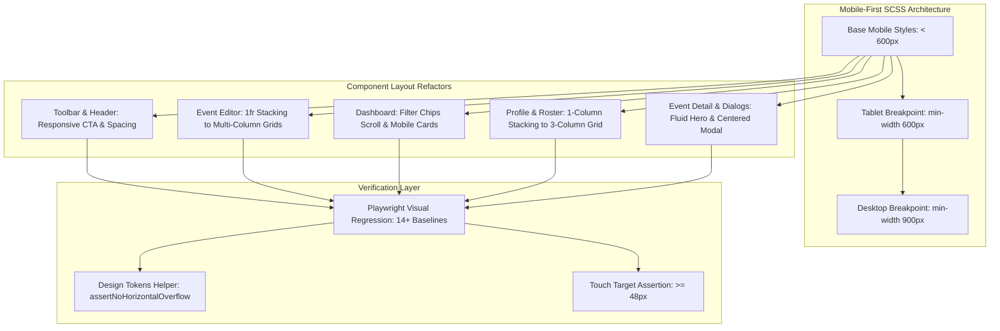

# Feature 11 Design — Visual Screenshot Audit & Responsive Layout Fixes (Mobile-First)

**Spec**: `.specs/features/11-visual-screenshot-audit-and-layout-fixes/spec.md`  
**Status**: Approved  

---

## Architecture Overview

This design defines the technical architecture for refactoring the UI layout across Organiza AI to follow a strict **Mobile-First SCSS** paradigm while preserving the **Vibrant Modernism / Glassmorphism** design system and achieving 100% WCAG 2.1 AA accessibility compliance.



### Approach Exploration

| Approach | Pros | Cons | Recommendation |
| --- | --- | --- | --- |
| **Approach 1: Strict Mobile-First SCSS + Media Query Progressive Enhancement** | Clean CSS hierarchy, zero unnecessary desktop overrides on mobile, eliminates horizontal blowout at the root, conforms with Angular Material MDC tokens. | Requires auditing each component's grid and flex containers. | **Recommended ⭐** |
| **Approach 2: Desktop-First with `max-width` media queries** | Faster to patch specific mobile bugs with quick overrides. | High specificity battles, prone to CSS regressions, violates mobile-first standard. | Not recommended |
| **Approach 3: Utility classes framework / helper classes** | Reusable class names for grids. | Diverges from SCSS BEM standard (AD-007) and risks style leakage. | Not recommended |

---

## Code Reuse Analysis

### Existing Components & Styles to Leverage

| Component / Asset | Location | How to Use |
| --- | --- | --- |
| `--org-*` CSS Tokens | `src/styles.scss` | Reuse glassmorphism (`--org-glass-bg`, `--org-glass-blur`, `--org-gradient-border`), brand gradients, and typography tokens. |
| MDC 3 Form Tokens | `src/styles.scss` | Maintain `--mdc-outlined-text-field-*`, `--mdc-dialog-*`, and `--mat-menu-*` without `!important` hacks (AD-028). |
| `EventFiltersComponent` | `src/app/features/organizer/dashboard/components/event-filters/` | Reuse existing chip markup with updated mobile-first horizontal scroll and 48px touch target padding. |
| `FamilyRosterManagerComponent` | `src/app/features/profile/components/family-roster-manager/` | Reuse existing reactive signals form and enhance responsive grid stacking. |
| `DesignTokensHelper` | `e2e/helpers/design-tokens.helper.ts` | Extend helper with `assertNoHorizontalOverflow(page)` to systematically verify mobile screens. |
| Playwright Test Fixtures | `e2e/fixtures/test.fixture.ts` | Re-use Page Object Models (`HomePage`, `LoginPage`, `EventEditorPage`, etc.) for generating desktop and mobile screenshots. |

### Integration Points

| System / Module | Integration Method |
| --- | --- |
| Angular Material Stepper | Customize `.mat-horizontal-stepper-header-container` padding and horizontal scroll behavior in `event-editor.container.scss`. |
| Angular Material Dialog | Target `.mdc-dialog__surface` via `src/styles.scss` for 28px border-radius and glassmorphism backdrop blur. |
| Playwright E2E Runner | `npm run test:e2e` executes both Chromium (1280x720) and Mobile Chrome (375x667 / 390x844) projects, capturing visual screenshot baselines in `e2e/screenshots/`. |

---

## Components & Layout Modules

### 1. Toolbar & App Header (`src/app/app.html`, `src/app/app.scss`)

- **Purpose**: Render responsive brand navigation, theme toggle, user profile dropdown, and authentication CTA without mobile text clipping or horizontal overflow.
- **Location**: `src/app/app.html`, `src/app/app.scss`
- **Mobile-First Changes**:
  - `app-toolbar__login-btn`: On mobile (`< 480px`), render compact CTA label ("Entrar") or hide redundant text, maintaining min touch target height of 48px (`min-height: 48px`).
  - Viewport Edge Padding: Maintain minimum 8px padding (`padding-inline: 8px`) on mobile, scaling to 16px on desktop.
  - Dark Theme: Maintain dark glassmorphic styling (`--org-glass-bg: rgba(31, 26, 29, 0.7)` and `backdrop-filter: blur(16px)`).

### 2. Event Editor Stepper & Address Form (`src/app/features/admin/event-editor/event-editor.container.scss`)

- **Purpose**: Provide responsive 3-step event creation and editing wizard with zero mobile horizontal blowout.
- **Location**: `src/app/features/admin/event-editor/event-editor.container.scss`
- **Mobile-First Changes**:
  - `editor__stepper`: Set header container padding to `12px 8px` on mobile, enabling native smooth horizontal scrolling for stepper headers without expanding document width.
  - `editor__date-time-row`: Base style `grid-template-columns: 1fr` (vertical stacking). On `@media (min-width: 600px)`, expand to `grid-template-columns: 2fr 1fr`.
  - `editor__address-row-top`: Base style `grid-template-columns: 1fr` (CEP and Number stacked). On `@media (min-width: 600px)`, expand to `grid-template-columns: 1fr 1fr`.
  - `editor__address-row`: Base style `grid-template-columns: 1fr` (Bairro and Cidade/UF stacked). On `@media (min-width: 600px)`, expand to `grid-template-columns: 2fr 1fr`.
  - `editor__form`: Padding `24px 12px` on mobile, scaling to `40px 32px` on tablet/desktop (`min-width: 600px`).

### 3. Organizer Dashboard & Filter Chips (`src/app/features/admin/dashboard/`, `src/app/features/organizer/dashboard/components/event-filters/`)

- **Purpose**: Adapt event feed, filter chips, and management actions seamlessly between thumb-friendly mobile cards and desktop data tables.
- **Location**: `src/app/features/organizer/dashboard/components/event-filters/event-filters.component.scss`, `src/app/features/admin/dashboard/dashboard.container.scss`
- **Mobile-First Changes**:
  - `event-filters`: `overflow-x: auto`, `scrollbar-width: none`, `-webkit-overflow-scrolling: touch`, `max-width: 100%`, flex nowrap.
  - `event-filters__item`: Touch target height `min-height: 48px`, padding `0.5rem 1rem`, `font-size: 0.875rem`.
  - `dashboard__mobile-cards`: Rendered exclusively on mobile (`< 768px`) with stacked metadata and 48px touch-friendly action buttons.
  - `dashboard__table-wrapper`: Rendered on desktop (`min-width: 768px`) with glassmorphic table styles.
  - "Novo Evento" Button: Ensure `min-height: 48px` across both viewports.

### 4. Profile & Family Roster (`src/app/features/profile/`)

- **Purpose**: Deliver accessible profile management and multi-member family registration with responsive forms.
- **Location**: `src/app/features/profile/profile.container.scss`, `src/app/features/profile/components/family-roster-manager/family-roster-manager.component.scss`
- **Mobile-First Changes**:
  - `profile-container`: Padding `16px 12px` on mobile, scaling to `32px 16px` on desktop.
  - `family-roster__form-grid`: Base style `grid-template-columns: 1fr` (Nome, Parentesco, Telefone stacked). On `@media (min-width: 640px)`, expand to `grid-template-columns: 2fr 1.5fr 1.5fr`.
  - `family-roster__add-btn` and `family-roster__remove-btn`: Minimum touch target height/size ≥ 48px (`min-height: 48px` / `min-width: 48px`).

### 5. Home & Event Detail (`src/app/features/home/`, `src/app/features/event-detail/`)

- **Purpose**: Maintain balanced festive event cards, responsive hero banners, and centered glassmorphism dialogs.
- **Location**: `src/app/features/home/home.container.scss`, `src/app/features/event-detail/event-detail.container.scss`, `src/app/features/event-detail/components/event-card/event-card.component.scss`, `src/app/features/event-detail/components/guest-form-dialog/guest-form-dialog.component.scss`
- **Mobile-First Changes**:
  - `home__grid`: `grid-template-columns: repeat(auto-fill, minmax(min(100%, 300px), 1fr))` ensuring cards never stretch or shrink awkwardly on single-item states.
  - `event-card__hero`: Hero image container with `border-radius: 20px` and responsive height (`240px` on mobile, `300px` on desktop).
  - `event-detail__section`: Responsive horizontal padding `0 16px` on mobile, `0 24px` on desktop.
  - `guest-dialog`: Dialog surface with `border-radius: 28px`, `backdrop-filter: blur(24px)`, and responsive padding.

### 6. Automated Visual & Overflow Helper (`e2e/helpers/design-tokens.helper.ts`)

- **Purpose**: Provide deterministic Playwright assertions for zero horizontal overflow, touch target sizing, font families, and glassmorphism.
- **Location**: `e2e/helpers/design-tokens.helper.ts`
- **Interfaces**:
  ```typescript
  export async function assertNoHorizontalOverflow(page: Page): Promise<void>;
  export async function assertMinTouchTarget(locator: Locator, minSize?: number): Promise<void>;
  export async function assertGlassmorphism(locator: Locator): Promise<void>;
  export async function assertFontFamily(locator: Locator, expectedFont?: string): Promise<void>;
  ```

---

## Data Models

No data model or Firestore schema changes are required for this feature. All refactoring is strictly focused on CSS/SCSS layout, responsiveness, and visual quality.

---

## Error Handling Strategy

| Error / Edge Scenario | Handling | User Impact |
| --- | --- | --- |
| Ultra-narrow screen (320px iPhone SE) | `minmax(min(100%, ...), 1fr)` and fluid `padding: 12px` prevent layout truncation. | No text clipping or sideways scrolling. |
| Very long event title or address (>100 chars) | `overflow-wrap: break-word` and `text-overflow: ellipsis` on table cells. | Clean multi-line wrapping without breaking card containers. |
| External hero image fails to load | Unsplash `onerror` fallback gracefully displays the branded primary-to-secondary gradient background. | Visual layout remains intact with sunset gradient. |
| Dynamic dark mode toggle | CSS custom properties transition smoothly without causing layout shifts (CLS = 0). | Instant, cohesive theme change. |

---

## Risks & Concerns

| Concern | Location (file:line) | Impact | Mitigation |
| --- | --- | --- | --- |
| **Unconditional multi-column grids in Event Editor** | `src/app/features/admin/event-editor/event-editor.container.scss:151-183` | Causes horizontal blowout on mobile viewports (<600px). | Convert base grid definitions to `grid-template-columns: 1fr` and wrap multi-column grids inside `@media (min-width: 600px)`. |
| **Fixed login button label clipping on mobile** | `src/app/app.html:86` & `src/app/app.scss:65` | "Entrar / Cadastrar" label overflows on viewports < 480px. | Add responsive CSS rule to hide secondary text / show compact "Entrar" on mobile viewports while preserving accessible `aria-label`. |
| **Filter chips container overflow clipping** | `src/app/features/organizer/dashboard/components/event-filters/event-filters.component.scss:1-17` | Status chips get clipped on right edge on mobile devices. | Ensure `overflow-x: auto`, `flex-wrap: nowrap`, and smooth momentum scrolling are fully enabled with safe padding. |
| **Family roster manager form clipping on mobile** | `src/app/features/profile/components/family-roster-manager/family-roster-manager.component.scss:64-72` | 3 inputs squish on small screens. | Enforce `1fr` single-column base style, expanding to 3-column only on `min-width: 640px`. |
| **Touch target size on interactive chips & buttons** | `event-filters.component.scss:19` & `family-roster-manager.component.scss:83` | Tap targets < 48px violate WCAG 2.5.5 AA. | Ensure `min-height: 48px` and minimum 48px touch bounding box on all primary buttons and chips. |

---

## Tech Decisions

| Decision | Choice | Rationale |
| --- | --- | --- |
| **Mobile-First Breakpoint Scale** | Base `< 600px`, Tablet `min-width: 600px`, Desktop `min-width: 900px` / `min-width: 768px` | Aligns with Angular Material / MDC standard responsive breakpoints and guarantees clean mobile rendering by default. |
| **Touch Target Standard** | Minimum 48px height (`min-height: 48px`) or accessible touch area | Strict adherence to WCAG 2.5.5 AA and mobile usability guidelines. |
| **Automated Overflow Assertion** | `document.documentElement.scrollWidth <= window.innerWidth` in Playwright tests | Deterministic CI verification ensuring zero horizontal scrolling on mobile viewports. |
