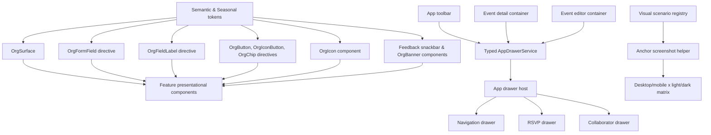

# Feature 14 Design — Design System Foundation and Experience Quality

**Spec**: `.specs/features/14-design-system-foundation-and-experience-quality/spec.md`
**Status**: Approved by the explicit task request

---

## Architecture Overview

The application will gain an internal design-system boundary at `src/app/shared/ui/`. It is a product-owned library, not a publishable package. The boundary contains presentational primitives, semantic tokens, accessibility contracts, and feedback/drawer infrastructure. It cannot import a feature container, Firebase service, or domain service.

Feature containers remain smart. They use the UI services and pass typed data to presentational drawers. The app root is the composition point for the one existing `mat-sidenav` side sheet. It chooses the active drawer branch and returns typed results to the requesting container.



### Chosen approach

Use a thin internal UI foundation built over Angular Material 22. Components own their own geometry; field styling is a directive/token recipe on native Material controls rather than a wrapper that recreates the entire `mat-form-field` API. Surface gradients are restricted to a single surface ring and primary calls to action. Material MDC tokens own control state.

Seasonal themes (`theme-junina`, `theme-natal`, `theme-pascoa`, `theme-ano-novo`) are fully integrated into the document root (`html`), adapting primary/secondary/tertiary colors, gradients, and festive overlays while maintaining solid glassmorphic surfaces, readable contrast, and standard feedback states.

This is the smallest reusable boundary that removes the current global-style contest. A separately versioned workspace project is deferred until a second application consumes the API.

---

## Code Reuse Analysis

### Existing components and utilities to leverage

| Existing item | Location | Reuse / change |
| --- | --- | --- |
| Global theme entry point | `src/styles.scss` | Retain brand, Material theme, and seasonal theme declarations; replace global form-outline, icon, and blanket `!important` overrides with semantic token definitions and primitive-local styles. |
| Existing root side sheet | `src/app/app.html`, `src/app/app.scss` | Populate the empty end `mat-sidenav`; retain `mode="over"`, backdrop, and the existing glass width constraints. |
| Drawer state service | `src/app/core/services/drawer.service.ts` | Replace `admin | event | null` and `unknown` data with a discriminated typed request/result contract. |
| Theme service | `src/app/core/services/theme.service.ts` | Reuse the persisted `light`, `dark`, and `system` behavior. |
| Seasonal theme service | `src/app/core/services/seasonal-theme.service.ts` | Retain automated date & keyword detection, root `theme-*` class injection, and festive overlay triggers. |
| Seasonal overlay | `src/app/shared/components/seasonal-overlay/` | Preserve animated festive decorations (bandeirinhas, flocos de neve, etc.). |
| Theme toggle | `src/app/shared/components/theme-toggle/` | Preserve light/dark/system toggle; reuse inside the new Navigation Drawer. |
| Confirm dialog | `src/app/shared/components/confirm-dialog/` | Keep it for cancellation/destructive confirmations only. |
| Guest dialog and family selector | `src/app/features/event-detail/components/` | Preserve reactive-form and family-selection behavior while migrating the long workflow to a drawer and adding named companions. |
| Collaborator invite dialog | `src/app/features/organizer/event-editor/components/` | Preserve signal input/output contracts while changing its presentation to a drawer. |
| Visual helper | `e2e/pages/base.page.ts` | Replace document-only `fullPage` capture with typed anchors inside `main.app-content`. |
| Design helpers | `e2e/helpers/design-tokens.helper.ts` | Extend numerical assertions for scroll origins, focus state, inset, unique surface ring, and drawer geometry. |

### Evidence behind the changes

- `src/styles.scss:646-876` applies transparent field backgrounds, local wrapper effects, and separate leading/notch/trailing gradient borders through global `!important` rules. This directly explains the white strip, segmented left edge, and clipped floating labels in the cited screenshots.
- `src/app/app.html:1-10` defines an empty end sidenav, while `src/app/app.html:27-115` keeps navigation controls in the toolbar. The intended navigation host already exists.
- `src/app/app.scss:151-155` makes `main.app-content` the actual scrolling element. `e2e/pages/base.page.ts:33-48` captures document `fullPage`, which cannot cover its full internal scroll journey.
- `src/styles.scss:154-187` declares seasonal classes on `html`. Keeping these classes cleanly defined ensures the application reflects festive seasons without breaking input borders or contrast.
- Direct `MatSnackBar.open` calls are scattered across Profile, Event Detail, Event Editor, Share Panel, and Dashboard. Their message/action/emoji combinations produce the inconsistent screenshots.

---

## Token Contract

### Token layers

| Layer | Ownership | Examples | Rule |
| --- | --- | --- | --- |
| Brand | `shared/ui/tokens` | `--org-color-brand-primary`, `--org-gradient-action` | Stable in base light/dark themes. |
| Seasonal | `shared/ui/tokens` | `--org-primary`, `--org-primary-container`, `--org-secondary`, `--org-gradient-primary` under `html.theme-*` | Dynamically themes primary palette and celebration gradients. |
| Semantic | `shared/ui/tokens` | `--org-surface`, `--org-on-surface`, `--org-field-fill`, `--org-success-*`, `--org-error-*` | Maps to Material system/MDC tokens. Stable across all themes. |
| Surface | `OrgSurface` | `--org-surface-ring`, `--org-surface-blur`, `--org-surface-shadow` | One owner per surface. |
| Event accent | event-detail host only | `--org-event-accent`, `--org-event-on-accent` | Category badge and hero highlights. |

### State ownership rules

| Concern | Single owner | Explicit prohibition |
| --- | --- | --- |
| Card, panel, and drawer ring | `OrgSurface` | No `appearance="outlined"`, local border, or pseudo-element may add another outline. |
| Native Material outline | MDC token recipe on `OrgFormFieldDirective` | Do not color `leading`, `notch`, and `trailing` separately or use internal Material selectors. |
| Field label | Material label plus `OrgFieldLabelDirective` contract | Do not add a background strip or positional override to the floating label. |
| Icon color and size | `OrgIconComponent` / named icon map | Do not color field suffixes or action icons ad hoc. |
| Success/error feedback | `FeedbackService` | Feature code must not call `MatSnackBar.open` directly. |
| Seasonal colors | `styles.scss` / seasonal tokens on `html` | Adapt primary palette/gradients while keeping semantic feedback (green/red) and surface readability solid. |

---

## Comprehensive Component & Directive Catalog

### 1. Foundation Primitives (`src/app/shared/ui/`)

- **`OrgSurfaceComponent` / `[orgSurface]`** (`src/app/shared/ui/surface/`):
  - **Purpose**: Unified glassmorphic card, panel, section, side sheet, or modal surface. Single 1.5px gradient border, backdrop blur, controlled radius and padding.
  - **Variants**: `'card'` | `'panel'` | `'drawer'` | `'dialog'` | `'hero'`.
  - **Padding**: `'none'` | `'compact'` | `'responsive'` (16px mobile -> 24px/32px desktop) | `'spacious'`.
  - **Accessibility**: Semantic container preservation (`section`, `article`, `dialog` region).
- **`OrgFormFieldDirective` / `[orgFormField]`** (`src/app/shared/ui/forms/`):
  - **Purpose**: Host directive for `mat-form-field` outlined controls. Configures MDC tokens (`--mdc-outlined-text-field-*`) for idle, hover, focus, invalid, disabled, autofill, and dark/seasonal modes. Prevents split borders.
- **`OrgFieldLabelDirective` / `[orgFieldLabel]`** (`src/app/shared/ui/forms/`):
  - **Purpose**: Accessible label directive for external field labels when floating labels are not used.
- **`OrgButtonDirective` / `[orgButton]`** (`src/app/shared/ui/actions/`):
  - **Purpose**: Action buttons with 48px touch targets, focus visible outline, loading spinner state, and visual variants (`'primary'` | `'secondary'` | `'danger'` | `'text'`).
- **`OrgIconButtonDirective` / `[orgIconButton]`** (`src/app/shared/ui/actions/`):
  - **Purpose**: Icon-only action buttons with 48px touch target and rounded hover effects (`'default'` | `'danger'` | `'primary'`).
- **`OrgChipDirective` / `[orgChip]`** (`src/app/shared/ui/actions/`):
  - **Purpose**: Filter chips, status tags, role badges, and relationship tags (`'default'` | `'primary'` | `'success'` | `'warning'` | `'accent'`).
- **`OrgIconComponent`** (`src/app/shared/ui/actions/`):
  - **Purpose**: OnPush semantic icon component with typed mapping (`OrgIconName`), standard sizes (`'sm'` | `'md'` | `'lg'`), and `aria-hidden="true"`.
  - **Icon Map**: `check_circle`, `error`, `close`, `menu`, `account_circle`, `group_add`, `how_to_reg`, `share`, `content_copy`, `event`, `place`, `schedule`, `delete`, `edit`, `add`, `search`, `mail`, `phone`, `palette`, `dark_mode`, `light_mode`, `logout`.
- **`FeedbackService` & `FeedbackSnackbarComponent`** (`src/app/shared/ui/feedback/`):
  - **Purpose**: Centralized typed notification service and custom snackbar with semantic surface (`success` green with `check_circle`, `error` red with `error`, `info` blue), `role="status"` live region, auto-dismissal.
- **`OrgBannerComponent`** (`src/app/shared/ui/feedback/`):
  - **Purpose**: Top/inline alert banner for global states (e.g. Email verification with 60s cooldown, Offline connectivity alert).
- **`AppDrawerService` & `NavigationDrawerComponent`** (`src/app/shared/ui/drawer/`):
  - **Purpose**: Discriminated union drawer state management and navigation drawer containing route links, theme selector, profile summary, and logout.

### 2. Feature & Application Consumer Inventory

| Domain / Route | Consumer Component | Migration / Role |
| --- | --- | --- |
| **Shell** (`/`) | `App` (`src/app/app.ts`, `app.html`) | Hosts toolbar (Brand, hamburger trigger, user avatar), root `mat-sidenav` host with typed `@switch`, `SeasonalOverlayComponent`, and `ThemeToggleComponent`. |
| **Home** (`/`) | `HomeContainer` (`src/app/features/home/`) | Uses `OrgSurface` for hero and event cards, `OrgButton`, `OrgChip`, and `OrgIcon` for actions. |
| **Auth** (`/login`) | `LoginContainer` (`src/app/features/auth/login/`) | Uses `OrgSurface` auth card, `OrgFormField` on inputs, `OrgButton` for Google and Email actions, and `OrgBanner` for alerts. |
| **Profile** (`/perfil`) | `ProfileContainer`, `ProfileInfoCardComponent`, `FamilyRosterManagerComponent` | Uses `OrgSurface`, `OrgFormField`, `OrgChip` for relationship tags, `OrgButton`/`OrgIconButton` for CRUD, and `FeedbackService`. |
| **Event Detail** (`/evento/:id`) | `EventDetailContainer`, `EventCardComponent`, `RsvpCardComponent`, `PixCardComponent`, `ItemListCardComponent`, `FamilySelectorComponent`, `RsvpDrawerComponent` | Uses `OrgSurface` for cards, `OrgChip` for category and item tags, `OrgButton` for actions, `FeedbackService` for mutations, and `RsvpDrawerComponent` for 0–10 named companion RSVP workflow. |
| **Dashboard** (`/meus-eventos`) | `DashboardContainer`, `EventFiltersComponent` | Uses `OrgSurface` for event cards and metrics, `OrgChip` on filter chips, `OrgButton` for new event CTA, and `FeedbackService`. |
| **Event Editor** (`/meus-eventos/evento/*`) | `EventEditorContainer`, `SharePanelComponent`, `CollaboratorDrawerComponent` | Uses `OrgSurface`, `OrgFormField` across all stepper steps, responsive mobile stepper, `SharePanelComponent` for WhatsApp/QR sharing, and `CollaboratorDrawerComponent` for collaborator management. |
| **Shared Dialogs** | `ConfirmDialogComponent` (`src/app/shared/components/confirm-dialog/`) | Uses `OrgSurface` dialog variant, `OrgButton` for confirm/cancel actions. |

---

## Data and Persistence

```typescript
export interface GuestCompanion {
  name: string;
}

export interface Guest {
  // existing fields
  companions?: GuestCompanion[];
  companionsCount?: number; // legacy-compatible derived count
}
```

`GuestService.batchConfirmRsvp` writes `companions` and `companionsCount: companions.length` atomically on the primary guest. Reads use `companions?.length ?? companionsCount ?? 0` for totals. Old documents are not backfilled.

The implementation must first reconcile `firestore.rules` with the verified RSVP write shape. The current rules require `uid` and `companionsCount` for every guest create, while linked family batch documents do not currently provide the matching contract. This is a release blocker for RSVP persistence, not a cosmetic follow-up. Add emulator-backed rules tests before changing the model or treating browser mocks as authorization evidence.

---

## Error Handling Strategy

| Scenario | Handling | User impact |
| --- | --- | --- |
| Drawer has unsaved RSVP values | Confirm discard before close; keep the explicit destructive confirmation in a short dialog. | Prevents accidental loss without trapping the user in a workflow dialog. |
| More than 10 companions or a blank companion name | Reactive form blocks submission and identifies the invalid control. | Names remain complete and bounded. |
| Snackbar receives a new message | Material replaces the current message through `FeedbackService`. | One clear live announcement. |
| Seasonal theme active | Applies seasonal classes to `html`; tokens adapt gradients while maintaining feedback/form readability. | Festive atmosphere with full usability. |
| A visual anchor cannot be reached or is clipped | The scenario fails with its anchor id and numerical geometry evidence. | The screenshot is diagnostic, not silently incomplete. |
| Firestore rules reject a changed RSVP document | Rules emulator test fails before browser E2E runs. | No false confidence from mocked Firestore. |

---

## Risks and Concerns

| Concern | Location | Impact | Mitigation |
| --- | --- | --- | --- |
| Global `!important` Material overrides conflict with primitive tokens | `src/styles.scss:646-876` | A migrated primitive can still inherit an old segmented outline or blue/white fill. | Migrate each consumer before deleting its old override; delete the global form-outline block only after all consumers use the directive. |
| Root drawer state has untyped data and an empty host | `src/app/core/services/drawer.service.ts:3-22`, `src/app/app.html:1-10` | Feature workflows can become coupled to a generic `unknown` payload or remain unrendered. | Introduce discriminated requests and test each root `@switch` branch before migration. |
| `fullPage` does not inspect the actual scroll owner | `src/app/app.scss:151-155`, `e2e/pages/base.page.ts:33-48` | Current baseline can omit lower content while tests pass. | Anchor capture inside `main.app-content`, scroll-origin assertions, and Playwright snapshot comparison. |
| Family batch write shape does not match guest create rule preconditions | `src/app/core/services/guest.service.ts:68-108`, `firestore.rules:28-40` | A real verified RSVP with family members can fail despite mock-green tests. | Add Firebase Emulator rules tests and correct the contract in the RSVP persistence slice. |
| Screenshot pixel baselines can be noisy | `e2e/pages/base.page.ts` | Animation, fonts, and date-driven decoration can produce false diffs. | Freeze time, disable nonessential animation in visual mode, wait for fonts, use deterministic mocks, and register only semantic anchors. |

---

## Tech Decisions

| Decision | Choice | Rationale |
| --- | --- | --- |
| Reuse boundary | Internal `shared/ui` public API, not an npm package | Reuses cleanly now without premature distribution cost. |
| Material integration | MDC tokens and host directives, no internal selectors | Enforces AD-028 and removes the source of split outlines. |
| Long workflow presentation | Real root `mat-sidenav` side sheet | The product asks for a drawer and the app already owns a suitable host. |
| Visual completeness | Semantic scroll-anchor matrix | It tests all user-visible content inside the actual scroll owner and produces readable failures. |
| Seasonal behavior | Preserved `html.theme-*` classes and scoped tokens | Full festive atmosphere while interaction language and contrast are preserved. |
| RSVP companions | Named metadata array plus legacy derived count | Preserves totals and gives organizers useful names without inventing unverified guests. |

This establishes the project-wide conventions in AD-032.

