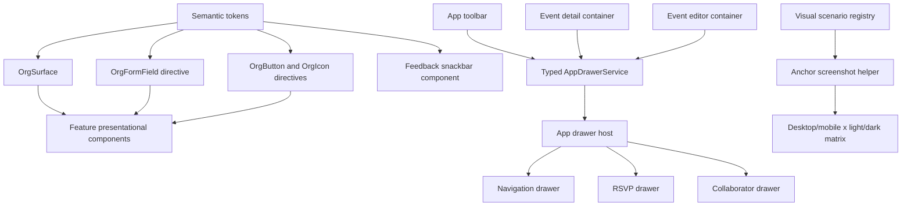

# Feature 14 Design — Design System Foundation and Experience Quality

**Spec**: `.specs/features/14-design-system-foundation-and-experience-quality/spec.md`
**Status**: Approved by the explicit task request

---

## Architecture Overview

The application will gain an internal design-system boundary at `src/app/shared/ui/`. It is a product-owned library, not a publishable package. The boundary contains presentational primitives, semantic tokens, accessibility contracts, and feedback/drawer infrastructure. It cannot import a feature container, Firebase service, or domain service.

Feature containers remain smart. They use the UI services and pass typed data to presentational drawers. The app root is the composition point for the one existing `mat-sidenav` side sheet. It chooses the active drawer branch and returns typed results to the requesting container.



### Chosen approach

Use a thin internal UI foundation built over Angular Material 22. Components own their own geometry; field styling is a directive/token recipe on native Material controls rather than a wrapper that recreates the entire `mat-form-field` API. Surface gradients are restricted to a single surface ring and primary calls to action. Material MDC tokens own control state.

This is the smallest reusable boundary that removes the current global-style contest. A separately versioned workspace project is deferred until a second application consumes the API.

---

## Code Reuse Analysis

### Existing components and utilities to leverage

| Existing item | Location | Reuse / change |
| --- | --- | --- |
| Global theme entry point | `src/styles.scss` | Retain the brand and Material theme declarations; replace global form-outline, icon, and blanket `!important` overrides with semantic token definitions and primitive-local styles. |
| Existing root side sheet | `src/app/app.html`, `src/app/app.scss` | Populate the empty end `mat-sidenav`; retain `mode="over"`, backdrop, and the existing glass width constraints. |
| Drawer state service | `src/app/core/services/drawer.service.ts` | Replace `admin | event | null` and `unknown` data with a discriminated typed request/result contract. |
| Theme service | `src/app/core/services/theme.service.ts` | Reuse the persisted `light`, `dark`, and `system` behavior. |
| Seasonal theme service | `src/app/core/services/seasonal-theme.service.ts` | Convert global root color mutation into an event-accent resolver and retain decoration selection. |
| Confirm dialog | `src/app/shared/components/confirm-dialog/` | Keep it for cancellation/destructive confirmations only. |
| Guest dialog and family selector | `src/app/features/event-detail/components/` | Preserve reactive-form and family-selection behavior while migrating the long workflow to a drawer and adding named companions. |
| Collaborator invite dialog | `src/app/features/organizer/event-editor/components/` | Preserve signal input/output contracts while changing its presentation to a drawer. |
| Visual helper | `e2e/pages/base.page.ts` | Replace document-only `fullPage` capture with typed anchors inside `main.app-content`. |
| Design helpers | `e2e/helpers/design-tokens.helper.ts` | Extend numerical assertions for scroll origins, focus state, inset, unique surface ring, and drawer geometry. |

### Evidence behind the changes

- `src/styles.scss:646-876` applies transparent field backgrounds, local wrapper effects, and separate leading/notch/trailing gradient borders through global `!important` rules. This directly explains the white strip, segmented left edge, and clipped floating labels in the cited screenshots.
- `src/app/app.html:1-10` defines an empty end sidenav, while `src/app/app.html:27-115` keeps navigation controls in the toolbar. The intended navigation host already exists.
- `src/app/app.scss:151-155` makes `main.app-content` the actual scrolling element. `e2e/pages/base.page.ts:33-48` captures document `fullPage`, which cannot cover its full internal scroll journey.
- `src/styles.scss:154-187` globally overwrites primary, secondary, and tertiary tokens for seasonal themes. `SeasonalThemeService.evaluateEventTheme` can activate it from event title/date, so the yellow/orange edge treatment in event screenshots is dynamic today, but incorrectly global.
- Direct `MatSnackBar.open` calls are scattered across Profile, Event Detail, Event Editor, Share Panel, and Dashboard. Their message/action/emoji combinations produce the inconsistent screenshots.

---

## Token Contract

### Token layers

| Layer | Ownership | Examples | Rule |
| --- | --- | --- | --- |
| Brand | `shared/ui/tokens` | `--org-color-brand-primary`, `--org-gradient-action` | Stable in both themes and never seasonal. |
| Semantic | `shared/ui/tokens` | `--org-surface`, `--org-on-surface`, `--org-field-fill`, `--org-success-*`, `--org-error-*` | Maps to Material system/MDC tokens. |
| Surface | `OrgSurface` | `--org-surface-ring`, `--org-surface-blur`, `--org-surface-shadow` | One owner per surface. |
| Event accent | event-detail host only | `--org-event-accent`, `--org-event-on-accent` | May change by category/date/title; never maps back into brand or semantic tokens. |

### State ownership rules

| Concern | Single owner | Explicit prohibition |
| --- | --- | --- |
| Card, panel, and drawer ring | `OrgSurface` | No `appearance="outlined"`, local border, or pseudo-element may add another outline. |
| Native Material outline | MDC token recipe on `OrgFormFieldDirective` | Do not color `leading`, `notch`, and `trailing` separately or use internal Material selectors. |
| Field label | Material label plus `OrgFieldLabelDirective` contract | Do not add a background strip or positional override to the floating label. |
| Icon color and size | `OrgIconComponent` / named icon map | Do not color field suffixes or action icons ad hoc. |
| Success/error feedback | `FeedbackService` | Feature code must not call `MatSnackBar.open` directly. |
| Seasonal colors | event-accent resolver and event host | Do not add seasonal classes to `html` or override global semantic tokens. |

---

## Components and Interfaces

### `OrgSurfaceComponent`

- **Purpose**: Render a glass card, panel, or drawer surface with one controlled ring, blur, background, radius, shadow, and padding rhythm.
- **Location**: `src/app/shared/ui/surface/`.
- **Interface**:
  - `variant = input<OrgSurfaceVariant>('card')`
  - `padding = input<OrgSurfacePadding>('responsive')`
  - `accent = input<'none' | 'event'>('none')`
- **Accessibility**: Preserves projected semantic element (`section`, `article`, or dialog/drawer region) instead of assigning an inappropriate role.
- **Reuses**: `--org-glass-*` intent from `src/styles.scss`, normalized through semantic tokens.

### `OrgFormFieldDirective` and `OrgFieldLabelDirective`

- **Purpose**: Apply one documented Material 22 outlined-field recipe to native `mat-form-field` and its label, prefix/suffix affordances, hints, and errors.
- **Location**: `src/app/shared/ui/forms/`.
- **Interface**:
  - `orgFormField: OrgFieldVariant = 'default'` on a `mat-form-field` host.
  - `orgFieldLabel` marks an optional external field label only when Material's floating label is not used.
- **Contract**: Default, hover, focus, invalid, disabled, and autofill states use MDC custom properties on the component host. The focus ring is solid `--org-primary`; fields are never glass surfaces and never use a gradient outline.
- **Reuses**: Existing Angular Material reactive controls and validation projection. No custom value accessor is introduced.

### `OrgButtonDirective`, `OrgIconButtonDirective`, and `OrgIconComponent`

- **Purpose**: Standardize action hierarchy, 48px targets, loading/disabled visuals, semantic icon names, icon geometry, and aria-hidden behavior.
- **Location**: `src/app/shared/ui/actions/`.
- **Interfaces**:
  - `orgButton: 'primary' | 'secondary' | 'danger' | 'text'`
  - `orgIconButton: 'default' | 'danger'`
  - `OrgIconComponent.name = input.required<OrgIconName>()`
- **Icon map**: `success → check_circle`, `error → error`, `close → close`, `menu → menu`, `profile → account_circle`, `invite → group_add`, `rsvp → how_to_reg`.

### `FeedbackService` and `FeedbackSnackbarComponent`

- **Purpose**: Publish consistent success, error, and info feedback through one typed API.
- **Location**: `src/app/shared/ui/feedback/`.
- **Interfaces**:
  - `success(message: string): void`
  - `error(message: string): void`
  - `info(message: string): void`
  - `FeedbackSnackbarData { kind: 'success' | 'error' | 'info'; message: string; duration: number }`
- **Contract**: Uses `MatSnackBar.openFromComponent`; content uses `matSnackBarLabel` and has an explicit `check_circle` icon for success. It announces politely, does not steal focus, and has no action for an auto-dismissed message.
- **Reuses**: Angular Material snackbar overlay and live-region behavior.

### `NavigationDrawerComponent`, typed `DrawerService`, and drawer host

- **Purpose**: Make the root end side sheet a typed host for navigation, RSVP, and collaborator flows.
- **Locations**: `src/app/shared/ui/drawer/`, `src/app/core/services/drawer.service.ts`, `src/app/app.*`.
- **Interfaces**:
  - `AppDrawerRequest = NavigationDrawerRequest | RsvpDrawerRequest | CollaboratorDrawerRequest`
  - `openNavigation(trigger: HTMLElement): void`
  - `openRsvp(data: RsvpDrawerData): Promise<RsvpDrawerResult | undefined>`
  - `openCollaborators(data: CollaboratorDrawerData): Promise<CollaboratorDrawerResult | undefined>`
  - `close(reason: DrawerCloseReason): void`
- **Contract**: `AppDrawerRequest` uses a discriminated `kind` and typed data, never `unknown`. The root `@switch` composes feature-presentational drawer bodies. Results return to the requesting container; no Firebase logic is moved into UI components.
- **Layout**: End `mode="over"`; 100vw minus safe inset on mobile and 400–480px on desktop. The content scrolls internally. Escape, backdrop, and close control restore focus to the stored trigger.

### `RsvpDrawerComponent` and named companion model

- **Purpose**: Replace `GuestFormDialogComponent` with a roomy RSVP drawer and collect named non-family companions.
- **Location**: `src/app/features/event-detail/components/rsvp-drawer/`.
- **Interfaces**:
  - `RsvpDrawerData { session; familyMembers; userId }`
  - `RsvpDrawerResult { name; phone; companions: GuestCompanion[]; selectedFamilyMembers }`
  - `GuestCompanion { name: string }`
- **Contract**: The count control is derived from `companions.length`. A `FormArray` renders 0–10 labelled names. The primary verified user remains the only authenticated identity.
- **Privacy**: Companion names are rendered only in organizer guest-management views; public event detail keeps aggregate counts.

### `CollaboratorDrawerComponent`

- **Purpose**: Replace the collaborator dialog with the same form and active/pending invitation sections inside the typed side sheet.
- **Location**: `src/app/features/organizer/event-editor/components/collaborator-drawer/`.
- **Interfaces**: Existing `invite`, `removeCollaborator`, and close result behavior stay typed and presentational.
- **Reuses**: Signal inputs and current email validation. The email suffix uses the shared semantic `mail` icon.

### Visual scenario registry and anchor capture

- **Purpose**: Make dark-mode and full-content visual coverage deterministic and complete without an unreadable one-image scroll strip.
- **Locations**: `e2e/visual/visual-scenarios.ts`, `e2e/pages/base.page.ts`, `e2e/helpers/design-tokens.helper.ts`, `playwright.config.ts`.
- **Interfaces**:
  - `VisualScenario { id; route; setup; anchors; overlays; requiredAssertions }`
  - `VisualAnchor { id; locator; assertion }`
  - `captureScenario(scenario: VisualScenario, theme: 'light' | 'dark'): Promise<void>`
- **Contract**: Each registered scenario captures each semantic anchor after `scrollIntoViewIfNeeded()` within `main.app-content`. Every anchor runs on desktop/mobile × light/dark. Visual artifacts use Playwright screenshot assertions, not only manually overwritten PNG files. A new scenario cannot pass registration checks unless it declares all four variants.

---

## Data and Persistence

```typescript
export interface GuestCompanion {
  name: string;
}

export interface Guest {
  // existing fields
  companions?: GuestCompanion[];
  companionsCount?: number; // legacy-compatible derived count
}
```

`GuestService.batchConfirmRsvp` writes `companions` and `companionsCount: companions.length` atomically on the primary guest. Reads use `companions?.length ?? companionsCount ?? 0` for totals. Old documents are not backfilled.

The implementation must first reconcile `firestore.rules` with the verified RSVP write shape. The current rules require `uid` and `companionsCount` for every guest create, while linked family batch documents do not currently provide the matching contract. This is a release blocker for RSVP persistence, not a cosmetic follow-up. Add emulator-backed rules tests before changing the model or treating browser mocks as authorization evidence.

---

## Error Handling Strategy

| Scenario | Handling | User impact |
| --- | --- | --- |
| Drawer has unsaved RSVP values | Confirm discard before close; keep the explicit destructive confirmation in a short dialog. | Prevents accidental loss without trapping the user in a workflow dialog. |
| More than 10 companions or a blank companion name | Reactive form blocks submission and identifies the invalid control. | Names remain complete and bounded. |
| Snackbar receives a new message | Material replaces the current message through `FeedbackService`. | One clear live announcement. |
| Seasonal classification is absent | Use the default accent tokens. | Shared UI remains visually stable. |
| A visual anchor cannot be reached or is clipped | The scenario fails with its anchor id and numerical geometry evidence. | The screenshot is diagnostic, not silently incomplete. |
| Firestore rules reject a changed RSVP document | Rules emulator test fails before browser E2E runs. | No false confidence from mocked Firestore. |

---

## Risks and Concerns

| Concern | Location | Impact | Mitigation |
| --- | --- | --- | --- |
| Global `!important` Material overrides conflict with primitive tokens | `src/styles.scss:646-876` | A migrated primitive can still inherit an old segmented outline or blue/white fill. | Migrate each consumer before deleting its old override; delete the global form-outline block only after all consumers use the directive. |
| Root drawer state has untyped data and an empty host | `src/app/core/services/drawer.service.ts:3-22`, `src/app/app.html:1-10` | Feature workflows can become coupled to a generic `unknown` payload or remain unrendered. | Introduce discriminated requests and test each root `@switch` branch before migration. |
| `fullPage` does not inspect the actual scroll owner | `src/app/app.scss:151-155`, `e2e/pages/base.page.ts:33-48` | Current baseline can omit lower content while tests pass. | Anchor capture inside `main.app-content`, scroll-origin assertions, and Playwright snapshot comparison. |
| Event themes mutate global semantic color tokens | `src/styles.scss:154-187`, `seasonal-theme.service.ts:120-175` | Seasonal colors leak into cards, fields, feedback, and navigation. | Scope event accents to event hosts and leave root brand/semantic tokens immutable. |
| Family batch write shape does not match guest create rule preconditions | `src/app/core/services/guest.service.ts:68-108`, `firestore.rules:28-40` | A real verified RSVP with family members can fail despite mock-green tests. | Add Firebase Emulator rules tests and correct the contract in the RSVP persistence slice. |
| Screenshot pixel baselines can be noisy | `e2e/pages/base.page.ts` | Animation, fonts, and date-driven decoration can produce false diffs. | Freeze time, disable nonessential animation in visual mode, wait for fonts, use deterministic mocks, and register only semantic anchors. |

---

## Tech Decisions

| Decision | Choice | Rationale |
| --- | --- | --- |
| Reuse boundary | Internal `shared/ui` public API, not an npm package | Reuses cleanly now without premature distribution cost. |
| Material integration | MDC tokens and host directives, no internal selectors | Enforces AD-028 and removes the source of split outlines. |
| Long workflow presentation | Real root `mat-sidenav` side sheet | The product asks for a drawer and the app already owns a suitable host. |
| Visual completeness | Semantic scroll-anchor matrix | It tests all user-visible content inside the actual scroll owner and produces readable failures. |
| Seasonal behavior | Event-scoped accent tokens | Dynamic event identity remains, while shared interaction language is stable. |
| RSVP companions | Named metadata array plus legacy derived count | Preserves totals and gives organizers useful names without inventing unverified guests. |

This establishes the project-wide conventions in AD-032.
