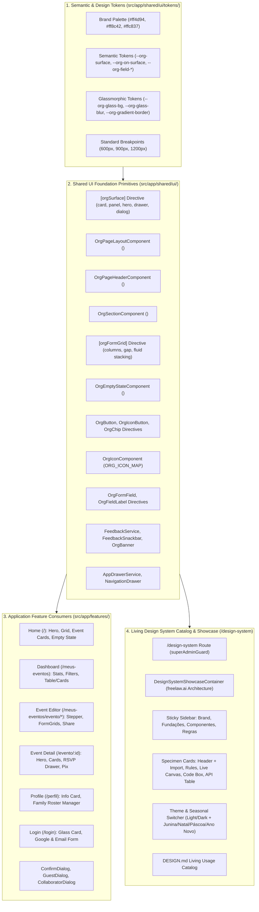
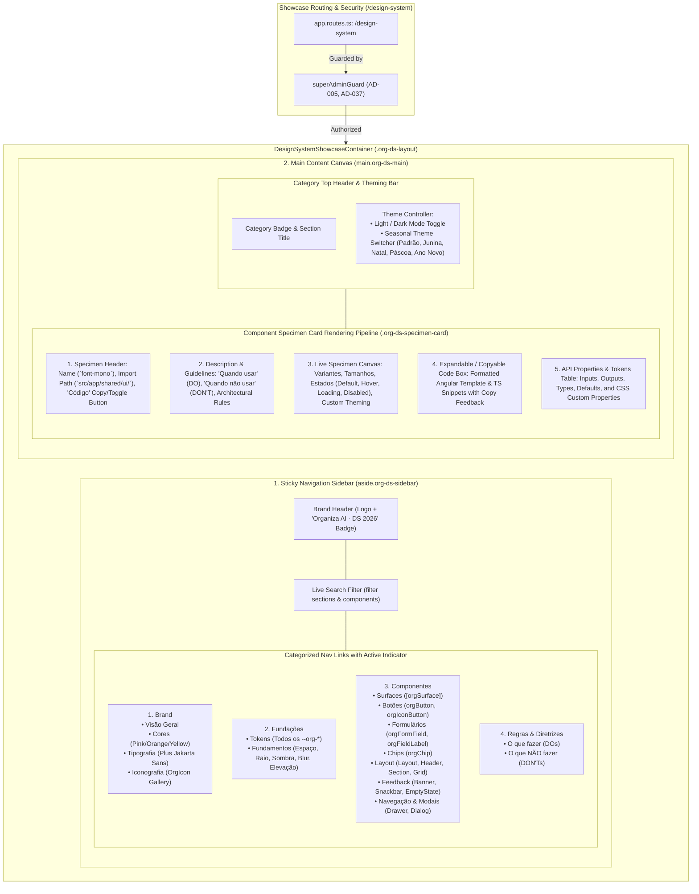

# Feature 15 — Design System Consolidation & Showcase Design

**Spec**: `.specs/features/15-design-system-consolidation-and-showcase/spec.md`  
**Status**: Approved

---

## Architecture Overview

Feature 15 consolidates and elevates the Organiza AI Design System from a set of standalone foundation tokens and controls into a unified, composable layout and surface architecture. It eliminates legacy styling debt across the entire codebase, migrates `OrgSurface` from an encapsulating component to an agile attribute directive (`[orgSurface]`), introduces structural page layout primitives, standardizes mobile-first breakpoints, enforces the canonical Pink-Orange-Yellow brand palette, and delivers a living, interactive Super Admin Showcase and Documentation Catalog at `/design-system` inspired by `https://design.freelaw.ai`.



### Layout Composition Architecture

The page composition follows a structured, semantic hierarchy where layout, header, section, form grid, and surface primitives cleanly separate responsibilities without superfluous DOM wrapper nodes:

```mermaid
flowchart TD
  subgraph PageComposition["Semantic Layout Composition Hierarchy"]
    L["<org-page-layout maxWidth='narrow|default|wide|full'> (role='main')"]
    H["<org-page-header title='...' subtitle='...' icon='...' gradient='true|false'>"]
    A["[orgPageHeaderActions] (CTA Buttons, Filters)"]
    S1["<org-section title='...' icon='...' count='...'>"]
    SA["[orgSectionActions] (Secondary CTAs)"]
    G["<form [orgFormGrid]='2fr 1fr'>"]
    F1["<mat-form-field orgFormField appearance='outline'>"]
    F2["<mat-form-field orgFormField appearance='outline'>"]
    C["<div [orgSurface]='card'> (Glassmorphic Surface Card)"]
    E["<org-empty-state icon='event' title='...' description='...'>"]
    
    L --> H
    H --> A
    L --> S1
    S1 --> SA
    S1 --> G
    G --> F1
    G --> F2
    S1 --> C
    S1 --> E
  end
```



### Living Showcase Architecture (`https://design.freelaw.ai` Inspiration)

The Showcase module is lazy-loaded under `/design-system`, strictly guarded by `superAdminGuard`, and architected as a complete living design system documentation platform with a dual-pane responsive layout:



---

## Code Reuse Analysis

### Existing Primitives & Integration Points

| Primitive | Current File Location | Planned Evolution & Migration |
| --- | --- | --- |
| `OrgSurfaceComponent` | `src/app/shared/ui/surface/org-surface.component.ts` | **Migrate to `OrgSurfaceDirective`** (`[orgSurface]`) at `src/app/shared/ui/surface/org-surface.directive.ts`. Eliminates unnecessary `<org-surface>` wrapper DOM nodes and allows direct application to `<section>`, `<article>`, `<mat-card>`, or `<div>`. Exposes `--org-glass-*` CSS custom property theming API. |
| `OrgButtonDirective` | `src/app/shared/ui/actions/org-button.directive.ts` | **Reuse**. Provides `primary`, `secondary`, `danger`, `text` variants, 48px touch targets, loading states, and disabled handling. |
| `OrgIconButtonDirective` | `src/app/shared/ui/actions/org-icon-button.directive.ts` | **Reuse**. Provides 48px circular touch targets, `default`, `danger`, `primary` variants. |
| `OrgChipDirective` | `src/app/shared/ui/actions/org-chip.directive.ts` | **Reuse**. Provides `default`, `primary`, `success`, `warning`, `accent` variants for status, category, and role badges. |
| `OrgIconComponent` | `src/app/shared/ui/actions/org-icon.component.ts` | **Reuse & Expand**. Typesafe mapping (`ORG_ICON_MAP`) with standard sizes (`sm: 16px`, `md: 20px`, `lg: 24px`) and `aria-hidden="true"`. |
| `OrgFormFieldDirective` | `src/app/shared/ui/forms/org-form-field.directive.ts` | **Reuse**. Applies MDC tokens (`--mdc-outlined-text-field-*`) to eliminate segmented borders, inconsistent outline colors, and background leaks. |
| `OrgFieldLabelDirective` | `src/app/shared/ui/forms/org-field-label.directive.ts` | **Reuse**. Provides accessible external field label typography and spacing. |
| `FeedbackService` & `FeedbackSnackbar` | `src/app/shared/ui/feedback/feedback.service.ts` | **Reuse**. Centralized typed notification service with semantic `success`, `error`, `info` snackbar styling. |
| `OrgBannerComponent` | `src/app/shared/ui/feedback/org-banner.component.ts` | **Reuse**. Top and inline alert banners with 60s cooldown actions. |
| `AppDrawerService` & `NavigationDrawer` | `src/app/shared/ui/drawer/` | **Reuse**. Typed side sheet drawer container for mobile and desktop workflows. |

### Angular Material MDC Design Tokens Integration

Angular Material form-fields, dialogs, menus, and chips are styled strictly via MDC custom property tokens declared in `:root` and scoped directives:
- Form fields: `--mdc-outlined-text-field-container-shape: 16px`, `--mdc-outlined-text-field-outline-color`, `--mdc-outlined-text-field-focus-outline-color: var(--org-primary)`.
- Dialogs: `--mdc-dialog-container-shape: 28px`, `--mdc-dialog-subhead-color`.
- Menus: `--mat-menu-container-shape: 16px`.
- Chips: `--mdc-chip-container-shape: 9999px`.

---

## Components and Directives Specification

### 1. `OrgSurfaceDirective` (`[orgSurface]`)

Replaces the previous wrapper component with an attribute directive that applies single-ring glassmorphism directly to any host element.

- **File Paths**: `src/app/shared/ui/surface/org-surface.directive.ts`, `src/app/shared/ui/surface/_org-surface.scss`
- **Selector**: `[orgSurface]`
- **Standalone**: `true`

#### TypeScript Contract

```typescript
import { Directive, input } from '@angular/core';

export type OrgSurfaceVariant = 'card' | 'panel' | 'hero' | 'drawer' | 'dialog';

@Directive({
  selector: '[orgSurface]',
  standalone: true,
  host: {
    class: 'org-surface',
    '[class.org-surface--card]': "variant() === 'card'",
    '[class.org-surface--panel]': "variant() === 'panel'",
    '[class.org-surface--hero]': "variant() === 'hero'",
    '[class.org-surface--drawer]': "variant() === 'drawer'",
    '[class.org-surface--dialog]': "variant() === 'dialog'",
  },
})
export class OrgSurfaceDirective {
  /** Visual variant of the surface. Defaults to 'card'. */
  public readonly variant = input<OrgSurfaceVariant>('card', { alias: 'orgSurface' });
}
```

#### SCSS Styles (`_org-surface.scss`)

```scss
.org-surface {
  backdrop-filter: var(--org-glass-blur, blur(24px));
  -webkit-backdrop-filter: var(--org-glass-blur, blur(24px));
  background:
    linear-gradient(var(--org-glass-bg, rgba(255, 255, 255, 0.6)), var(--org-glass-bg, rgba(255, 255, 255, 0.6))) padding-box,
    var(--org-gradient-border) border-box;
  border: var(--org-glass-ring-width, 1.5px) solid transparent;
  border-radius: var(--org-radius-lg, 1rem);
  box-shadow: var(--org-glass-shadow);
  box-sizing: border-box;
  padding: 16px 12px;
  position: relative;
  transition: transform 0.2s cubic-bezier(0.4, 0, 0.2, 1), box-shadow 0.2s cubic-bezier(0.4, 0, 0.2, 1);

  @media (min-width: 600px) {
    padding: 24px 16px;
  }

  &--panel {
    border-radius: 1.25rem;
    padding: 20px 16px;

    @media (min-width: 600px) {
      padding: 32px 24px;
    }
  }

  &--hero {
    border-radius: 1.5rem;
    overflow: hidden;
    padding: 0;
  }

  &--drawer {
    border-radius: 20px 0 0 20px;
    padding: 24px 16px;
    border-right: none;
  }

  &--dialog {
    border-radius: 28px;
    padding: 24px;
  }
}

.dark .org-surface {
  background:
    linear-gradient(var(--org-glass-bg, rgba(31, 26, 29, 0.7)), var(--org-glass-bg, rgba(31, 26, 29, 0.7))) padding-box,
    var(--org-gradient-border) border-box;
}
```

#### CSS Variables Theming API

| CSS Property | Default (Light) | Default (Dark) | Description |
| --- | --- | --- | --- |
| `--org-glass-bg` | `rgba(255, 255, 255, 0.6)` | `rgba(31, 26, 29, 0.7)` | Translucent background fill under the blur |
| `--org-glass-blur` | `blur(24px)` | `blur(24px)` | Backdrop filter blur intensity |
| `--org-glass-shadow` | `inset 0 1px 2px rgba(...), 0 8px 32px rgba(...)` | `0 8px 32px rgba(0, 0, 0, 0.35)` | Surface depth and inner reflection |
| `--org-gradient-border` | `linear-gradient(135deg, rgba(255, 77, 148, 0.4), rgba(255, 140, 66, 0.4))` | Same | Signature border gradient (Pink -> Orange) |
| `--org-glass-ring-width` | `1.5px` | `1.5px` | Outer border stroke width |
| `--org-radius-lg` | `1rem` (`16px`) | `1rem` (`16px`) | Surface corner rounding |

---

### 2. `OrgPageLayoutComponent` (`<org-page-layout>`)

Structural layout container that sets the main landmark (`role="main"`), enforces maximum width bounds, and delivers zero-horizontal-overflow responsive padding.

- **File Paths**: `src/app/shared/ui/layout/org-page-layout.component.ts`, `.html`, `.scss`
- **Selector**: `org-page-layout`
- **Standalone**: `true`

#### TypeScript Contract

```typescript
import { ChangeDetectionStrategy, Component, input } from '@angular/core';

export type OrgPageLayoutMaxWidth = 'narrow' | 'default' | 'wide' | 'full';

@Component({
  selector: 'org-page-layout',
  standalone: true,
  changeDetection: ChangeDetectionStrategy.OnPush,
  templateUrl: './org-page-layout.component.html',
  styleUrl: './org-page-layout.component.scss',
  host: {
    role: 'main',
    class: 'org-page-layout',
    '[class.org-page-layout--narrow]': "maxWidth() === 'narrow'",
    '[class.org-page-layout--default]': "maxWidth() === 'default'",
    '[class.org-page-layout--wide]': "maxWidth() === 'wide'",
    '[class.org-page-layout--full]': "maxWidth() === 'full'",
  },
})
export class OrgPageLayoutComponent {
  /** Maximum content width boundary: narrow (600px), default (960px), wide (1200px), full (100%). */
  public readonly maxWidth = input<OrgPageLayoutMaxWidth>('default');
}
```

#### Template (`org-page-layout.component.html`)

```html
<div class="org-page-layout__container">
  <ng-content />
</div>
```

#### SCSS Styles (`org-page-layout.component.scss`)

```scss
:host {
  display: block;
  width: 100%;
  box-sizing: border-box;
  margin-inline: auto;
  padding: 16px 12px 48px;

  @media (min-width: 600px) {
    padding: 32px 16px 64px;
  }
}

.org-page-layout {
  &--narrow .org-page-layout__container {
    max-width: 600px;
    margin-inline: auto;
  }

  &--default .org-page-layout__container {
    max-width: 960px;
    margin-inline: auto;
  }

  &--wide .org-page-layout__container {
    max-width: 1200px;
    margin-inline: auto;
  }

  &--full .org-page-layout__container {
    max-width: 100%;
  }
}

.org-page-layout__container {
  width: 100%;
  box-sizing: border-box;
}
```

---

### 3. `OrgPageHeaderComponent` (`<org-page-header>`)

Semantic page header providing an `<h1>` headline, optional subtitle, optional `OrgIconComponent`, optional brand gradient text, and a projected action slot.

- **File Paths**: `src/app/shared/ui/layout/org-page-header.component.ts`, `.html`, `.scss`
- **Selector**: `org-page-header`
- **Standalone**: `true`

#### TypeScript Contract

```typescript
import { ChangeDetectionStrategy, Component, input } from '@angular/core';
import { OrgIconComponent, OrgIconName } from '../actions/org-icon.component';

@Component({
  selector: 'org-page-header',
  standalone: true,
  imports: [OrgIconComponent],
  changeDetection: ChangeDetectionStrategy.OnPush,
  templateUrl: './org-page-header.component.html',
  styleUrl: './org-page-header.component.scss',
})
export class OrgPageHeaderComponent {
  /** Primary page title rendered inside <h1>. */
  public readonly title = input.required<string>();

  /** Optional descriptive subtitle. */
  public readonly subtitle = input<string>();

  /** Optional leading icon name. */
  public readonly icon = input<OrgIconName>();

  /** Whether the title applies the signature brand gradient styling. Defaults to false. */
  public readonly gradient = input<boolean>(false);
}
```

#### Template (`org-page-header.component.html`)

```html
<header class="org-page-header">
  <div class="org-page-header__content">
    @if (icon()) {
      <div class="org-page-header__icon-wrap">
        <org-icon [name]="icon()!" size="lg" color="var(--org-primary)" />
      </div>
    }
    <div class="org-page-header__titles">
      <h1 class="org-page-header__title" [class.org-gradient-text]="gradient()">
        {{ title() }}
      </h1>
      @if (subtitle()) {
        <p class="org-page-header__subtitle">{{ subtitle() }}</p>
      }
    </div>
  </div>

  <div class="org-page-header__actions">
    <ng-content select="[orgPageHeaderActions]" />
  </div>
</header>
```

#### SCSS Styles (`org-page-header.component.scss`)

```scss
:host {
  display: block;
  margin-bottom: 24px;

  @media (min-width: 600px) {
    margin-bottom: 36px;
  }
}

.org-page-header {
  display: flex;
  flex-direction: column;
  gap: 16px;
  align-items: flex-start;

  @media (min-width: 600px) {
    flex-direction: row;
    align-items: center;
    justify-content: space-between;
  }

  &__content {
    display: flex;
    align-items: flex-start;
    gap: 16px;
  }

  &__icon-wrap {
    display: flex;
    align-items: center;
    justify-content: center;
    width: 48px;
    height: 48px;
    border-radius: 14px;
    background: rgba(255, 77, 148, 0.12);
    flex-shrink: 0;
  }

  &__titles {
    display: flex;
    flex-direction: column;
    gap: 4px;
  }

  &__title {
    font-size: 1.75rem;
    font-weight: 800;
    line-height: 1.2;
    color: var(--mat-sys-on-surface);
    margin: 0;
    letter-spacing: -0.02em;

    @media (min-width: 600px) {
      font-size: 2.25rem;
    }
  }

  &__subtitle {
    font-size: 0.9375rem;
    color: var(--mat-sys-on-surface-variant);
    margin: 0;
    line-height: 1.5;
    max-width: 600px;

    @media (min-width: 600px) {
      font-size: 1.0625rem;
    }
  }

  &__actions {
    display: flex;
    align-items: center;
    gap: 12px;
    flex-wrap: wrap;
    width: 100%;

    @media (min-width: 600px) {
      width: auto;
    }
  }
}
```

---

### 4. `OrgSectionComponent` (`<org-section>`)

Semantic section container providing an `<h2>` heading, optional icon, count badge, projected action slot, and a standardized 48px vertical rhythm between consecutive sections.

- **File Paths**: `src/app/shared/ui/layout/org-section.component.ts`, `.html`, `.scss`
- **Selector**: `org-section`
- **Standalone**: `true`

#### TypeScript Contract

```typescript
import { ChangeDetectionStrategy, Component, input } from '@angular/core';
import { OrgIconComponent, OrgIconName } from '../actions/org-icon.component';

@Component({
  selector: 'org-section',
  standalone: true,
  imports: [OrgIconComponent],
  changeDetection: ChangeDetectionStrategy.OnPush,
  templateUrl: './org-section.component.html',
  styleUrl: './org-section.component.scss',
})
export class OrgSectionComponent {
  /** Section heading rendered inside <h2>. */
  public readonly title = input.required<string>();

  /** Optional leading icon name. */
  public readonly icon = input<OrgIconName>();

  /** Optional numerical badge count (e.g. number of guests, items, or events). */
  public readonly count = input<number>();
}
```

#### Template (`org-section.component.html`)

```html
<section class="org-section">
  <header class="org-section__header">
    <div class="org-section__title-wrap">
      @if (icon()) {
        <org-icon [name]="icon()!" size="md" color="var(--org-primary)" />
      }
      <h2 class="org-section__title">{{ title() }}</h2>
      @if (count() !== undefined) {
        <span class="org-section__count-badge">{{ count() }}</span>
      }
    </div>

    <div class="org-section__actions">
      <ng-content select="[orgSectionActions]" />
    </div>
  </header>

  <div class="org-section__content">
    <ng-content />
  </div>
</section>
```

#### SCSS Styles (`org-section.component.scss`)

```scss
:host {
  display: block;

  + :host {
    margin-top: 48px;
  }
}

.org-section {
  display: flex;
  flex-direction: column;
  gap: 20px;

  @media (min-width: 600px) {
    gap: 24px;
  }

  &__header {
    display: flex;
    align-items: center;
    justify-content: space-between;
    gap: 16px;
    padding: 0 4px;
  }

  &__title-wrap {
    display: flex;
    align-items: center;
    gap: 10px;
  }

  &__title {
    font-size: 1.25rem;
    font-weight: 700;
    color: var(--mat-sys-on-surface);
    margin: 0;
    letter-spacing: -0.01em;

    @media (min-width: 600px) {
      font-size: 1.5rem;
    }
  }

  &__count-badge {
    font-size: 0.75rem;
    font-weight: 800;
    color: var(--mat-sys-primary);
    background: rgba(255, 77, 148, 0.12);
    padding: 2px 8px;
    border-radius: 9999px;
  }

  &__actions {
    display: flex;
    align-items: center;
    gap: 8px;
  }

  &__content {
    display: flex;
    flex-direction: column;
    gap: 16px;
  }
}
```

---

### 5. `OrgFormGridDirective` (`[orgFormGrid]`)

Attribute directive that turns any form container into a mobile-first responsive CSS Grid (1fr stacking on mobile < 600px, multi-column on desktop >= 600px).

- **File Path**: `src/app/shared/ui/layout/org-form-grid.directive.ts`
- **Selector**: `[orgFormGrid]`
- **Standalone**: `true`

#### TypeScript Contract

```typescript
import { Directive, input } from '@angular/core';

@Directive({
  selector: '[orgFormGrid]',
  standalone: true,
  host: {
    class: 'org-form-grid',
    '[style.--org-form-grid-cols]': 'columns()',
  },
})
export class OrgFormGridDirective {
  /** Desktop grid columns specification (e.g. '1fr 1fr', '2fr 1fr', '1fr 1fr 1fr'). Defaults to '1fr 1fr'. */
  public readonly columns = input<string>('1fr 1fr', { alias: 'orgFormGrid' });
}
```

#### SCSS Styles

```scss
.org-form-grid {
  display: grid;
  grid-template-columns: 1fr;
  gap: 12px;
  width: 100%;
  box-sizing: border-box;

  @media (min-width: 600px) {
    grid-template-columns: var(--org-form-grid-cols, 1fr 1fr);
    gap: 24px;
  }
}
```

---

### 6. `OrgEmptyStateComponent` (`<org-empty-state>`)

Centered glassmorphic empty state card displaying an icon, title, description, and an optional projected action slot.

- **File Paths**: `src/app/shared/ui/feedback/org-empty-state.component.ts`, `.html`, `.scss`
- **Selector**: `org-empty-state`
- **Standalone**: `true`

#### TypeScript Contract

```typescript
import { ChangeDetectionStrategy, Component, input } from '@angular/core';
import { OrgIconComponent, OrgIconName } from '../actions/org-icon.component';
import { OrgSurfaceDirective } from '../surface/org-surface.directive';

@Component({
  selector: 'org-empty-state',
  standalone: true,
  imports: [OrgIconComponent, OrgSurfaceDirective],
  changeDetection: ChangeDetectionStrategy.OnPush,
  templateUrl: './org-empty-state.component.html',
  styleUrl: './org-empty-state.component.scss',
})
export class OrgEmptyStateComponent {
  /** Icon name to display. Defaults to 'info'. */
  public readonly icon = input<OrgIconName>('info');

  /** Primary empty state heading. */
  public readonly title = input.required<string>();

  /** Optional descriptive explanation. */
  public readonly description = input<string>();
}
```

#### Template (`org-empty-state.component.html`)

```html
<article [orgSurface]="'card'" class="org-empty-state">
  <div class="org-empty-state__icon-wrap">
    <org-icon [name]="icon()" size="lg" color="var(--org-primary)" />
  </div>
  <h3 class="org-empty-state__title">{{ title() }}</h3>
  @if (description()) {
    <p class="org-empty-state__description">{{ description() }}</p>
  }
  <div class="org-empty-state__action">
    <ng-content select="[orgEmptyStateAction]" />
  </div>
</article>
```

#### SCSS Styles (`org-empty-state.component.scss`)

```scss
:host {
  display: block;
  width: 100%;
}

.org-empty-state {
  display: flex;
  flex-direction: column;
  align-items: center;
  text-align: center;
  padding: 40px 20px;
  max-width: 520px;
  margin-inline: auto;

  &__icon-wrap {
    display: flex;
    align-items: center;
    justify-content: center;
    width: 64px;
    height: 64px;
    border-radius: 50%;
    background: rgba(255, 77, 148, 0.12);
    margin-bottom: 16px;
    color: var(--org-primary);
  }

  &__title {
    font-size: 1.25rem;
    font-weight: 700;
    color: var(--mat-sys-on-surface);
    margin: 0 0 8px;
    line-height: 1.3;
  }

  &__description {
    font-size: 0.9375rem;
    color: var(--mat-sys-on-surface-variant);
    margin: 0 0 20px;
    line-height: 1.5;
    max-width: 380px;
  }

  &__action {
    display: flex;
    justify-content: center;
  }
}
```

---

### 7. Living Design System Catalog & Showcase (`/design-system`)

The showcase page is implemented as an interactive living catalog inspired by `https://design.freelaw.ai`. It delivers a high-fidelity, categorized documentation and component testing platform organized into 4 primary sections: **Brand**, **Fundações**, **Componentes**, and **Regras & Diretrizes**.

- **File Paths**:
  - `src/app/features/design-system/design-system-showcase.container.ts`
  - `src/app/features/design-system/design-system-showcase.container.html`
  - `src/app/features/design-system/design-system-showcase.container.scss`
- **Route**: `/design-system`, lazy-loaded in `src/app/app.routes.ts`, guarded with `canActivate: [superAdminGuard]`.

#### Showcase Layout Architecture

```
+---------------------------------------------------------------------------------------------------------+
| .org-ds-layout                                                                                          |
| +-------------------------------+---------------------------------------------------------------------+ |
| | aside.org-ds-sidebar          | main.org-ds-main                                                    | |
| |                               |                                                                     | |
| | [Logo] Organiza AI · DS 2026  | +-----------------------------------------------------------------+ | |
| | [Search components / tokens]  | | header.org-ds-topbar                                            | | |
| |                               | | [Category Badge] · Section Title                                | | |
| | > BRAND                       | | [Theme Toggle 🌙/☀️]  [Seasonal: Padrão|Junina|Natal|Páscoa|Ano] | | |
| |   • Visão Geral               | +-----------------------------------------------------------------+ | |
| |   • Cores                     |                                                                     | |
| |   • Tipografia                | +-----------------------------------------------------------------+ | |
| |   • Iconografia               | | article.org-ds-specimen-card                                    | | |
| |                               | | +-------------------------------------------------------------+ | | |
| | > FUNDAÇÕES                   | | | Specimen Header: [Title] `@org/ui`              [Código 📋] | | | |
| |   • Tokens                    | | +-------------------------------------------------------------+ | | |
| |   • Fundamentos               | | | Guidelines: "Quando usar" (✅)  /  "Quando NÃO usar" (❌)     | | | |
| |                               | | +-------------------------------------------------------------+ | | |
| | > COMPONENTES                 | | | Live Specimen Canvas:                                       | | | |
| |   • Surfaces                  | | |   Variantes | Tamanhos | Estados (Hover, Loading, Disabled) | | | |
| |   • Botões & Ações            | | +-------------------------------------------------------------+ | | |
| |   • Formulários               | | | Expandable / Copyable Code Box                              | | | |
| |   • Chips                     | | +-------------------------------------------------------------+ | | |
| |   • Layout                    | | | Properties & Tokens Table (Inputs, Outputs, CSS Variables)  | | | |
| |   • Feedback                  | | +-------------------------------------------------------------+ | | |
| |   • Navegação & Modais        | +-----------------------------------------------------------------+ | |
| |                               |                                                                     | |
| | > REGRAS & DIRETRIZES         | (Next Specimen Cards...)                                            | |
| |   • O que fazer (DO)          |                                                                     | |
| |   • O que NÃO fazer (DON'T)   |                                                                     | |
| +-------------------------------+---------------------------------------------------------------------+ |
+---------------------------------------------------------------------------------------------------------+
```

#### Detailed Showcase Section Breakdown

##### 1. BRAND
- **Visão Geral (`#brand-overview`)**: Design system philosophy, Single Source of Truth architecture, mobile-first responsiveness, and accessibility baseline.
- **Cores (`#brand-colors`)**: Interactive color swatches for the canonical brand palette:
  - Primary Pink: `#ff4d94` (`--org-primary`)
  - Secondary Orange: `#ff8c42` (`--org-secondary`)
  - Tertiary Yellow: `#ffc837` (`--org-tertiary`)
  - Neutral surfaces (`--org-surface`, `--org-surface-variant`, `--org-surface-card`)
  - Semantic feedback colors (`--org-success: #10b981`, `--org-error: #ef4444`, `--org-info: #3b82f6`)
- **Tipografia (`#brand-typography`)**: Plus Jakarta Sans typographic scale previewing Display (48px), Headline (32px), Title (24px), Subtitle (18px), Body (14px/16px), and Label (12px) with line-height and letter-spacing tokens.
- **Iconografia (`#brand-icons`)**: Full searchable visual grid of all 23 mapped `OrgIconComponent` names, interactive size toggle (`sm`, `md`, `lg`), and 1-click icon name copy.

##### 2. FUNDAÇÕES
- **Tokens (`#foundations-tokens`)**: Exhaustive interactive catalog of all `--org-*` CSS variables, computed light/dark values, and copy buttons.
- **Fundamentos (`#foundations-fundamentals`)**:
  - **Espaçamento**: 4px (`--org-space-xs`), 8px (`--org-space-sm`), 16px (`--org-space-md`), 24px (`--org-space-lg`), 32px (`--org-space-xl`), 48px (`--org-space-2xl`).
  - **Cantos / Border Radius**: 4px (`--org-radius-xs`), 8px (`--org-radius-sm`), 16px (`--org-radius-md`), 24px (`--org-radius-lg`), 28px (`--org-radius-xl`), 9999px (`--org-radius-full`).
  - **Sombra & Elevação**: Low, Medium, Glass depth elevations with inner reflection highlights.
  - **Blur & Glass**: Single-ring backdrop filter glassmorphic blur levels (`blur(16px)` to `blur(32px)`).

##### 3. COMPONENTES (Specimen Cards)
- **Surfaces (`#components-surfaces`)**: `[orgSurface]` across 5 variants (`card`, `panel`, `hero`, `drawer`, `dialog`) with live blur/background sliders.
- **Botões & Ações (`#components-buttons`)**:
  - `OrgButtonDirective`: `primary`, `secondary`, `danger`, `text` variants; sizes; interactive loading spinner toggle; disabled state; 48px touch target indicator.
  - `OrgIconButtonDirective`: `default`, `danger`, `primary` circular 48px touch buttons.
- **Formulários (`#components-forms`)**: `OrgFormFieldDirective` and `OrgFieldLabelDirective` on `mat-form-field` with prefix/suffix icons, floating labels, hint texts, error states, and select dropdowns.
- **Chips (`#components-chips`)**: `OrgChipDirective` in `default`, `primary`, `success`, `warning`, `accent` variants, and selectable toggles.
- **Layout Primitives (`#components-layout`)**:
  - `OrgPageLayoutComponent` (`narrow`, `default`, `wide`, `full`)
  - `OrgPageHeaderComponent` (title, subtitle, icon, gradient title, actions slot)
  - `OrgSectionComponent` (title, icon, count badge, actions slot)
  - `OrgFormGridDirective` (`1fr 1fr`, `2fr 1fr`, `1fr 1fr 1fr`, responsive mobile stacking)
- **Feedback (`#components-feedback`)**:
  - `OrgEmptyStateComponent` (customizable icon, title, description, and CTA slot)
  - `FeedbackService` live triggers (`showSuccess()`, `showError()`, `showInfo()`)
  - `OrgBannerComponent` (inline alert banner with cooldown button)
- **Navegação & Modais (`#components-navigation`)**:
  - `AppDrawerService` & `NavigationDrawerComponent` (Side sheet slide-in drawer trigger)
  - `ConfirmDialogComponent` (Material 3 glassmorphic confirmation dialog)

##### 4. REGRAS & DIRETRIZES
- **Diretrizes de Design (`#guidelines-dos-donts`)**:
  - **O que FAZER (DO)**:
    - Usar sempre `[orgSurface]` para qualquer card, painel ou diálogo com efeito de vidro.
    - Utilizar os tokens canônicos `--org-primary`, `--org-secondary`, `--org-tertiary`.
    - Garantir touch targets mínimos de 48px em botões e chips em dispositivos móveis.
    - Estruturar páginas com `<org-page-layout>` e seções com `<org-section>`.
    - Usar `[orgFormGrid]` para layouts de formulário responsivos.
  - **O que NÃO FAZER (DON'T)**:
    - **NUNCA** escrever `backdrop-filter: blur(...)` manual nos arquivos SCSS de features.
    - **NUNCA** utilizar as classes legadas `.glass-card`, `.org-glass`, `.org-legacy-form-field`.
    - **NUNCA** utilizar cores hexadecimais legadas fora da paleta (e.g. `#630ed4`, `#6366f1`, `#38bdf8`, `#00bfa5`).
    - **NUNCA** usar `!important` para sobrescrever classes internas do Angular Material; utilizar tokens MDC.
    - **NUNCA** criar breakpoints arbitrários (`640px`, `768px`, `1024px`); usar estritamente 600px / 900px / 1200px.

---

#### Component Specimen Card Pattern Specification

Every component documented in the showcase strictly implements the Specimen Card pattern:

```html
<article class="org-ds-specimen-card" [id]="specimen.id">
  <!-- 1. Header: Component Title + Import Path + Code Toggle/Copy Button -->
  <header class="org-ds-specimen-card__header">
    <div class="org-ds-specimen-card__title-wrap">
      <h3 class="org-ds-specimen-card__title">{{ specimen.name }}</h3>
      <code class="org-ds-specimen-card__import">{{ specimen.importPath }}</code>
    </div>
    <div class="org-ds-specimen-card__actions">
      <button
        type="button"
        orgButton="secondary"
        class="org-ds-specimen-card__code-btn"
        (click)="toggleCode(specimen.id)"
        [attr.aria-expanded]="isCodeExpanded(specimen.id)"
      >
        <org-icon name="content_copy" size="sm" />
        <span>{{ isCodeExpanded(specimen.id) ? 'Ocultar Código' : 'Ver Código' }}</span>
      </button>
    </div>
  </header>

  <!-- 2. Guidance: Description, Quando Usar, Quando Não Usar -->
  <div class="org-ds-specimen-card__guidance">
    <p class="org-ds-specimen-card__description">{{ specimen.description }}</p>
    <div class="org-ds-specimen-card__rules-grid">
      <div class="org-ds-rule org-ds-rule--do">
        <div class="org-ds-rule__header">
          <org-icon name="check_circle" size="sm" color="#10b981" />
          <strong>Quando usar</strong>
        </div>
        <ul>
          @for (rule of specimen.whenToUse; track rule) {
            <li>{{ rule }}</li>
          }
        </ul>
      </div>
      <div class="org-ds-rule org-ds-rule--dont">
        <div class="org-ds-rule__header">
          <org-icon name="close" size="sm" color="#ef4444" />
          <strong>Quando NÃO usar</strong>
        </div>
        <ul>
          @for (rule of specimen.whenNotToUse; track rule) {
            <li>{{ rule }}</li>
          }
        </ul>
      </div>
    </div>
  </div>

  <!-- 3. Live Specimen Canvas: Interactive Variations, Sizes, States & Theming -->
  <div class="org-ds-specimen-card__canvas" [orgSurface]="'panel'">
    <ng-content select="[specimenCanvas]" />
  </div>

  <!-- 4. Expandable / Copyable Code Box -->
  @if (isCodeExpanded(specimen.id)) {
    <div class="org-ds-specimen-card__code-box">
      <div class="org-ds-code-header">
        <span class="org-ds-code-lang">HTML / TypeScript</span>
        <button
          type="button"
          class="org-ds-copy-btn"
          (click)="copyCode(specimen.codeSnippet, specimen.id)"
          aria-label="Copiar código"
        >
          <org-icon name="content_copy" size="sm" />
          <span>{{ copiedSnippetId() === specimen.id ? 'Copiado!' : 'Copiar' }}</span>
        </button>
      </div>
      <pre class="org-ds-code-pre"><code>{{ specimen.codeSnippet }}</code></pre>
    </div>
  }

  <!-- 5. API Properties & Tokens Table -->
  <div class="org-ds-specimen-card__api-table-wrap">
    <h4 class="org-ds-api-heading">Propriedades & Tokens CSS</h4>
    <table class="org-ds-table">
      <thead>
        <tr>
          <th>Propriedade / Token</th>
          <th>Tipo</th>
          <th>Padrão</th>
          <th>Descrição</th>
        </tr>
      </thead>
      <tbody>
        @for (prop of specimen.apiProperties; track prop.name) {
          <tr>
            <td><code>{{ prop.name }}</code></td>
            <td><span class="org-ds-type-badge">{{ prop.type }}</span></td>
            <td><code>{{ prop.defaultValue }}</code></td>
            <td>{{ prop.description }}</td>
          </tr>
        }
      </tbody>
    </table>
  </div>
</article>
```

---

#### Showcase Container TypeScript Contract

```typescript
import { ChangeDetectionStrategy, Component, inject, signal } from '@angular/core';
import { CommonModule } from '@angular/common';
import { FormsModule } from '@angular/forms';
import { MatCardModule } from '@angular/material/card';
import { MatFormFieldModule } from '@angular/material/form-field';
import { MatInputModule } from '@angular/material/input';
import { MatSelectModule } from '@angular/material/select';

// Shared UI Primitives
import {
  OrgSurfaceDirective,
  OrgPageLayoutComponent,
  OrgPageHeaderComponent,
  OrgSectionComponent,
  OrgFormGridDirective,
  OrgEmptyStateComponent,
  OrgButtonDirective,
  OrgIconButtonDirective,
  OrgChipDirective,
  OrgIconComponent,
  OrgIconName,
  OrgFormFieldDirective,
  OrgFieldLabelDirective,
  FeedbackService,
  OrgBannerComponent,
} from '../../shared/ui';
import { ThemeService } from '../../core/services/theme.service';

export type SeasonalThemeOption = 'default' | 'theme-junina' | 'theme-natal' | 'theme-pascoa' | 'theme-ano-novo';

export interface SpecimenApiProperty {
  name: string;
  type: string;
  defaultValue: string;
  description: string;
}

export interface SpecimenCardData {
  id: string;
  name: string;
  category: 'brand' | 'foundations' | 'components' | 'guidelines';
  importPath: string;
  description: string;
  whenToUse: string[];
  whenNotToUse: string[];
  codeSnippet: string;
  apiProperties: SpecimenApiProperty[];
}

@Component({
  selector: 'app-design-system-showcase',
  standalone: true,
  imports: [
    CommonModule,
    FormsModule,
    MatCardModule,
    MatFormFieldModule,
    MatInputModule,
    MatSelectModule,
    OrgSurfaceDirective,
    OrgPageLayoutComponent,
    OrgPageHeaderComponent,
    OrgSectionComponent,
    OrgFormGridDirective,
    OrgEmptyStateComponent,
    OrgButtonDirective,
    OrgIconButtonDirective,
    OrgChipDirective,
    OrgIconComponent,
    OrgFormFieldDirective,
    OrgFieldLabelDirective,
    OrgBannerComponent,
  ],
  changeDetection: ChangeDetectionStrategy.OnPush,
  templateUrl: './design-system-showcase.container.html',
  styleUrl: './design-system-showcase.container.scss',
})
export class DesignSystemShowcaseContainer {
  protected readonly themeService = inject(ThemeService);
  protected readonly feedbackService = inject(FeedbackService);

  // Active navigation & search filter
  public readonly activeSection = signal<string>('brand-overview');
  public readonly searchQuery = signal<string>('');
  
  // Seasonal theme controller
  public readonly activeSeasonalTheme = signal<SeasonalThemeOption>('default');
  
  // Interactive testing state
  public readonly buttonLoadingState = signal<boolean>(false);
  public readonly iconSearchQuery = signal<string>('');
  public readonly selectedIconSize = signal<'sm' | 'md' | 'lg'>('md');
  public readonly surfaceBlurSlider = signal<number>(24);
  public readonly surfaceBgOpacity = signal<number>(60);
  public readonly formGridColumns = signal<string>('1fr 1fr');
  
  // Expanded code snippets tracking
  public readonly expandedCodeIds = signal<Set<string>>(new Set());
  public readonly copiedSnippetId = signal<string | null>(null);

  public toggleCode(id: string): void {
    const current = new Set(this.expandedCodeIds());
    if (current.has(id)) {
      current.delete(id);
    } else {
      current.add(id);
    }
    this.expandedCodeIds.set(current);
  }

  public isCodeExpanded(id: string): boolean {
    return this.expandedCodeIds().has(id);
  }

  public async copyCode(code: string, id: string): Promise<void> {
    await navigator.clipboard.writeText(code);
    this.copiedSnippetId.set(id);
    this.feedbackService.showSuccess('Código copiado para a área de transferência!');
    setTimeout(() => {
      if (this.copiedSnippetId() === id) {
        this.copiedSnippetId.set(null);
      }
    }, 2500);
  }

  public setSeasonalTheme(theme: SeasonalThemeOption): void {
    const htmlEl = document.documentElement;
    htmlEl.classList.remove('theme-junina', 'theme-natal', 'theme-pascoa', 'theme-ano-novo');
    if (theme !== 'default') {
      htmlEl.classList.add(theme);
    }
    this.activeSeasonalTheme.set(theme);
  }

  public toggleThemeMode(): void {
    this.themeService.toggleTheme();
  }

  public scrollToSection(sectionId: string): void {
    this.activeSection.set(sectionId);
    const target = document.getElementById(sectionId);
    if (target) {
      target.scrollIntoView({ behavior: 'smooth', block: 'start' });
    }
  }
}
```

#### Showcase SCSS Styles (`design-system-showcase.container.scss`)

```scss
:host {
  display: block;
  width: 100%;
  min-height: 100vh;
  background: var(--org-bg-canvas, var(--mat-sys-background));
  color: var(--mat-sys-on-surface);
}

.org-ds-layout {
  display: flex;
  flex-direction: column;
  width: 100%;
  min-height: 100vh;

  @media (min-width: 900px) {
    flex-direction: row;
  }
}

// 1. Sticky Navigation Sidebar
.org-ds-sidebar {
  width: 100%;
  background: var(--org-glass-bg, rgba(255, 255, 255, 0.8));
  backdrop-filter: blur(20px);
  -webkit-backdrop-filter: blur(20px);
  border-bottom: 1px solid var(--org-glass-ring-color, rgba(255, 77, 148, 0.15));
  padding: 16px;
  box-sizing: border-box;

  @media (min-width: 900px) {
    width: 280px;
    height: 100vh;
    position: sticky;
    top: 0;
    overflow-y: auto;
    border-bottom: none;
    border-right: 1px solid var(--org-glass-ring-color, rgba(255, 77, 148, 0.15));
    padding: 24px 16px;
    flex-shrink: 0;
  }

  &__brand {
    display: flex;
    align-items: center;
    gap: 12px;
    margin-bottom: 20px;
  }

  &__logo {
    width: 36px;
    height: 36px;
    border-radius: 10px;
  }

  &__title-wrap {
    display: flex;
    flex-direction: column;
  }

  &__brand-name {
    font-size: 1.125rem;
    font-weight: 800;
    line-height: 1.2;
  }

  &__version-badge {
    font-size: 0.6875rem;
    font-weight: 700;
    color: var(--org-primary);
    letter-spacing: 0.05em;
    text-transform: uppercase;
  }

  &__search {
    margin-bottom: 20px;
  }

  &__nav-group {
    margin-bottom: 24px;
  }

  &__group-title {
    font-size: 0.75rem;
    font-weight: 800;
    text-transform: uppercase;
    letter-spacing: 0.08em;
    color: var(--mat-sys-on-surface-variant);
    margin: 0 0 8px 8px;
  }

  &__nav-list {
    list-style: none;
    margin: 0;
    padding: 0;
    display: flex;
    flex-direction: column;
    gap: 4px;
  }

  &__nav-link {
    display: flex;
    align-items: center;
    gap: 10px;
    padding: 8px 12px;
    border-radius: 8px;
    font-size: 0.875rem;
    font-weight: 600;
    color: var(--mat-sys-on-surface-variant);
    text-decoration: none;
    cursor: pointer;
    transition: background 0.15s ease, color 0.15s ease;

    &:hover {
      background: rgba(255, 77, 148, 0.08);
      color: var(--org-primary);
    }

    &--active {
      background: rgba(255, 77, 148, 0.14);
      color: var(--org-primary);
      font-weight: 700;
    }
  }
}

// 2. Main Content Canvas
.org-ds-main {
  flex: 1;
  padding: 16px 12px 64px;
  box-sizing: border-box;
  max-width: 100%;

  @media (min-width: 600px) {
    padding: 32px 24px 80px;
  }

  @media (min-width: 1200px) {
    padding: 40px 48px 96px;
  }
}

// 3. Topbar & Theming Controller
.org-ds-topbar {
  display: flex;
  flex-direction: column;
  gap: 16px;
  margin-bottom: 40px;
  padding-bottom: 24px;
  border-bottom: 1px solid var(--org-glass-ring-color, rgba(255, 77, 148, 0.15));

  @media (min-width: 900px) {
    flex-direction: row;
    align-items: center;
    justify-content: space-between;
  }

  &__controls {
    display: flex;
    align-items: center;
    gap: 12px;
    flex-wrap: wrap;
  }
}

// 4. Specimen Card Pattern
.org-ds-specimen-card {
  display: flex;
  flex-direction: column;
  gap: 20px;
  margin-bottom: 48px;
  padding-bottom: 48px;
  border-bottom: 1px solid rgba(255, 77, 148, 0.1);

  &__header {
    display: flex;
    flex-direction: column;
    gap: 12px;

    @media (min-width: 600px) {
      flex-direction: row;
      align-items: center;
      justify-content: space-between;
    }
  }

  &__title-wrap {
    display: flex;
    align-items: baseline;
    gap: 12px;
    flex-wrap: wrap;
  }

  &__title {
    font-size: 1.5rem;
    font-weight: 800;
    font-family: var(--org-font-mono, monospace);
    margin: 0;
    color: var(--mat-sys-on-surface);
  }

  &__import {
    font-size: 0.8125rem;
    padding: 2px 8px;
    border-radius: 6px;
    background: rgba(255, 77, 148, 0.08);
    color: var(--org-primary);
  }

  &__description {
    font-size: 0.9375rem;
    line-height: 1.6;
    color: var(--mat-sys-on-surface-variant);
    margin: 0 0 16px;
  }

  &__rules-grid {
    display: grid;
    grid-template-columns: 1fr;
    gap: 16px;
    margin-bottom: 20px;

    @media (min-width: 600px) {
      grid-template-columns: 1fr 1fr;
    }
  }

  &__canvas {
    padding: 24px;
    min-height: 120px;
    display: flex;
    flex-direction: column;
    gap: 24px;
  }

  &__code-box {
    border-radius: 12px;
    background: #1e1e24;
    color: #f8f8f2;
    padding: 16px;
    overflow-x: auto;
  }

  &__api-table-wrap {
    overflow-x: auto;
    margin-top: 12px;
  }
}

.org-ds-rule {
  padding: 16px;
  border-radius: 12px;
  font-size: 0.875rem;

  &--do {
    background: rgba(16, 185, 129, 0.08);
    border: 1px solid rgba(16, 185, 129, 0.2);
  }

  &--dont {
    background: rgba(239, 68, 68, 0.08);
    border: 1px solid rgba(239, 68, 68, 0.2);
  }

  &__header {
    display: flex;
    align-items: center;
    gap: 8px;
    margin-bottom: 8px;
  }

  ul {
    margin: 0;
    padding-left: 20px;
    display: flex;
    flex-direction: column;
    gap: 4px;
  }
}

.org-ds-table {
  width: 100%;
  border-collapse: collapse;
  font-size: 0.875rem;

  th, td {
    padding: 10px 14px;
    text-align: left;
    border-bottom: 1px solid rgba(255, 77, 148, 0.1);
  }

  th {
    font-weight: 700;
    color: var(--mat-sys-on-surface-variant);
  }
}
```

---

## Barrel Exports in `src/app/shared/ui/index.ts`

```typescript
// Surface Directives & Types
export { OrgSurfaceDirective } from './surface/org-surface.directive';
export type { OrgSurfaceVariant } from './surface/org-surface.directive';

// Layout Components & Directives
export { OrgPageLayoutComponent } from './layout/org-page-layout.component';
export type { OrgPageLayoutMaxWidth } from './layout/org-page-layout.component';
export { OrgPageHeaderComponent } from './layout/org-page-header.component';
export { OrgSectionComponent } from './layout/org-section.component';
export { OrgFormGridDirective } from './layout/org-form-grid.directive';

// Form Directives
export { OrgFormFieldDirective } from './forms/org-form-field.directive';
export { OrgFieldLabelDirective } from './forms/org-field-label.directive';

// Actions, Chips & Icons
export { OrgButtonDirective } from './actions/org-button.directive';
export type { OrgButtonVariant } from './actions/org-button.directive';
export { OrgIconButtonDirective } from './actions/org-icon-button.directive';
export type { OrgIconButtonVariant } from './actions/org-icon-button.directive';
export { OrgChipDirective } from './actions/org-chip.directive';
export type { OrgChipVariant } from './actions/org-chip.directive';
export { ORG_ICON_MAP, OrgIconComponent } from './actions/org-icon.component';
export type { OrgIconName, OrgIconSize } from './actions/org-icon.component';

// Feedback & Banners
export { FeedbackSnackbarComponent } from './feedback/feedback-snackbar.component';
export type { FeedbackSnackbarData, FeedbackVariant } from './feedback/feedback-snackbar.component';
export { FeedbackService } from './feedback/feedback.service';
export type { FeedbackOptions } from './feedback/feedback.service';
export { OrgBannerComponent } from './feedback/org-banner.component';
export { OrgEmptyStateComponent } from './feedback/org-empty-state.component';

// Drawer Infrastructure
export { NavigationDrawerComponent } from './drawer/navigation-drawer.component';
```

---

## Legacy Class Removal & Migration Strategy

### 1. Style Cleanups in `src/styles.scss`

- **Remove Class Blocks**: Completely delete `.glass-card`, `.org-glass`, `.org-legacy-form-field`, `.glass-input`, and their `.dark` variations.
- **Remove Leftover Utility Classes**: Completely delete `.h-4`, `.h-5`, `.h-6`, `.h-10`, `.h-14`, `.h-28`, `.w-10`, `.w-16`, `.w-20`, `.w-24`, `.w-32`, `.w-40`, `.w-48`, `.w-full`, `.rounded-full`, `.items-center`, `.mb-2`, `.mt-2`, `.flex`, `.gap-2`.
- **Enforce Breakpoint Standard**: Replace all ad-hoc media queries (`640px`, `768px`, `960px`, `1024px`) with canonical breakpoints:
  - Mobile: `< 600px`
  - Small / Tablet: `@media (min-width: 600px)`
  - Medium / Desktop: `@media (min-width: 900px)`
  - Large / Wide: `@media (min-width: 1200px)`

### 2. Feature Migration Blueprints

#### A. Home (`src/app/features/home/`)
- Wrap template in `<org-page-layout maxWidth="default">`.
- Replace manual hero header with `<org-page-header title="Eventos: Descubra, Participe e Celebre" subtitle="..." [gradient]="true">`.
- Replace `.home__section-header` with `<org-section title="Próximos Eventos" [count]="events().length">`.
- Replace `.home__empty` with `<org-empty-state icon="event" title="Nenhum evento disponível no momento." description="...">` and `<a orgButton="primary" orgEmptyStateAction routerLink="/meus-eventos/evento/novo">Criar Primeiro Evento</a>`.
- Replace `<org-surface variant="card">` inside card items with `<article [orgSurface]="'card'" class="home__card">`.
- Remove manual `backdrop-filter` and obsolete purple `rgba(99, 14, 212, ...)` styles.

#### B. Organizer Dashboard (`src/app/features/admin/dashboard/` / `src/app/features/organizer/dashboard/`)
- Wrap template in `<org-page-layout maxWidth="wide">`.
- Replace manual header with `<org-page-header title="Meus Eventos" subtitle="Gerencie seus eventos e colaborações" icon="event">` with `<a orgButton="primary" orgPageHeaderActions routerLink="evento/novo">Novo Evento</a>`.
- Replace `.dashboard__empty` with `<org-empty-state icon="event" title="Nenhum evento encontrado" description="...">`.
- Replace `.glass-card` on alert banner, table wrapper, and mobile cards with `[orgSurface]="'card'"` or `[orgSurface]="'panel'"`.

#### C. Event Editor (`src/app/features/admin/event-editor/` / `src/app/features/organizer/event-editor/`)
- Wrap in `<org-page-layout maxWidth="default">`.
- Replace `.editor__card.glass-card` with `<mat-card [orgSurface]="'card'">`.
- Migrate form rows (Date/Time, Address CEP/Street/City/State) to use `<div [orgFormGrid]="'2fr 1fr'">` and `<div [orgFormGrid]="'1fr 1fr 1fr'">`.
- Ensure all `mat-form-field` controls apply `orgFormField`.
- Eliminate obsolete accent color `#38bdf8` in favor of `--org-primary`.

#### D. Event Detail (`src/app/features/event-detail/`)
- Wrap in `<org-page-layout maxWidth="default">`.
- Migrate `EventCardComponent`, `RsvpCardComponent`, `PixCardComponent`, and `ItemListCardComponent` from `.glass-card` to `[orgSurface]="'card'"`.
- In `PixCardComponent`, replace obsolete teal `#00bfa5` with `--org-primary`.
- In `FamilySelectorComponent` and `GuestFormDialogComponent`, apply `orgFormField` to all `mat-form-field` inputs and replace `#6366f1` with `--org-primary`.
- In `RsvpDrawerComponent`, remove manual `backdrop-filter` and delegate surface styling to `[orgSurface]="'drawer'"`.

#### E. Profile & Family Roster (`src/app/features/profile/`)
- Wrap in `<org-page-layout maxWidth="default">`.
- Replace `.glass-card` in `ProfileInfoCardComponent` and `FamilyRosterManagerComponent` with `[orgSurface]="'card'"`.
- Replace obsolete purple `#630ed4` with `var(--org-primary)`.
- Use `<org-section title="Minha Família" icon="group_add">` inside `FamilyRosterManagerComponent`.

#### F. Auth Login (`src/app/features/auth/login/`)
- Wrap in `<org-page-layout maxWidth="narrow">`.
- Replace `.glass-card.login__card` with `<div [orgSurface]="'card'" class="login__card">`.
- Apply `orgFormField` to email and password `mat-form-field` controls.
- Remove manual `backdrop-filter: blur(12px)`.

#### G. Dialogs
- `ConfirmDialogComponent`: Ensure `<mat-dialog-content>` uses glassmorphism via Material MDC tokens and `orgButton` directives for action buttons.
- `GuestFormDialogComponent` & `CollaboratorInviteDialogComponent`: Apply `orgFormField` to all text inputs and chips.

---

## Data Models and Types

```typescript
// Surface
export type OrgSurfaceVariant = 'card' | 'panel' | 'hero' | 'drawer' | 'dialog';

// Page Layout
export type OrgPageLayoutMaxWidth = 'narrow' | 'default' | 'wide' | 'full';

// Actions & Chips
export type OrgButtonVariant = 'primary' | 'secondary' | 'danger' | 'text';
export type OrgIconButtonVariant = 'default' | 'danger' | 'primary';
export type OrgChipVariant = 'default' | 'primary' | 'success' | 'warning' | 'accent';

// Icons
export type OrgIconSize = 'sm' | 'md' | 'lg';
export type OrgIconName =
  | 'check_circle'
  | 'error'
  | 'info'
  | 'close'
  | 'menu'
  | 'account_circle'
  | 'group_add'
  | 'how_to_reg'
  | 'share'
  | 'content_copy'
  | 'event'
  | 'place'
  | 'schedule'
  | 'delete'
  | 'edit'
  | 'add'
  | 'search'
  | 'mail'
  | 'phone'
  | 'palette'
  | 'dark_mode'
  | 'light_mode'
  | 'logout';

// Feedback
export type FeedbackVariant = 'success' | 'error' | 'info';

export interface FeedbackOptions {
  duration?: number;
  actionLabel?: string;
  horizontalPosition?: 'start' | 'center' | 'end' | 'left' | 'right';
  verticalPosition?: 'top' | 'bottom';
}

export interface FeedbackSnackbarData {
  message: string;
  variant: FeedbackVariant;
  actionLabel?: string;
  icon: OrgIconName;
}

// Showcase Data Models
export type SeasonalThemeOption = 'default' | 'theme-junina' | 'theme-natal' | 'theme-pascoa' | 'theme-ano-novo';

export interface SpecimenApiProperty {
  name: string;
  type: string;
  defaultValue: string;
  description: string;
}

export interface SpecimenCardData {
  id: string;
  name: string;
  category: 'brand' | 'foundations' | 'components' | 'guidelines';
  importPath: string;
  description: string;
  whenToUse: string[];
  whenNotToUse: string[];
  codeSnippet: string;
  apiProperties: SpecimenApiProperty[];
}
```

---

## Error Handling Strategy

| Scenario | Handling | User Impact |
| --- | --- | --- |
| Unknown `maxWidth` passed to `OrgPageLayoutComponent` | Fallbacks safely to `'default'` (960px max width). | Clean layout rendering without horizontal page overflow. |
| Unknown variant passed to `[orgSurface]` | Fallbacks safely to `'card'` class binding. | Element receives standard glassmorphic card styling. |
| Unknown icon name passed to `OrgIconComponent` or `OrgEmptyStateComponent` | Defaults to `'info'` or `'help_outline'` without throwing Angular template errors. | Icon renders gracefully. |
| Form grid placed in narrow viewport or small dialog (< 400px) | Media query stacks fields into a single column (`1fr`) with 12px gap. | No input clipping or horizontal scrollbars. |
| Non-superadmin or unauthenticated user navigates to `/design-system` | `superAdminGuard` intercepts route activation and redirects to `/login` or `/`. | Showcase is kept secure and inaccessible to regular guests. |
| Extra-long text in `OrgPageHeaderComponent` or `OrgEmptyStateComponent` | Text wraps naturally using `word-break: break-word` and `max-width: 100%`. | Zero layout displacement or horizontal overflow. |
| Clipboard copy failure in Specimen Card code box | Fallbacks gracefully and alerts user via `FeedbackService.showError('Não foi possível copiar o código')`. | Transparent error message without breaking UI state. |

---

## Risks & Concerns

| Concern | Location | Potential Failure Impact | Mitigation |
| --- | --- | --- | --- |
| Residual `.glass-card` or `.org-glass` usages missed during migration | `src/app/features/**/*.html` | Visual inconsistencies or broken styles once legacy classes are deleted from `styles.scss`. | Comprehensive ripgrep validation pass across all HTML/SCSS files before executing deletion in `styles.scss`. |
| Nested form field borders conflict with MDC outline tokens | `src/app/shared/ui/forms/_org-form-field.scss` | Fragmented or double border rendering on focused inputs. | Apply MDC tokens (`--mdc-outlined-text-field-*`) directly to the host directive; eliminate internal notch border overrides. |
| Horizontal overflow on mobile viewports (< 600px) | `src/app/shared/ui/layout/` | Breaks the zero-horizontal-overflow invariant on mobile devices. | Enforce `box-sizing: border-box`, `max-width: 100%`, and automated `assertNoHorizontalOverflow` Playwright assertions. |
| Touch target dimensions drop below 48px | `src/app/shared/ui/actions/` | Fails WCAG 2.5.5 AA compliance for mobile accessibility. | Explicit `min-height: 48px; min-width: 48px;` host styling on `OrgButtonDirective`, `OrgIconButtonDirective`, and `OrgChipDirective`. |
| Outdated color tokens (#630ed4, #6366f1, #38bdf8, #00bfa5) linger in feature SCSS | `src/app/features/**/*.scss` | Color drift away from the canonical Pink-Orange-Yellow brand identity. | Scan and replace all hardcoded color fallbacks with `--org-primary`, `--org-secondary`, or `--org-tertiary`. |
| Showcase page bundle size or performance | `src/app/features/design-system/` | Slower app initial load if showcase is eagerly bundled. | Lazy-load `DesignSystemShowcaseContainer` under `/design-system` route; showcase is never loaded on guest/user journeys. |
| Sticky sidebar height & scrolling on narrow viewports | `src/app/features/design-system/` | Sidebar overflowing or blocking main content on mobile screens (< 900px). | Convert sticky sidebar into a collapsible/horizontal header bar on viewports < 900px using clean media queries. |

---

## Tech Decisions

| Decision ID | Area | Choice | Rationale |
| --- | --- | --- | --- |
| **AD-034** | Surface Primitive | Attribute Directive (`[orgSurface]`) | Eliminates extra wrapper DOM nodes, preserves semantic tags (`<section>`, `<article>`, `<mat-card>`), and supports simple host class bindings. |
| **AD-035** | Legacy Styles | Total removal of `.glass-card`, `.org-glass`, `.org-legacy-form-field` | Enforces zero ambiguity and guarantees that all features consume the canonical `shared/ui` design system primitives. |
| **AD-036** | Responsive Breakpoints | Canonical 600px / 900px / 1200px rhythm | Standardizes media queries across all stylesheets, preventing fragmented layout thresholds. |
| **AD-037** | Showcase Page | Dedicated `/design-system` route with `superAdminGuard` inspired by `https://design.freelaw.ai` | Provides an interactive, living visual catalog and test playground for all tokens and UI primitives in Light/Dark themes and seasonal themes. |
| **AD-033** | Brand Direction | Canonical Pink (`#ff4d94`), Orange (`#ff8c42`), Yellow (`#ffc837`) | Maintains the original vibrant celebration identity without purple/cyan color drift. |
| **AD-028** | Material Integration | MDC Design Tokens on directives | Avoids fragile `!important` global overrides on internal Angular Material classes. |
