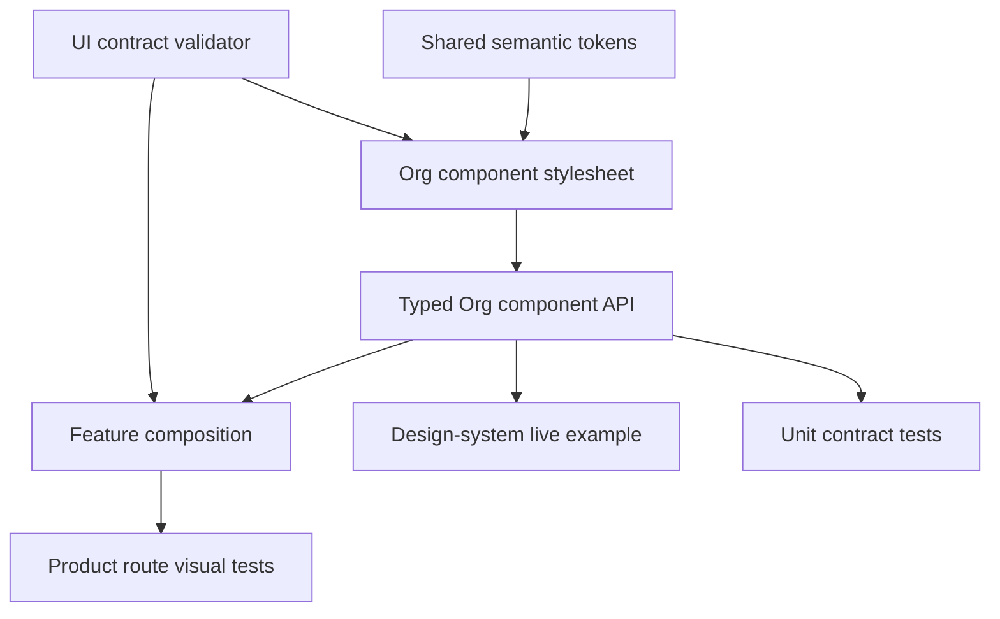

# Feature 17 — Component-First Library Expansion Design

**Spec**: `.specs/features/17-component-library-expansion/spec.md`  
**Status**: Approved by user direction on 2026-08-24

## Architecture Overview

The component library owns every reusable visual contract. A feature composes typed `Org*` components and supplies domain data, event handlers, routing, and layout placement. It does not recreate a control with Material markup, `--mdc-*` tokens, or copied hover, border, density, focus, or surface rules.

### Approaches considered

| Approach | Result | Decision |
| --- | --- | --- |
| Continue using Material plus styling directives | Keeps markup short but leaves visual behavior distributed across every feature. | Rejected. |
| Build closed `Org*` components and migrate all current consumers | Gives one API, one stylesheet owner, typed inputs, and deterministic migration checks. | Selected. |
| Create a schema renderer that generates every screen | Would remove markup but hides Angular and Material semantics behind an unnecessary abstraction. | Rejected. |

## Source-of-Truth Boundaries

| Layer | Owns | Must not own |
| --- | --- | --- |
| `src/styles.scss` and `shared/ui/tokens` | Theme-wide `--org-*` semantic values and Material system tokens. | Per-component selectors or feature-specific layout. |
| `shared/ui/<family>/<org-component>.component.scss` | BEM structure, hover/focus/disabled state, density, border, radius, glass, atmosphere, and component Material tokens. | Product layout placement or domain copy. |
| `features/**.scss` and `shared/components/**.scss` | Grid placement, page spacing, domain content arrangement, and responsive composition. | `.mat-*` overrides, `--mdc-*` / `--mat-*` component tokens, repeated action/surface/field visuals. |
| `features/**.html` | Typed `Org*` composition, inputs, outputs, slots, and domain behavior. | Legacy UI directives or directly styled in-scope Material controls. |

The structural validator will enforce these boundaries. It scans application consumers, feature SCSS, the public barrel, and the showcase. The only allowlist is the design-system fixture code block, which may show raw Material only to explain the underlying primitive when the corresponding `Org*` API is not the documented recommendation.

## Code Reuse Analysis

| Existing code | Location | Design use |
| --- | --- | --- |
| Theme and semantic tokens | `src/styles.scss`, `src/app/shared/ui/tokens/_semantic.scss` | Single source for light, dark, and seasonal values. New components only consume these tokens. |
| Current surface component | `src/app/shared/ui/surface/org-surface.component.*` | Becomes the standard surface API. The directive is removed after consumer migration. |
| Current date and time fields | `src/app/shared/ui/forms/org-date-field.component.*`, `org-time-field.component.*` | Establishes standalone, `model()`-based field conventions and native Material sizing. |
| Navigation drawer link | `src/app/shared/ui/drawer/navigation-drawer-link.component.*` | Reused by the navigation-list component rather than restyled in each drawer. |
| Feedback service and snackbar | `src/app/shared/ui/feedback/*` | Retained as the transient feedback contract; dialog work adds a parallel confirmation API. |
| Code example component | `src/app/features/design-system/design-system-code-example.component.*` | Receives one collapsed "Uso recomendado" example per public family. |
| Showcase live Material demos | `src/app/features/design-system/design-system-showcase.container.*` | Replaced family by family with `Org*` components. |

## Public Components and Interfaces

Each component is standalone, `OnPush`, and uses separate `.ts`, `.html`, and `.scss` files. All public exports live in `src/app/shared/ui/index.ts`.

### Actions

| Component | Location | Typed contract |
| --- | --- | --- |
| `OrgButtonComponent` | `shared/ui/actions/` | `label`, `icon?`, `variant`, `type`, `disabled`, `loading`, `gradient`, `pressed`. |
| `OrgIconButtonComponent` | `shared/ui/actions/` | `icon`, required `ariaLabel`, `variant`, `disabled`, `gradient`, `pressed`. |
| `OrgChipComponent` | `shared/ui/actions/` | `label`, `variant`, `selected`, `disabled`, `gradient`, `selectionChange`. |

The components render the native Material controls internally. A parent never combines a Material directive with an `Org*` styling directive.

### Fields and selection

| Component | Location | Typed contract |
| --- | --- | --- |
| `OrgTextFieldComponent` | `shared/ui/forms/` | `label`, `type`, `placeholder`, `hint?`, `error?`, `disabled`, `value`. |
| `OrgTextareaFieldComponent` | `shared/ui/forms/` | `label`, `rows`, `hint?`, `error?`, `disabled`, `value`. |
| `OrgSelectFieldComponent` | `shared/ui/forms/` | `label`, typed readonly options, `hint?`, `error?`, `disabled`, `value`. |
| `OrgDateFieldComponent` and `OrgTimeFieldComponent` | `shared/ui/forms/` | Keep their existing `model()` API and share the field base styles. |
| `OrgToggleComponent` | `shared/ui/selection/` | `label`, `disabled`, `checked`, `checkedChange`. |
| `OrgCheckboxComponent` | `shared/ui/selection/` | `label`, `disabled`, `checked`, `indeterminate`, `checkedChange`. |
| `OrgRadioGroupComponent` | `shared/ui/selection/` | `label`, typed readonly options, `disabled`, `value`. |

All fields use a shared internal field stylesheet imported only by field components. It owns Material outline tokens and native control geometry. Feature SCSS cannot target a field implementation.

### Navigation and display

| Component | Location | Typed contract |
| --- | --- | --- |
| `OrgTabsComponent` | `shared/ui/navigation/` | typed tab items, `selectedId`, `gradient`, `selectedIdChange`; parent renders domain content from selected state. |
| `OrgStepperComponent` + `OrgStepComponent` | `shared/ui/navigation/` | child step content is projected through closed children; `orientation` defaults compact below 600px; `selectedIndex` model preserves workflow behavior. |
| `OrgMenuComponent` | `shared/ui/navigation/` | trigger label/icon, typed actions, `actionSelected`; owns the Material menu surface. |
| `OrgNavigationListComponent` | `shared/ui/navigation/` | typed items, active item, `itemSelected`; the drawer adapts it to router links. |
| `OrgProgressComponent` | `shared/ui/data-display/` | bounded `value` 0-100, `variant`, `gradient`; owns active indicator tokens. |
| `OrgMetricCardComponent` | `shared/ui/data-display/` | `label`, `value`, `description?`, `trend?`, `gradient`, `atmosphere`. |
| `OrgBadgeComponent` | `shared/ui/data-display/` | `label`, semantic variant, optional icon. |

### Feedback overlay

| Component / service | Location | Typed contract |
| --- | --- | --- |
| `OrgConfirmDialogComponent` | `shared/ui/feedback/` | typed title, message, action labels and variant. Owns the glass dialog surface. |
| `OrgDialogService` | `shared/ui/feedback/` | `confirm(config): MatDialogRef<OrgConfirmDialogComponent, boolean>`; centralizes Material dialog configuration. |

## Migration Plan

1. Create and test every new component family before changing product consumers.
2. Replace showcase raw Material demos with the new family component and its "Uso recomendado" snippet.
3. Migrate feature templates in groups: actions/surfaces, forms/selection, then navigation/data/overlays.
4. Move reusable visual declarations into the owning component stylesheet. Remove only rules made obsolete by the migration; retain feature layout and domain rules.
5. Remove `OrgButtonDirective`, `OrgIconButtonDirective`, `OrgChipDirective`, `OrgFormFieldDirective`, `OrgFieldLabelDirective`, `OrgFormGridDirective`, and `OrgSurfaceDirective`, their exports, tests, and all application imports after no consumer remains.
6. Add and run a deterministic UI contract validator. It rejects duplicate visual ownership and legacy consumers.

## Error Handling Strategy

| Scenario | Handling | User impact |
| --- | --- | --- |
| Unsupported component variant | Component normalizes to documented default. | A readable default control, never a broken class. |
| Disabled action or field | Native Material disabled state is applied; no activation/value output occurs. | Expected disabled interaction. |
| Invalid progress value | The component clamps to 0-100 before rendering. | No invalid indicator geometry. |
| Empty menu/list/tab item collection | No invalid interactive control renders. | No keyboard trap or blank action button. |
| Dialog service unavailable in a test host | Unit test provides `MatDialog`; production uses the root injector. | No product fallback is needed. |

## Risks & Concerns

| Concern | Location | Impact | Mitigation |
| --- | --- | --- | --- |
| Legacy directives have many consumers across auth, admin, organizer, profile, and event detail. | `src/app/features/**` | A partial migration would leave two style systems. | Consumer inventory and contract validator make zero legacy consumers a release gate. |
| Existing field controls use different binding styles. | `src/app/features/admin/event-editor/`, `event-detail/`, `profile/` | A naive wrapper could alter validation or submit behavior. | Each migration task preserves existing handler/form contract and adds focused behavior tests. |
| Angular Material internal DOM selectors are currently present in style layers. | `src/styles.scss`, feature styles | Moving blindly can cause visual regressions. | Move only to token-supported component styles and verify desktop/mobile light/dark screenshots by route. |
| Current `OrgSurfaceDirective` conflicts with the chosen component-first contract. | `src/app/shared/ui/surface/org-surface.directive.ts` | It encourages direct styling outside component ownership. | AD-039 supersedes AD-034 and final migration removes the directive. |
| Catalog expansion spans more than one task batch. | Feature 17 | Long-running work risks unreviewed partial behavior. | Formal phased tasks, one commit per task, sequential gates, then independent validation. |

## Tech Decisions

| Decision | Choice | Rationale |
| --- | --- | --- |
| Public authoring API | Standalone closed components only | Prevents directives and copied CSS from becoming ambiguous feature-level contracts. |
| Styling ownership | Token layer plus owning component SCSS only | One correction updates every consumer. |
| Material integration | Components wrap or render native Angular Material controls; no fork of Material behavior | Preserves keyboard semantics and official MDC token support. |
| Optional visual treatment | Typed boolean/input options such as `gradient` and `atmosphere` | Lets other SaaS products use the library without festive appearance. |
| Migration proof | Static UI contract test plus route and component tests | Proves absence of duplicate/legacy usage instead of relying on code review. |

## Research Notes

Angular Material provides native accessibility behavior for form-field, tabs, stepper, menu, dialog, progress, selection, and data primitives. This design keeps those controls internal to `Org*` components rather than recreating their semantic behavior. The official documentation identifies form field as the shared wrapper for inputs, textareas, and selects, and preserves native tab and stepper keyboard behavior. [Angular Material components](https://material.angular.dev/components)
# Addendum — Ownership of Material table appearance

`OrgDataTableComponent` is the sole owner of Material table background and row appearance tokens. Feature containers may provide columns, data and interaction handlers, but MUST NOT override `.mat-mdc-*`, `--mat-table-*`, or use `::ng-deep` to make a table transparent. This removes the remaining dashboard appearance override without creating an exception to the component-first policy.
