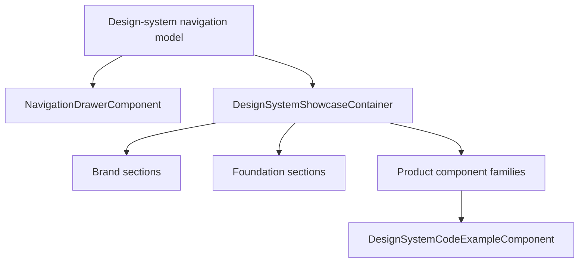

# Design-system information architecture design

**Spec**: `.specs/features/20-design-system-information-architecture/spec.md`
**Status**: Approved

## Architecture Overview

The catalog retains one `DesignSystemShowcaseContainer` and one shared `NavigationDrawerComponent`. A core navigation model is the single source of truth for the ordered groups and section anchors. The showcase imports the flattened section list for section assertions; the drawer renders the grouped list directly.



## Code Reuse Analysis

### Existing Components to Leverage

| Component | Location | How to Use |
| --- | --- | --- |
| `NavigationDrawerComponent` | `src/app/shared/ui/drawer/` | Render grouped section links when the existing design-system mode is active. |
| `DesignSystemCodeExampleComponent` | `src/app/features/design-system/` | Keep all examples collapsed and copyable. |
| Public `Org*` components | `src/app/shared/ui/` | Render real component previews and exact import/markup examples. |
| `OrgDataTableComponent` | `src/app/shared/ui/data-display/` | Add the omitted table family to the data-display preview. |

### Integration Points

| System | Integration Method |
| --- | --- |
| Route fragments | Existing `href="/design-system#<id>"` anchor navigation. |
| Application theme | Existing shared drawer theme links and root token classes. |
| Seasonal preview | Existing `setSeasonalTheme` root-class logic. |

## Components

### Design-system navigation model

- **Purpose**: Own the ordered `Marca`, `Fundações`, and `Produto` groups and their stable anchors.
- **Location**: `src/app/core/models/design-system-navigation.model.ts`
- **Interfaces**: `DesignSystemNavigationGroup`, `DesignSystemNavigationItem`, grouped constant, flattened section constant.
- **Dependencies**: None.
- **Reuses**: Existing anchors and drawer link component.

### NavigationDrawerComponent

- **Purpose**: Render the shared drawer with semantic group headings in design-system mode.
- **Location**: `src/app/shared/ui/drawer/navigation-drawer.component.*`
- **Dependencies**: Navigation model and `NavigationDrawerLinkComponent`.
- **Reuses**: Existing active-fragment logic and shared theme controls.

### DesignSystemShowcaseContainer

- **Purpose**: Separate Brand, Foundations, and Product content while keeping interactive previews and code examples co-located.
- **Location**: `src/app/features/design-system/design-system-showcase.container.*`
- **Dependencies**: Existing closed `Org*` library plus the navigation model.
- **Reuses**: Existing component examples, seasonal state, dialog and feedback services.

## Data Models

```typescript
interface DesignSystemNavigationItem {
  readonly id: string;
  readonly label: string;
  readonly icon: string;
}

interface DesignSystemNavigationGroup {
  readonly id: string;
  readonly label: string;
  readonly items: readonly DesignSystemNavigationItem[];
}
```

## Error Handling Strategy

| Error Scenario | Handling | User Impact |
| --- | --- | --- |
| Missing URL fragment | Keep `Visão geral` active. | A stable default destination. |
| Clipboard unavailable | Keep the existing no-op copy behaviour. | The example remains readable. |
| Unauthorised route | Keep existing `superAdminGuard`. | No catalog exposure. |

## Risks & Concerns

| Concern | Location | Impact | Mitigation |
| --- | --- | --- | --- |
| Section data is duplicated between the drawer and showcase. | `navigation-drawer.component.ts`, `design-system-showcase.container.ts` | Labels or anchors can drift. | Move the definition to one core model. |
| The showcase stylesheet exceeds its configured component budget. | `design-system-showcase.container.scss` | Build emits a warning. | Keep styling changes scoped and split only if the structure requires a new reusable component. |
| The old catalog does not preview `OrgDataTableComponent`. | `design-system-showcase.container.html` | The public data-table API lacks live documentation. | Add a typed, read-only table preview and exact code. |

## Tech Decisions

| Decision | Choice | Rationale |
| --- | --- | --- |
| Information architecture | `Marca` → `Fundações` → `Produto` | Matches the clarity of the reference while preserving Organiza AI terminology. |
| Documentation boundary | One code disclosure per product family, containing each rendered family API | Keeps examples exact and scannable without duplicating visual demos. |
| Shared navigation | Model-driven `app-navigation-drawer`, not a catalog-only sidebar | Keeps the same drawer, theme behaviour, and active state. |
