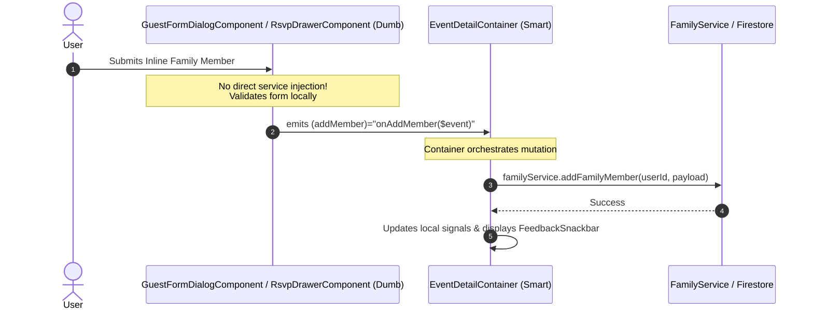

# Feature 21: CSS Design Token Unification & Component Architecture Design

**Spec**: `.specs/features/21-css-design-token-and-component-architecture/spec.md`  
**Status**: Draft

---

## Architecture Overview

This feature establishes an uncompromising visual, styling, and component architectural foundation across the Organiza AI codebase. It resolves token duplication, purges legacy color palettes, eliminates component `!important` declarations, adopts responsive SCSS mixins, enforces the Smart/Dumb component pattern, migrates all templates to standard `Org*` components, and purges dead code.

Importantly, all UI primitives in `src/app/shared/ui/` are architected to be modular, strictly namespaced (`--org-*` tokens, `.org-*` BEM classes), and decoupled from app-specific logic so they can be exported as a standalone organization-wide design system package in the future.

```mermaid
graph TD
    subgraph DesignTokens["Design Tokens Layer (_semantic.scss)"]
        Brand["Brand Triple<br/>(Pink, Orange, Yellow)"]
        Semantic["Semantic Tokens<br/>(--org-surface, --org-danger, --org-text-*)"]
        Glass["Glassmorphism Mixins<br/>(--org-glass-bg, --org-glass-blur)"]
        Breakpoints["Responsive Breakpoint Mixins<br/>(mobile, tablet, desktop, wide)"]
    end

    subgraph DesignSystem["Design System Primitives (@shared/ui - Export Ready)"]
        OrgSurface["OrgSurfaceComponent"]
        OrgButton["OrgButtonComponent / OrgIconButtonComponent"]
        OrgForms["OrgTextField / OrgDateField / OrgSelectField"]
        OrgDisplay["OrgChip / OrgBadge / OrgDataTable / OrgMetricCard"]
        OrgLayout["OrgPageLayout / OrgPageHeader / OrgSection"]
    end

    subgraph FeatureComponents["Feature Presentation Layer (Dumb Components)"]
        ProfileCards["ProfileInfoCard / FamilyRosterManager"]
        EventCards["EventCard / ItemListCard / PixCard / RsvpCard"]
        Dialogs["GuestFormDialog / RsvpDrawer / CollaboratorDrawer"]
    end

    subgraph Containers["Smart State Containers (*.container.ts)"]
        Dashboard["DashboardContainer"]
        EventEditor["EventEditorContainer"]
        EventDetail["EventDetailContainer"]
        Profile["ProfileContainer"]
        Home["HomeContainer"]
    end

    DesignTokens --> DesignSystem
    DesignSystem --> FeatureComponents
    FeatureComponents -->|input() state / output() events| Containers
    Containers -->|Firebase & Service Orchestration| CoreServices["Core Services Layer (Firestore, Auth)"]
```

---

## Code Reuse Analysis

### Existing Components & Primitives to Leverage

| Component / Primitive | Location | How to Use |
|---|---|---|
| `_semantic.scss` | `src/app/shared/ui/tokens/_semantic.scss` | Single canonical source of all `:root` design tokens, seasonal themes, and breakpoint mixins |
| `OrgSurfaceComponent` | `src/app/shared/ui/surface/org-surface.component.ts` | Replaces all `<mat-card>` containers for cards, panels, dialogs, and hero surfaces |
| `OrgButtonComponent` / `OrgIconButtonComponent` | `src/app/shared/ui/actions/` | Replaces all raw `<button mat-button>`, `<button mat-flat-button>`, `<button mat-icon-button>` |
| `OrgTextFieldComponent` / `OrgDateFieldComponent` | `src/app/shared/ui/forms/` | Replaces all raw `<mat-form-field>` and `<input matInput>` elements |
| `OrgChipComponent` | `src/app/shared/ui/actions/org-chip.component.ts` | Replaces all raw `<mat-chip-set>` and `<mat-chip-row>` elements |
| `OrgConfirmDialogComponent` | `src/app/shared/ui/feedback/org-confirm-dialog.component.ts` | Canonical confirm dialog (superseding legacy `confirm-dialog`) |
| `FeedbackService` | `src/app/shared/ui/feedback/feedback.service.ts` | Canonical user notification and toast service |

---

## Token Hierarchy & Single Source of Truth

### 1. Token Source Consolidation
- **Single Source:** `src/app/shared/ui/tokens/_semantic.scss` defines all `--org-*` custom properties via the `@mixin apply` rule.
- **Global Stylesheet (`src/styles.scss`):** Removes all duplicate `:root` custom property declarations (lines 8–101) and simply invokes `@include semantic.apply;`.
- **Export Readiness:** Token variables are completely namespaced with the `--org-` prefix, allowing the stylesheet to be bundled into an npm package (e.g. `@org/design-system/tokens`) without colliding with host applications.

### 2. Missing Token Declarations Added to `_semantic.scss`
```scss
// Status & Feedback Tokens
--org-danger: #ef4444;
--org-on-danger: #ffffff;
--org-warning: #f59e0b;
--org-on-warning: #000000;

// Typography & Text Neutrals
--org-text-primary: var(--org-on-surface);
--org-text-secondary: var(--org-on-surface-variant);
--org-text-muted: rgba(74, 68, 85, 0.6);

// Surface & Border Utilities
--org-border: var(--org-glass-ring-color);
--org-primary-light: rgba(255, 77, 148, 0.12);
--org-surface-card: rgba(255, 255, 255, 0.72);
--org-surface-glass: rgba(255, 255, 255, 0.45);
--org-surface-panel: rgba(255, 255, 255, 0.85);
```

---

## Specificity & `!important` Elimination Strategy

### Why `!important` is Banned in Component SCSS (AD-007)
In Angular's emulated view encapsulation (`ViewEncapsulation.Emulated`), component styles are scoped by unique attribute selectors (e.g., `[_ngcontent-c12]`). 

Specificity conflicts and the urge to use `!important` historically arose from three anti-patterns:
1. **Fighting Angular Material internals:** Trying to override `.mat-mdc-button` styles from inside a feature component.
2. **Generic class collisions:** Multiple components sharing unnamespaced class names like `.card` or `.header`.
3. **Overriding inline or utility styles:** Competing with ad-hoc utility classes.

### How We Guarantee Zero `!important` in Component Styles:
1. **Component-First Encapsulation:** When templates use `Org*` components, styles are self-contained. Feature components style their own host or wrapper using pure BEM classes (`.org-[block]__[element]--[modifier]`).
2. **`:host` Styling:** Use `:host { display: block; }` and `:host([variant='...'])` for component-level variations.
3. **CSS Custom Property Cascade:** Variations (e.g., button colors or surface blurs) are customized by passing component inputs or overriding `--org-*` local custom properties, which cascade naturally without needing high specificity.
4. **Third-Party Overrides Isolation (Edge Cases):** If an Angular Material global overlay (e.g. CDK dialog panel or menu overlay) requires higher specificity to override default Material theme properties, that override is placed in `src/styles.scss` (global scope) targeting the explicit CDK panel class with standard CSS specificity, **never inside a feature `.component.scss`**.

---

## Smart/Dumb Component Architecture & Refactoring Contracts

Per **AD-011**, business logic and Firebase mutations belong exclusively in Smart Containers (`*.container.ts`). Dumb Presentational Components (`*.component.ts`) only receive state via `input()` and emit user intentions via `output()` Signals.



### Refactoring Contracts:

1. **`GuestFormDialogComponent` (`src/app/features/event-detail/components/guest-form-dialog/`):**
   - **Remove:** `inject(FamilyService)`
   - **Contract:** Emits `InlineFamilyMemberPayload` via dialog close result or explicit `output<InlineFamilyMemberPayload>()`.
   - **Parent Handling:** `EventDetailContainer` receives the result and invokes `familyService.addFamilyMember()`.

2. **`RsvpDrawerComponent` (`src/app/features/event-detail/components/rsvp-drawer/`):**
   - **Remove:** `inject(FamilyService)`
   - **Contract:** Exposes `readonly addInlineFamilyMember = output<InlineFamilyMemberPayload>()`.
   - **Parent Handling:** `EventDetailContainer` binds `(addInlineFamilyMember)="onAddInlineFamilyMember($event)"` and executes the mutation.

3. **`AdminFormDrawerComponent` (`src/app/features/admin/dashboard/components/admin-form-drawer/`):**
   - **Decision:** Retired by AD-021; directory and tests will be deleted in Task T12.

---

## Complete Template Migration Map (Raw Material $\rightarrow$ Design System)

Every template across the application will be migrated to standard `Org*` components:

| Feature / Template | Raw Material Element | Replaced By Design System Component |
|---|---|---|
| `admin/event-editor/event-editor.container.html` | `<mat-card class="editor__card" appearance="outlined">` (4 instances) | `<org-surface variant="card">` |
| `admin/dashboard/dashboard.container.html` | `<mat-card>` (Skeleton cards) | `<org-surface variant="card">` |
| `organizer/event-editor/components/collaborator-drawer/collaborator-drawer.component.html` | `<button mat-icon-button>`, `<button mat-flat-button>` | `<org-icon-button>`, `<org-button variant="primary">` |
| `admin/dashboard/dashboard.container.html` | `style="height: ...; width: ...;"` inline skeleton attributes | `.skeleton-box--title`, `.skeleton-box--avatar`, `.skeleton-box--pill` |
| `admin/event-editor/event-editor.container.html` | `style="height: ...; width: ...;"` inline skeleton attributes | `.skeleton-box--title` |

---

## Dead Code Deletion Plan

The following orphaned files and directories will be completely purged from the repository:

1. `src/app/shared/ui/surface/_org-surface.scss` (Orphan SCSS partial, unimported)
2. `src/app/shared/components/confirm-dialog/` (Legacy duplicate of `OrgConfirmDialogComponent`)
3. `src/app/shared/components/theme-toggle/` (Unused runtime component)
4. `src/app/features/organizer/event-editor/components/collaborator-invite-dialog/` (Superseded by `CollaboratorDrawerComponent`)
5. `src/app/features/admin/dashboard/components/admin-form-drawer/` (Retired by AD-021)

---

## Risks & Concerns

| Concern | Location | Impact | Mitigation |
|---|---|---|---|
| Test breakages from removing `FamilyService` from dumb components | `guest-form-dialog.component.spec.ts`, `rsvp-drawer.component.spec.ts` | Unit tests fail if still expecting service mocks | Refactor spec files to assert `output()` emission rather than service spy calls |
| Visual regression from removing hardcoded colors | `profile`, `event-detail`, `login` | Color shades might slightly shift if tokens differ from hardcoded hex | Visual verification with Playwright screenshot comparisons (`assertNoHorizontalOverflow`, baselines) |
| Missing imports after dead code deletion | Various specs | Lingering test references to `ConfirmDialogComponent` or `AdminFormDrawerComponent` | Clean up all test references and run full test suite (`npm test`, `npx playwright test`, `npm run build`) |

---

## Architectural Decisions Logged

- **AD-040 — Unified Design Token Architecture in `_semantic.scss`:** All `--org-*` design tokens, seasonal theme classes, and breakpoint mixins are exclusively defined in `src/app/shared/ui/tokens/_semantic.scss`. `src/styles.scss` delegates completely to this source of truth.
- **AD-041 — Zero `!important` and Ubiquitous Design System Migration:** All feature templates must exclusively consume `Org*` components from `@shared/ui`. Component-level stylesheets must contain zero `!important` flags and zero hardcoded arbitrary hex values.
