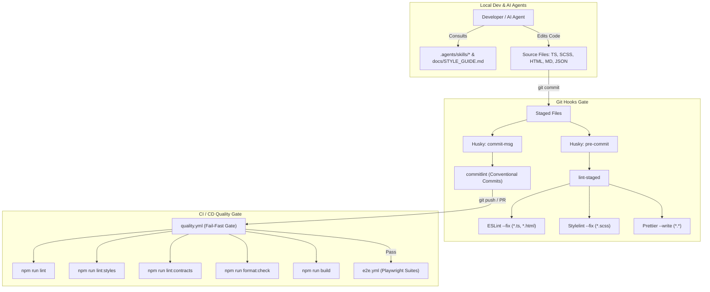

# Feature 23 Design: Linting, Formatting & Developer Style Guide Toolchain

**Spec**: `.specs/features/23-linting-and-formatting-toolchain/spec.md`  
**Status**: Draft  

---

## Architecture Overview

Feature 23 establishes a complete, multi-tiered code quality enforcement toolchain and developer style guide system for Organiza AI. The architecture operates across 4 synchronized defense layers:

1. **IDE & Local Development Layer**: Real-time linting via ESLint 9+ (Flat Config) for TypeScript and Angular templates, Stylelint for SCSS BEM and design tokens, and Prettier for universal multi-format formatting.
2. **Git Pre-Commit & Commit-Msg Boundary**: Husky and lint-staged execute automated fixes (`eslint --fix`, `stylelint --fix`, `prettier --write`) on staged files, while commitlint strictly enforces Conventional Commits (`feat(...)`, `fix(...)`, etc.).
3. **CI/CD Quality Gate**: A standalone GitHub Actions workflow (`quality.yml`) runs fail-fast before E2E suites, asserting `lint`, `lint:styles`, `lint:contracts`, `format:check`, and `build`.
4. **Agent & Contributor Knowledge Layer**: Project-local skills in `.agents/skills/` (`style-guide`, `creating-pages`, `creating-components`, `design-system-usage`) and `docs/STYLE_GUIDE.md` give AI agents and human engineers explicit, actionable recipes for smart/dumb architecture and design system component usage.

---

## Code Reuse Analysis

### Existing Components & Configurations to Leverage

| Component / File | Location | How to Use |
| ---------------- | -------- | ---------- |
| `scripts/validate-ui-contracts.mjs` | `scripts/validate-ui-contracts.mjs` | Wire directly into `npm run lint:contracts` and CI `quality.yml` to enforce Design System component contracts. |
| `.prettierrc` | `/.prettierrc` | Existing configuration (single quotes, 100 print width, Angular HTML parser) preserved and expanded with `.prettierignore`. |
| `.github/workflows/e2e.yml` | `.github/workflows/e2e.yml` | Update workflow trigger or dependency chain to run downstream of `quality.yml`. |
| `angular.json` | `/angular.json` | Add `@angular-eslint/builder:lint` target under `architect.lint` enabling `ng lint`. |
| `DESIGN.md` | `/DESIGN.md` | Single source of truth for color tokens (`--org-*`), typography, and BEM conventions referenced by Stylelint rules and style guide skills. |
| `AGENTS.md` | `/AGENTS.md` | High-level engineering guidelines extracted into granular `.agents/skills/` playbooks. |

### Integration Points

| System | Integration Method |
| ------ | ------------------ |
| Angular CLI (`ng lint`) | `@angular-eslint/builder` configured in `angular.json`. |
| ESLint Flat Config | `eslint.config.mjs` unifying TypeScript, Angular HTML templates, Unit Tests, and Playwright E2E files. |
| Stylelint SCSS | `stylelint.config.mjs` running against `src/**/*.scss` enforcing BEM, `--org-*` tokens, and `!important` ban. |
| Git Lifecycle | Husky `prepare` script initializing `.husky/` hooks for pre-commit and commit-msg. |
| GitHub Actions | `.github/workflows/quality.yml` running on pull requests and pushes to `main`. |

---

## Tool Configurations & Components

### 1. ESLint Flat Configuration (`eslint.config.mjs`)

- **Purpose**: Enforce TypeScript strict typing, Angular Standalone/OnPush architecture, accessible templates, and Playwright E2E standards.
- **Location**: `/eslint.config.mjs`
- **Rules & Scopes**:
  - **Production TypeScript (`src/**/*.ts` excluding tests)**:
    - `@angular-eslint/prefer-on-push-component-change-detection`: `error`
    - `@angular-eslint/prefer-standalone`: `error`
    - `@angular-eslint/component-selector`: `error` (prefix: `org` or `app`, style: `kebab-case`)
    - `@typescript-eslint/no-explicit-any`: `error`
    - `no-console`: `warn` (allow `warn`, `error`, `info`)
  - **Unit Tests & Mocks (`src/**/*.spec.ts`, `src/**/*.mock.ts`, `src/app/testing/**`)**:
    - `@typescript-eslint/no-explicit-any`: `warn`
    - `@angular-eslint/prefer-on-push-component-change-detection`: `off`
  - **Playwright E2E Tests (`e2e/**/*.ts`)**:
    - `playwright/no-wait-for-timeout`: `warn`
    - `playwright/prefer-web-first-assertions`: `warn`
    - `playwright/prefer-to-have-count`: `warn`
    - `playwright/no-element-handle`: `warn`
    - `playwright/no-eval`: `warn`
    - `playwright/no-conditional-in-test`: `warn`
    - `playwright/no-focused-test`: `error`
    - `playwright/expect-expect`: `warn`
    - `playwright/no-force-option`: `warn`
  - **Angular HTML Templates (`src/**/*.html`)**:
    - `@angular-eslint/template/accessibility-alt-text`: `warn`
    - `@angular-eslint/template/accessibility-label-has-associated-control`: `warn`
    - `@angular-eslint/template/click-events-have-key-events`: `warn`
    - `@angular-eslint/template/prefer-control-flow`: `error`
  - **Prettier Interoperability**:
    - `eslint-config-prettier` applied to disable conflicting formatting rules.

### 2. Stylelint SCSS Configuration (`stylelint.config.mjs`)

- **Purpose**: Enforce BEM class naming, zero `!important` in components, and `--org-*` token usage.
- **Location**: `/stylelint.config.mjs`
- **Key Rules**:
  - `declaration-no-important`: `true` (prohibits `!important` in component SCSS; override permitted only for global utility layers if necessary)
  - `color-no-hex`: `[true, { "ignore": ["#fff", "#000", "#ffffff"] }]` (forces all theme colors to use `--org-*` CSS variables)
  - `custom-property-pattern`: `^(?:org|mat|mdc|mat-sys|showcase)-[a-z0-9-]+$` (allows official Design System and Material custom property prefixes)
  - `selector-class-pattern`: `^[a-z][a-z0-9]*(?:-[a-z0-9]+)*(?:__[a-z0-9]+(?:-[a-z0-9]+)*)?(?:--[a-z0-9]+(?:-[a-z0-9]+)*)?$` (strict BEM: `block__element--modifier`)

### 3. Prettier Formatting & Ignore (`.prettierrc`, `.prettierignore`)

- **Purpose**: Ensure deterministic formatting across `.ts`, `.html`, `.scss`, `.json`, `.yml`, `.yaml`, and `.md`.
- **Location**: `/.prettierrc`, `/.prettierignore`
- **Ignored Paths**: `dist/`, `node_modules/`, `.angular/`, `coverage/`, `e2e/screenshots/`, `graphify-out/`, `*.min.*`.

### 4. Git Hooks & Commitlint (`commitlint.config.mjs`, `.husky/`, `.lintstagedrc.json`)

- **Purpose**: Intercept commits before they leave the developer environment.
- **Location**: `/commitlint.config.mjs`, `/.lintstagedrc.json`, `/.husky/pre-commit`, `/.husky/commit-msg`
- **lint-staged Mappings**:
  - `*.{ts,html}`: `["eslint --fix", "prettier --write"]`
  - `*.scss`: `["stylelint --fix", "prettier --write"]`
  - `*.{json,yml,yaml,md}`: `["prettier --write"]`
- **commitlint**: Extends `@commitlint/config-conventional` (valid types: `feat`, `fix`, `docs`, `style`, `refactor`, `perf`, `test`, `build`, `ci`, `chore`, `revert`).

### 5. CI Quality Gate Workflow (`.github/workflows/quality.yml`)

- **Purpose**: Automated blocking PR gate running ahead of E2E tests.
- **Location**: `/.github/workflows/quality.yml`
- **Steps**:
  1. `npm ci`
  2. `npm run lint` (ESLint TypeScript & Templates)
  3. `npm run lint:styles` (Stylelint SCSS)
  4. `npm run lint:contracts` (Design System UI Contracts check)
  5. `npm run format:check` (Prettier Check)
  6. `npm run build` (Production Build Verification)

### 6. `.agents/` Skills & Developer Style Guide

- **Purpose**: Actionable, self-contained documentation and playbooks for human engineers and AI agents.
- **Locations**:
  - `.agents/skills/style-guide/SKILL.md` (mirrored to `docs/STYLE_GUIDE.md`): Core engineering rules, DOs and DON'Ts, verification checklist.
  - `.agents/skills/creating-pages/SKILL.md`: Step-by-step routed page creation recipe (smart container, routes, guards, layout primitives).
  - `.agents/skills/creating-components/SKILL.md`: Smart/dumb component separation (AD-011), `input()`/`output()` Signals, zero service injection in dumb components.
  - `.agents/skills/design-system-usage/SKILL.md`: Catalog of all 32 `Org*` components, public APIs, imports from `@shared/ui`.

---

## Error Handling Strategy

| Error Scenario | Handling | User / Developer Impact |
| -------------- | -------- | ----------------------- |
| Commit message does not follow Conventional Commits | Husky `commit-msg` hook invokes `commitlint` and aborts commit with clear syntax instructions | Commit is blocked locally with explanatory error message. |
| Staged file contains unformatted code or fixable lint errors | `lint-staged` auto-applies `eslint --fix`, `stylelint --fix`, and `prettier --write` and re-stages | Commit succeeds with cleanly formatted, compliant code. |
| Staged file contains unfixable lint error (e.g. `any` in production code or `!important`) | `lint-staged` exits with code 1 and aborts commit | Commit is blocked; developer fixes violation before proceeding. |
| Developer runs `git commit --no-verify` to bypass local hooks | GitHub Actions `quality.yml` workflow catches violations on pull request | PR cannot be merged; CI fails-fast before running E2E. |
| Husky `prepare` script runs in CI environment where git hooks are unnecessary | Husky checks `CI=true` and skips hook installation gracefully | `npm ci` succeeds cleanly in GitHub Actions without errors. |

---

## Risks & Concerns

| Concern | Location (file:line) | Impact | Mitigation |
| ------- | -------------------- | ------ | ---------- |
| Legacy broken `.agents` symlink | `/.agents` | May cause file access errors or duplicate path resolution | Remove broken symlink and create a clean project-local `.agents/skills/` directory structure. |
| ESLint Flat Config syntax incompatibility with older tooling | `eslint.config.mjs` | Tooling failure if dependencies mismatch | Use official `@angular-eslint` 19+ / 22+ Flat Config presets and verified dependencies. |
| Strict BEM regex flagging valid third-party or utility class names | `stylelint.config.mjs` | False positive stylelint errors | Scope BEM regex to component stylesheets; allow Material/Design System custom properties and standard BEM modifiers. |
| Test mocks requiring type assertions flagged by `no-explicit-any` | `src/**/*.spec.ts` | Test authoring friction | Configure explicit ESLint override for `*.spec.ts` and `*.mock.ts` with `no-explicit-any: warn`. |

---

## Tech Decisions

| Decision | Choice | Rationale |
| -------- | ------ | --------- |
| ESLint Configuration Format | Flat Config (`eslint.config.mjs`) | Modern standard for ESLint 9+ and Angular ESLint 19+; future-proof and modular. |
| SCSS Color Enforcement | `color-no-hex` as `error` with `#fff`, `#000`, `#ffffff` allowlist | Enforces universal usage of `--org-*` tokens established in Feature 21. |
| Git Hook Automation | Husky + lint-staged + commitlint | Zero-overhead local enforcement preventing bad commits from reaching repository. |
| CI Quality Workflow Architecture | Standalone `quality.yml` workflow executed before `e2e.yml` | Fail-fast principle: saves CI compute time by rejecting non-compliant PRs before spinning up Playwright browsers. |
| Style Guide & Skills Placement | `.agents/skills/` with export mirror in `docs/STYLE_GUIDE.md` | Makes playbooks directly discoverable by AI tools while exportable as corporate standard. |

> **Project-Level Decision Logged**: `AD-042 — Comprehensive Code Quality Toolchain & Developer Style Guide` appended to `.specs/STATE.md`.
