# Firebase Hosting Deploy Design

**Spec**: `.specs/features/24-firebase-hosting-deploy/spec.md`
**Status**: Draft

---

## Architecture Overview

Two new GitHub Actions workflows deploy the Angular SPA to Firebase Hosting. The production workflow (`cd.yml`) chains after the existing CI pipeline (`ci.yml`); the PR preview workflow (`cd-preview.yml`) runs independently on pull requests. Firestore security rules are updated to provide complete coverage for invitations and family rosters, and are deployed automatically on merge.

```mermaid
graph TD
    subgraph "Push to main"
        A[git push main] --> B[ci.yml: quality + e2e]
        B -->|success| C[cd.yml]
        C --> D[Generate runtime-config.js]
        D --> E[npm run build]
        E --> F["firebase deploy --only hosting,firestore"]
        F --> G[organiza-ai-3416f.web.app LIVE]
    end

    subgraph "Pull Request"
        H[PR opened/updated] --> I[cd-preview.yml]
        I --> J[Generate runtime-config.js]
        J --> K[npm run build]
        K --> L["FirebaseExtended/action-hosting-deploy (preview)"]
        L --> M[Preview URL posted as PR comment]
    end
```



---

## Code Reuse Analysis

### Existing Components to Leverage

| Component                   | Location                           | How to Use                                                                                                      |
| --------------------------- | ---------------------------------- | --------------------------------------------------------------------------------------------------------------- |
| `firebase.json`             | Project root                       | Already configured with hosting pointing to `dist/organizaai/browser`, SPA rewrite, and Firestore rules/indexes |
| `.firebaserc`               | Project root                       | Already configured with `organiza-ai-3416f` as default project                                                  |
| `firestore.rules`           | Project root                       | Updated to cover invitations and family subcollections, deployed via `--only firestore`                         |
| `firestore.indexes.json`    | Project root                       | Deployed alongside hosting via `--only hosting,firestore`                                                       |
| `ci.yml`                    | `.github/workflows/ci.yml`         | Remains unchanged; deploy workflow triggers after it succeeds                                                   |
| `runtime-config.example.js` | `public/runtime-config.example.js` | Template for the CI-generated `runtime-config.js`                                                               |
| costuraai deploy workflows  | Sibling project reference          | Pattern for `FirebaseExtended/action-hosting-deploy@v0` usage                                                   |

### Integration Points

| System                 | Integration Method                                                  |
| ---------------------- | ------------------------------------------------------------------- |
| Firebase Hosting CDN   | `FirebaseExtended/action-hosting-deploy@v0` deploys built assets    |
| Firebase Firestore     | `firebase deploy --only firestore` deploys rules and indexes        |
| GitHub Actions Secrets | `FIREBASE_SERVICE_ACCOUNT_ORGANIZA_AI_3416F` and `FIREBASE_API_KEY` |
| Existing CI Pipeline   | `workflow_run` trigger in `cd.yml` chains deploy after CI success   |

---

## Components

### Firestore Security Rules (`firestore.rules`)

- **Purpose**: Enforce declarative access control across all Firestore collections and subcollections used by the application
- **Location**: `firestore.rules`
- **Updates**:
  1. `events/{eventId}/invitations/{email}`: Allows event admins to create/manage invitations; allows the invited user (`request.auth.token.email.lower() == email.lower()`) to read and delete (claim/dismiss) their own invitation.
  2. `/{path=**}/invitations/{email}` (Collection Group Query): Allows authenticated users to query invitations matching their email address for `claimPendingInvitations()`.
  3. `users/{uid}/family/{memberId}`: Allows authenticated users to read and write their own family roster records (`request.auth.uid == uid`).

### cd.yml (Production Deploy Workflow)

- **Purpose**: Deploy the Angular SPA + Firestore rules to production on merge to `main`, after CI passes
- **Location**: `.github/workflows/cd.yml`
- **Trigger**: `workflow_run` on `CI Pipeline` workflow completion (success only, `main` branch)
- **Steps**:
  1. Checkout repository (`actions/checkout@v4`)
  2. Setup Node.js 22 with npm cache (`actions/setup-node@v4`)
  3. `npm ci`
  4. Generate `public/runtime-config.js` from `FIREBASE_API_KEY` secret (heredoc)
  5. `npm run build`
  6. Deploy Firestore rules via `npx firebase-tools deploy --only firestore --token ...` or service account
  7. Deploy hosting using `FirebaseExtended/action-hosting-deploy@v0` with `channelId: live`
- **Secrets**: `FIREBASE_SERVICE_ACCOUNT_ORGANIZA_AI_3416F`, `FIREBASE_API_KEY`
- **Reuses**: costuraai merge workflow pattern, adapted for runtime-config.js instead of environment.ts

### cd-preview.yml (PR Preview Workflow)

- **Purpose**: Deploy an ephemeral preview channel for visual review on pull requests
- **Location**: `.github/workflows/cd-preview.yml`
- **Trigger**: `pull_request` against `main` (with `paths-ignore: '**/*.md'`)
- **Guard**: `if: github.event.pull_request.head.repo.full_name == github.repository` (no forks)
- **Steps**:
  1. Checkout repository (`actions/checkout@v4`)
  2. Setup Node.js 22 with npm cache (`actions/setup-node@v4`)
  3. `npm ci`
  4. Generate `public/runtime-config.js` from `FIREBASE_API_KEY` secret
  5. `npm run build`
  6. Deploy using `FirebaseExtended/action-hosting-deploy@v0` (no `channelId` — auto-creates preview)
- **Secrets**: Same as production
- **Reuses**: costuraai PR workflow pattern

### package.json `deploy` script

- **Purpose**: Convenience script for manual local deployment
- **Location**: `package.json` `scripts` section
- **Command**: `"deploy": "npm run build && firebase deploy --only hosting,firestore"`

---

## Key Design Decisions

### Production Deploy Trigger: `workflow_run` vs Chained Job

**Choice: `workflow_run`** — The deploy workflow triggers via `workflow_run` on the existing `CI Pipeline` workflow. This is superior to adding a third job to `ci.yml` because:

1. **Separation of concerns**: CI (quality + testing in `ci.yml`) and CD (deployment in `cd.yml`) remain independent workflows
2. **No modification to ci.yml**: Existing CI pipeline stays exactly as-is (DEPLOY-14)
3. **Selective triggering**: Only runs on `main` branch, only on CI success
4. **Permissions isolation**: Deploy workflow gets its own permissions scope for the Firebase service account

### Runtime Config Injection (Organiza AI vs costuraai pattern)

**Adaptation**: costuraai generates `src/environments/environment.ts` with all Firebase config. Organiza AI uses a different pattern — `public/runtime-config.js` is a runtime script loaded by `index.html` to allow API key rotation without rebuilding (AD-004, README). The CI step generates only this file:

```javascript
globalThis.__organizaAiRuntimeConfig = {
  firebase: {
    apiKey: '${{ secrets.FIREBASE_API_KEY }}',
  },
};
```

All other Firebase config values (projectId, appId, etc.) are already hardcoded in `src/environments/firebase-config.ts` — only the API key needs injection.

### Firestore Rules Deployment

Deploy rules + indexes alongside hosting via `firebase deploy --only hosting,firestore`. The `firebase.json` already references `firestore.rules` and `firestore.indexes.json`. PR previews skip Firestore rules because rules are global (not scoped to preview channels).

---

## Risks & Concerns

| Concern                                                                    | Location                  | Impact                                            | Mitigation                                                                |
| -------------------------------------------------------------------------- | ------------------------- | ------------------------------------------------- | ------------------------------------------------------------------------- |
| Service account secret must be manually configured in GitHub repo settings | GitHub Settings > Secrets | Deploy fails without it                           | Document the setup steps in README; the workflow fails with a clear error |
| `FirebaseExtended/action-hosting-deploy@v0` is pinned to `@v0`             | Workflow files            | Potential breaking changes on major version bumps | Match costuraai pattern; `@v0` is the current stable release              |
| `runtime-config.js` with empty API key if secret is missing                | Generated file            | App fails to initialize Firebase                  | Build succeeds but runtime fails — visible during review                  |

---

## Tech Decisions

| Decision                      | Choice                                                  | Rationale                                                                 |
| ----------------------------- | ------------------------------------------------------- | ------------------------------------------------------------------------- |
| Workflow filenames            | `cd.yml` (production) and `cd-preview.yml` (PR preview) | Clear semantic pairing with `ci.yml`                                      |
| Deploy action version         | `FirebaseExtended/action-hosting-deploy@v0`             | Matches costuraai; official Firebase action                               |
| Node.js version in deploy     | 22                                                      | Matches existing CI pipeline                                              |
| Checkout action version       | `actions/checkout@v4`                                   | Matches existing CI pipeline                                              |
| Setup Node action version     | `actions/setup-node@v4`                                 | Matches existing CI pipeline                                              |
| Firestore rules deploy method | Separate `firebase deploy --only firestore` step        | `action-hosting-deploy` only handles hosting; rules need the CLI directly |
