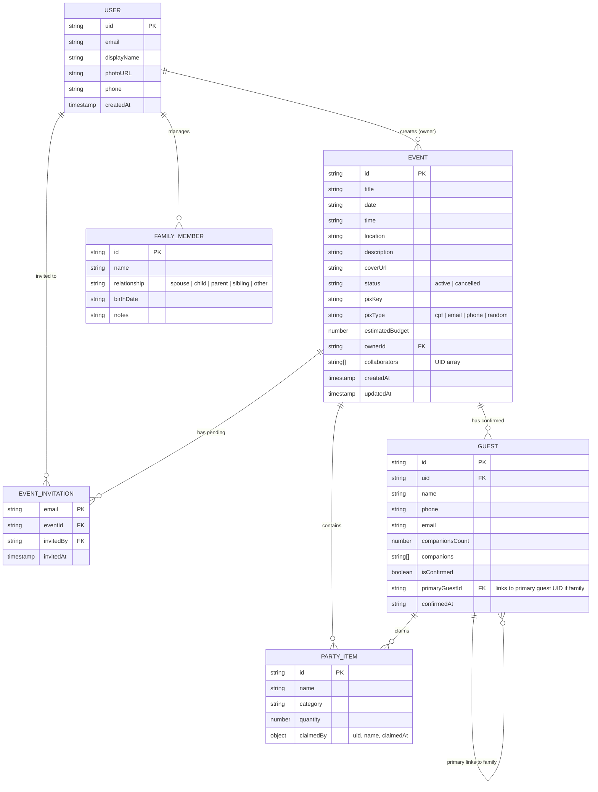

# Organiza AI — System & Engineering Context

> **Version:** 2.0.0  
> **Status:** Active / Production Architecture  
> **Primary Stack:** Angular 22 (Signals + Standalone) · Firebase Modular SDK 12 · Angular Material 22 (MDC) · Vitest 4 · Playwright 1.62  
> **Audience:** Core Engineers, AI Coding Assistants, Tech Leads & Architects

---

## 1. Executive Summary & Mission

**Organiza AI** is an event planning and guest management platform that transforms event organizing from an administrative chore into a vibrant, communal celebration.

### Core Value Proposition

- **Self-Serve Event Creation:** Any authenticated user can create and manage events without manual administrator approvals.
- **1-Touch Verified RSVP:** Guests confirm attendance with verified Google identity or authenticated profile, eliminating prank registrations, fake phone numbers, and unverified data.
- **Personal Family Roster:** Primary guests can batch-RSVP for family members in a single tap with linked guest records and cascading cancellation.
- **Collaborator Co-Hosting:** Event owners can invite collaborators via email; invitations auto-claim upon sign-in with zero transactional email infrastructure costs.
- **Smart Rachadinha (Split Estimation):** Automatic per-guest budget splitting with instant 1-click Pix copy.
- **Atmospheric Celebration:** Glassmorphic surfaces, canonical warm brand gradient (Pink $\rightarrow$ Orange $\rightarrow$ Yellow), celebratory confetti, and seasonal themes (Festa Junina, Natal, Páscoa, Ano Novo).
- **PWA & Offline Resilience:** Progressive Web App with Angular Service Worker (`@angular/pwa`), enabling home screen installation and cached offline access.

---

## 2. Technical Stack & Architectural Ecosystem

| Domain                     | Technology / Specification               | Architectural Role & Details                                                                                                                                                                                                                                           |
| -------------------------- | ---------------------------------------- | ---------------------------------------------------------------------------------------------------------------------------------------------------------------------------------------------------------------------------------------------------------------------- |
| **Frontend Framework**     | Angular 22.0+                            | Standalone Components exclusively; zero `NgModule`s ([AD-001](file:///.specs/STATE.md)).                                                                                                                                                                               |
| **Change Detection**       | `ChangeDetectionStrategy.OnPush`         | Mandatory on every single component ([AD-002](file:///.specs/STATE.md)).                                                                                                                                                                                               |
| **Reactivity & State**     | Angular Signals                          | `signal()`, `computed()`, `effect()`, `input()`, `output()`, `model()`. RxJS used only for Firestore streams via `toSignal()` ([AD-003](file:///.specs/STATE.md)).                                                                                                     |
| **Backend & Auth**         | Firebase Modular SDK (v12.14+)           | Direct SDK usage in core services; `@angular/fire` is intentionally omitted ([AD-004](file:///.specs/STATE.md)).                                                                                                                                                       |
| **UI Components & Tokens** | Angular Material 22 + MDC Tokens         | Form fields, dialogs, drawers, and menus themed via `--mdc-*`, `--mat-sys-*`, and `--org-*` tokens ([AD-028](file:///.specs/STATE.md)).                                                                                                                                |
| **Design System**          | `src/app/shared/ui/`                     | Internal UI foundation: 32 closed `Org*` standalone components (`OrgSurfaceComponent`, `OrgButtonComponent`, `OrgTextFieldComponent`, `OrgDataTableComponent`, `OrgMetricCardComponent`, etc.) ([AD-039](file:///.specs/STATE.md), [AD-041](file:///.specs/STATE.md)). |
| **Styling & Layout**       | SCSS + BEM + Custom Properties           | Mobile-first SCSS; zero Tailwind ([AD-007](file:///.specs/STATE.md)); 3 canonical breakpoints (600px, 900px, 1200px) ([AD-036](file:///.specs/STATE.md)).                                                                                                              |
| **PWA & Service Worker**   | `@angular/service-worker` (NGSW)         | Offline asset and data caching configured in `ngsw-config.json` ([AD-010](file:///.specs/STATE.md)).                                                                                                                                                                   |
| **Unit Testing**           | Vitest 4 + `@angular/build`              | 80 test suites, 446 tests focusing on Component API, Signal reactivity, and a11y.                                                                                                                                                                                      |
| **E2E Testing**            | Playwright 1.62 + `@axe-core/playwright` | Atomic test suite (15 suites, 158 tests) across Desktop Chromium & Mobile Chrome with 60 visual screenshot baselines ([AD-029](file:///.specs/STATE.md), [AD-030](file:///.specs/STATE.md)).                                                                           |
| **Type Safety**            | TypeScript 6.0 (Strict Mode)             | Zero `any` types; strictly typed DTOs and models in `src/app/core/models/`.                                                                                                                                                                                            |
| **AI Review & CI Gate**    | Google Gemini Flash + GitHub Actions     | Automated PR code review verifying `AGENTS.md`, `DESIGN.md`, `CONTEXT.md`, and feature specs after quality + E2E pass ([AD-045](file:///.specs/STATE.md)).                                                                                                             |

---

## 3. Domain Model & Business Workflows

### 3.1 Entity Relationships



### 3.2 Core Business Flows

#### 1. Event Creation & Editing (`/meus-eventos/evento/novo`, `/meus-eventos/evento/:id`)

- **Step 1 (Basic Details):** Title, event date/time, description, category, and seasonal theme.
- **Step 2 (Location & Logistics):** Address with automatic ViaCEP postal code resolution (`LocationService`), map coordinates, and parking instructions.
- **Step 3 (Financial & Wishlist):** Optional `estimatedBudget`, Pix key and type, initial wishlist/potluck items (`PartyItem`).
- **Persistence:** Created in Firestore `events/{eventId}` with `ownerId = auth.uid` and `status = 'active'`.

#### 2. 1-Touch Verified RSVP (`/evento/:id`)

- Guests sign in with Google or an authenticated profile ([AD-024](file:///.specs/STATE.md)). Anonymous/unverified registrations are blocked by Firestore rules.
- Guests specify companion count or pick family members from their personal roster.
- Upon confirmation, a `Guest` record is created in `events/{eventId}/guests/{guestId}`. Celebratory confetti triggers via `ConfettiService`.

#### 3. Family Roster & Batch Confirmation (`/perfil`, `/evento/:id`)

- Users curate a private family roster in subcollection `users/{uid}/family/{memberId}`.
- In the RSVP modal (`FamilySelectorComponent`), users can check off family members to confirm attendance in a single batch transaction (`GuestService.batchConfirmRsvp`).
- Secondary family records contain `primaryGuestId = primaryAuth.uid`. If the primary attendee cancels, linked family records are atomically deleted in cascade.

#### 4. Zero-Cost Collaborator Auto-Claim

- The event owner sends collaborator invitations by email (`events/{id}/invitations/{email}`).
- When the invited user signs into Organiza AI, the application detects matching pending invitations in Firestore, appends the user's UID to `events/{id}.collaborators`, and deletes the invitation record in a batch write.
- Collaborators have write access to manage items and view guest lists, but cannot alter core event info or delete the event.

#### 5. "Rachadinha" Split Calculation

- If `estimatedBudget > 0`, the public event detail page (`PixCardComponent`) dynamically computes:
  $$\text{Per-Guest Split} = \frac{\text{estimatedBudget}}{\max(1, \text{confirmedGuestCount})}$$
- Displays a 1-click Pix copy button with instantaneous visual feedback via `FeedbackService`.

#### 6. Automated Event Reminders & Notification Cadence

- **Critical Changes:** Real-time updates to date, time, or location trigger in-app & PWA push alerts (`EventNotificationService`).
- **7-Day Reminder:** Fires 7 days before event execution.
- **1-Day Reminder:** Fires 24 hours prior to the event for both hosts and attendees.

---

## 4. Codebase Organization & Directory Structure

```
organizaai/
├── .specs/                         # TLC Spec-Driven Development documentation
│   ├── STATE.md                    # Project Memory & Architectural Decision Log (AD-001..AD-037)
│   └── features/                   # Feature specifications (01 to 15)
├── e2e/                            # Playwright E2E testing framework
│   ├── components/                 # Component Test Harnesses (RsvpDialog, ItemList, ...)
│   ├── fixtures/                   # Custom test fixtures with POM dependency injection
│   ├── helpers/                    # Auth/Firestore mocks, a11y helpers, overflow assert
│   ├── pages/                      # Page Object Models (HomePage, LoginPage, EventEditorPage, ...)
│   ├── screenshots/                # Baseline visual screenshots (Desktop & Mobile)
│   └── specs/                      # 15 atomic E2E test suites
├── public/                         # Static assets, PWA icons, manifest.webmanifest
└── src/
    ├── app/
    │   ├── core/                   # Singleton core services, models, guards, gateways
    │   │   ├── guards/             # authGuard, superAdminGuard
    │   │   ├── models/             # Strict TypeScript domain interfaces
    │   │   └── services/           # AuthService, EventService, GuestService, LocationService...
    │   ├── features/               # Feature domain modules
    │   │   ├── admin/              # Super Admin dashboard & route definitions
    │   │   ├── auth/               # Login & authentication containers
    │   │   ├── design-system/      # Showcase container (/design-system)
    │   │   ├── event-detail/       # Public event viewing & RSVP flow
    │   │   ├── home/               # Public landing & scoped user feed
    │   │   ├── organizer/          # Event management & multi-step editor
    │   │   └── profile/            # User profile & family roster management
    │   ├── shared/                 # Shared UI primitives & presentation components
    │   │   ├── components/         # Reusable feature widgets (Navbar, Footer, PixCard, ...)
    │   │   └── ui/                 # Official UI Foundation primitives (OrgSurface, OrgButton, ...)
    │   ├── testing/                # Unit test mocks, harnesses, and test builders
    │   ├── app.config.ts           # Root application providers, router, PWA service worker
    │   ├── app.html / app.ts       # Root shell component with navigation drawer
    │   └── app.routes.ts           # Top-level routing table
    ├── styles/                     # Global styles, variables, typography, reset
    └── styles.scss                 # CSS Custom Properties (--org-*) & Material 3 setup
```

---

## 5. Routes & Access Control Matrix

| Route                       | Domain          | Container / Component                             | Guard / Access Level | Description                                                       |
| --------------------------- | --------------- | ------------------------------------------------- | -------------------- | ----------------------------------------------------------------- |
| `/`                         | `home`          | `HomeContainer`                                   | Public               | Landing page & scoped user event feed (owned + collaborated).     |
| `/login`                    | `auth`          | `LoginContainer`                                  | Public               | Google Sign-in and Email/Password authentication.                 |
| `/evento/:id`               | `event-detail`  | `EventDetailContainer`                            | Public               | Public event view, 1-touch RSVP, Pix split, wishlist item claims. |
| `/perfil`                   | `profile`       | `ProfileContainer`                                | `authGuard`          | User profile info and personal family roster CRUD.                |
| `/meus-eventos`             | `organizer`     | `DashboardContainer` (via `organizer.routes.ts`)  | `authGuard`          | Organizer dashboard listing owned and collaborated events.        |
| `/meus-eventos/evento/novo` | `organizer`     | `EventEditorContainer`                            | `authGuard`          | 3-step wizard to create a new event.                              |
| `/meus-eventos/evento/:id`  | `organizer`     | `EventEditorContainer`                            | `authGuard`          | 3-step wizard to edit an existing event.                          |
| `/admin`                    | `admin`         | `AdminDashboardContainer` (via `admin.routes.ts`) | `superAdminGuard`    | Super Admin platform analytics, system health, and governance.    |
| `/design-system`            | `design-system` | `DesignSystemShowcaseContainer`                   | `superAdminGuard`    | Interactive living catalog of all UI foundation primitives.       |

> **Critical Rule:** Never confuse `/meus-eventos` (organizer dashboard for any user) with `/admin` (Super Admin governance).

---

## 6. UI Foundation & Design System (`src/app/shared/ui/`)

### 6.1 Canonical Palette & Semantic Tokens

- **Brand Triple:** Pink (`#FF4D94`), Orange (`#FF8C42`), Yellow (`#FFC837`).
- **Semantic Feedback:** Success (`#10B981`), Warning (`#F59E0B`), Danger (`#EF4444`), Info (`#3B82F6`).
- **Typography:** **Plus Jakarta Sans** across all headings, body, and labels.

### 6.2 Glassmorphism Contract

To eliminate double outlines, jagged clipping, and visual bloat, all glassmorphic surfaces use `<org-surface>`:

```html
<!-- Canonical Surface Usage -->
<org-surface>...</org-surface>
```

```scss
// Glass Contract
backdrop-filter: blur(24px);
-webkit-backdrop-filter: blur(24px);
border: 1px solid var(--org-glass-ring-color);
background-clip: padding-box;
box-shadow: 0 8px 32px 0 rgba(255, 77, 148, 0.08);
```

### 6.3 Canonical Breakpoints ([AD-036](file:///.specs/STATE.md))

All responsive CSS media queries must strictly use these three breakpoints:

- **Small / Mobile:** `< 600px` (Single column, 12-16px padding, $\ge 48\text{px}$ touch targets).
- **Medium / Tablet:** `600px - 899px` (`@media (min-width: 600px)`).
- **Large / Desktop:** `900px - 1199px` (`@media (min-width: 900px)`).
- **Wide Container:** `≥ 1200px` (`@media (min-width: 1200px)`).

### 6.4 UI Foundation Components (32 Primitives in `@shared/ui`)

- **Layout:** `OrgPageLayoutComponent`, `OrgPageHeaderComponent`, `OrgSectionComponent`, `OrgSurfaceComponent`
- **Actions:** `OrgButtonComponent`, `OrgIconButtonComponent`, `OrgChipComponent`, `OrgIconComponent`
- **Forms:** `OrgTextFieldComponent`, `OrgTextareaFieldComponent`, `OrgDateFieldComponent`, `OrgTimeFieldComponent`, `OrgSelectFieldComponent`, `OrgAutocompleteFieldComponent`
- **Selection:** `OrgToggleComponent`, `OrgCheckboxComponent`, `OrgRadioGroupComponent`
- **Navigation:** `OrgTabsComponent`, `OrgStepperComponent`, `OrgStepComponent`, `OrgMenuComponent`, `OrgNavigationListComponent`
- **Data Display:** `OrgMetricCardComponent`, `OrgDataTableComponent`, `OrgBadgeComponent`, `OrgProgressComponent`
- **Feedback & Overlays:** `OrgConfirmDialogComponent`, `OrgDialogService`, `OrgEmptyStateComponent`, `OrgBannerComponent`, `FeedbackSnackbarComponent`, `FeedbackService`

---

## 7. Security Architecture & Firestore Rules

### 7.1 Role-Based Access Control (RBAC)

1. **Super Admin:** Hardcoded whitelist (`luiz.gmr.dev@gmail.com`, `jessica.calm.dev@gmail.com`) checked in `AuthService.isSuperAdmin()` and enforced in `firestore.rules`.
2. **Event Owner:** `resource.data.ownerId == request.auth.uid`. Full CRUD privileges.
3. **Collaborator:** `request.auth.uid in resource.data.collaborators`. Permission to update items, view RSVPs, and check in guests. Cannot delete event or edit core details.
4. **Verified Guest:** Must be authenticated (`request.auth != null`). Anonymous guest data is never saved to the global `/users` collection.

### 7.2 Security Rules Invariants (`firestore.rules`)

- `/admins/{email}`: Read/write permitted only if `isSuperAdmin()` or user owns the email record.
- `/users/{uid}`: Read/write restricted exclusively to `request.auth.uid == uid`.
- `/events/{eventId}`: Public read; create/update/delete restricted to authorized organizers (`isAdmin()`).
- `/events/{eventId}/guests/{guestId}`: Verified write via `isPrimaryRsvp()` or `isLinkedFamilyRsvp()`. Companion counts bounded to $[0, 10]$.
- `/events/{eventId}/items/{itemId}`: Public read; claim/unclaim toggles strictly enforce `claimedBy.uid == request.auth.uid`.

---

## 8. Architectural Invariants Registry (AD-001 – AD-042)

| ID         | Title                                       | Summary & Enforcement Rule                                                                        |
| ---------- | ------------------------------------------- | ------------------------------------------------------------------------------------------------- |
| **AD-001** | Standalone Only                             | No `NgModule`s allowed. All components, directives, and pipes are `standalone: true`.             |
| **AD-002** | OnPush Everywhere                           | `ChangeDetectionStrategy.OnPush` is mandatory on every single component.                          |
| **AD-003** | Signals for State                           | Use `signal()`, `computed()`, `input()`, `output()`. RxJS only for Firestore streams.             |
| **AD-004** | Direct Firebase SDK                         | Use `firebase/firestore`, `firebase/auth` directly. Never install `@angular/fire`.                |
| **AD-005** | Super Admin Whitelist                       | Global platform governance restricted to designated super admin emails.                           |
| **AD-007** | Pure SCSS + BEM                             | Tailwind CSS is permanently removed. No `!important` overrides. Use `--org-*` tokens.             |
| **AD-010** | Angular NGSW PWA                            | PWA support via `@angular/service-worker` with `ngsw-config.json` caching rules.                  |
| **AD-011** | Smart/Dumb Pattern                          | Containers (`*.container.ts`) manage data; Presentational (`*.component.ts`) receive `input()`.   |
| **AD-016** | Open Registration                           | Any authenticated user can create and manage events.                                              |
| **AD-024** | Verified RSVP Identity                      | 1-touch verified Google OAuth identity required; anonymous guest RSVP is deprecated.              |
| **AD-028** | Material 3 MDC Tokens                       | Style form inputs and dialogs via official MDC tokens, not deep internal CSS selectors.           |
| **AD-030** | Atomic E2E Tests                            | Each Playwright test is standalone (sets up state, asserts 1 thing, takes 1 screenshot).          |
| **AD-031** | Zero Overflow Invariant                     | Every view must satisfy `scrollWidth <= innerWidth + 1` (`assertNoHorizontalOverflow`).           |
| **AD-036** | Canonical Breakpoints                       | Responsive styling must exclusively use `600px`, `900px`, and `1200px` media queries.             |
| **AD-037** | Design System Showcase                      | Living showcase route at `/design-system` for interactive token & UI auditing.                    |
| **AD-039** | Component-First UI Primitives               | 32 closed `Org*` components in `@shared/ui` replace styling directives.                           |
| **AD-040** | Unified Design Token Architecture           | All `--org-*` tokens consolidated in `_semantic.scss`.                                            |
| **AD-041** | Zero `!important` & Design System Migration | Feature templates consume `Org*` components exclusively with 0 `!important`.                      |
| **AD-042** | Code Quality Toolchain & Style Guide        | ESLint 9, Stylelint, Husky pre-commit, and `.agents/skills/` style guides.                        |
| **AD-043** | Automated Firebase Hosting CD Pipeline      | Production deploy on main, PR preview channels, and Firestore security rules governance.          |
| **AD-044** | Design Token Category Harmonization & Gate  | Semantic category tokens, 32 closed primitives, and strict template UI contract validation.       |
| **AD-045** | AI Code Review Gatekeeper & Multi-Account   | Post-CI Gemini code review with spec awareness, model fallback, and isolated `npm run pr:create`. |

---

## 9. Testing & Quality Assurance Strategy

### 9.1 Unit & Component Tests (Vitest)

```bash
# Run unit test suite
npm test -- --watch=false
```

- **Scope:** 80 test suites, 446 tests.
- **Focus:** Component input/output contract verification, Signal reactivity, a11y DOM attributes (ARIA, roles, tabindex), and service mocking via `src/app/testing/mocks/`.

### 9.2 End-to-End Tests (Playwright)

```bash
# Run all E2E tests (Desktop & Mobile Chrome)
npm run test:e2e

# Run headless in CI
npm run test:e2e:ci

# Run Mobile Chrome only (Pixel 5 viewport)
npm run test:e2e:mobile
```

- **Atomic Test Principle ([AD-030](file:///.specs/STATE.md)):** Each test sets up independent mock data via `addInitScript` (IndexedDB auth injection) and `page.route()` (Firestore REST intercepts). Tests never depend on execution order.
- **Page Object Models & Harnesses:** Page objects live in `e2e/pages/`; component harnesses live in `e2e/components/`.
- **Accessibility & Design Checks:** Automated `@axe-core/playwright` scans, touch target checks ($\ge 48\text{px}$), and layout invariant validations (`assertNoHorizontalOverflow`).

---

## 10. Developer Commands & Workflow

### 10.1 Daily Commands

```bash
# Start local development server (http://localhost:4200)
npm start

# Build for production
npm run build

# Run unit tests
npm test -- --watch=false

# Run Playwright E2E tests
npm run test:e2e

# Run Firestore security rules unit tests
npm run test:rules

# Push branch and open Pull Request with personal GitHub token
npm run pr:create
```

### 10.2 Commit Message Standard (Conventional Commits)

All git commits must follow the Conventional Commits format:

```
feat(scope): add family member batch confirmation
fix(event-detail): prevent duplicate pix key copy feedback
refactor(ui): migrate surface component to orgSurface directive
test(e2e): add atomic happy-path test for collaborator invite
chore(deps): update angular core to 22.0.7
```

### 10.3 Spec-Driven Development (TLC SDD)

Features follow the 4-phase lifecycle:

1. **Specify:** Define `spec.md` with user stories and EARS acceptance criteria in `.specs/features/[feature]/`.
2. **Design (if needed):** Architectural decisions and technical blueprints in `design.md`.
3. **Tasks:** Granular task list in `tasks.md` with atomic commits per task.
4. **Execute & Verify:** Implementation followed by an independent Verifier report in `validation.md`.

---

## 11. Guidelines for AI Agents & Pair Programmers

When working on this repository, you **MUST** strictly adhere to the following rules:

1. **Angular Architecture:**
   - Always use Standalone Components (`imports: [...]`). Never create or reference NgModules.
   - Always specify `changeDetection: ChangeDetectionStrategy.OnPush`.
   - Use modern Angular control flow (`@if`, `@for`, `@switch`). Never use `*ngIf` or `*ngFor`.
   - Manage state via Angular Signals (`signal()`, `computed()`, `input()`, `output()`, `model()`).
   - Keep templates and styles separated: always specify `templateUrl` and `styleUrl`. Never write inline templates or styles.

2. **Accessibility & Layout:**
   - Enforce WCAG 2.1 AA and semantic HTML (`<main>`, `<section>`, `<nav>`, `<button>`, `<dialog>`).
   - Maintain minimum $48\text{px} \times 48\text{px}$ touch targets for all primary buttons, chips, and interactive icons.
   - Guard against horizontal scrollbars: enforce `document.documentElement.scrollWidth <= window.innerWidth + 1`.

3. **Styling & Theming:**
   - Write mobile-first SCSS using BEM. Never use Tailwind classes or `!important`.
   - Use `--org-*` CSS variables and official Angular Material MDC tokens (`--mdc-*`, `--mat-sys-*`).
   - Use `[orgSurface]` directive for cards, panels, and modals to maintain single-ring glassmorphism.

4. **Type Safety & Testing:**
   - Enforce strict TypeScript. Never use `any`. Explicitly type all inputs, outputs, models, and service methods.
   - Provide a `.spec.ts` unit test for every new component or service created.
   - Ensure all automated checks (`npm test -- --watch=false` and `npm run build`) pass before completing any task.
